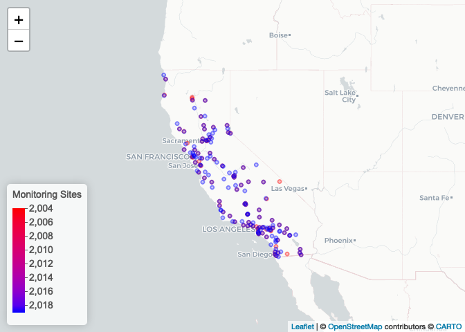
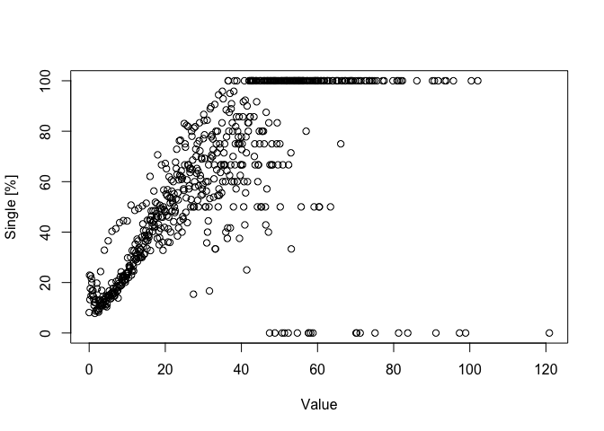
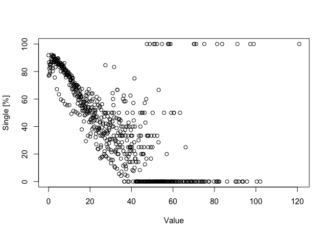
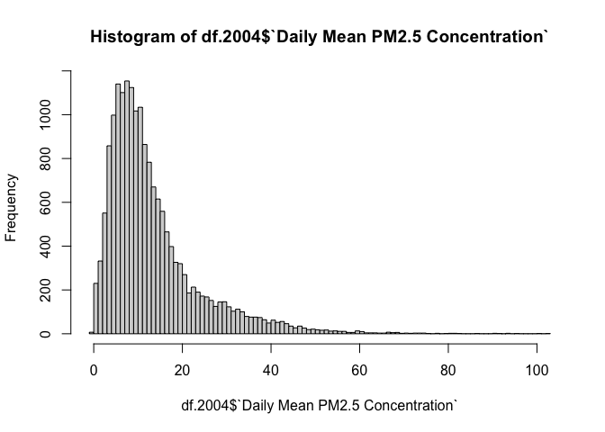
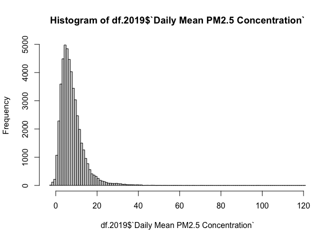
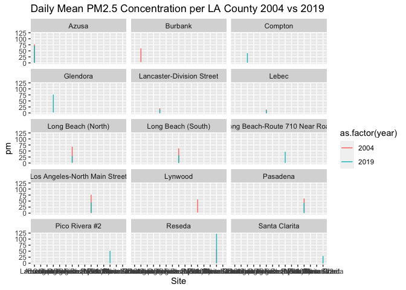
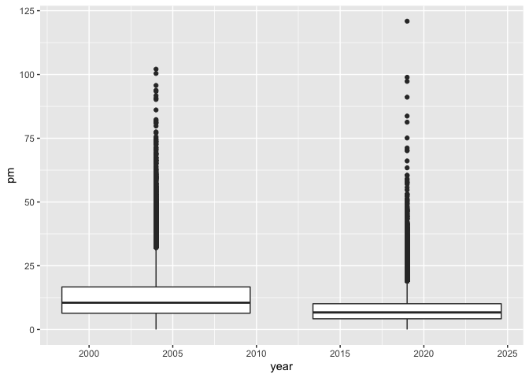

pm566-hw1
================
Misha Khan
2022-09-22

``` r
library(lubridate)
```

    ## 
    ## Attaching package: 'lubridate'

    ## The following objects are masked from 'package:base':
    ## 
    ##     date, intersect, setdiff, union

``` r
library(tidyverse)
```

    ## ── Attaching packages
    ## ───────────────────────────────────────
    ## tidyverse 1.3.2 ──

    ## ✔ ggplot2 3.3.6      ✔ purrr   0.3.4 
    ## ✔ tibble  3.1.8      ✔ dplyr   1.0.10
    ## ✔ tidyr   1.2.1      ✔ stringr 1.4.1 
    ## ✔ readr   2.1.2      ✔ forcats 0.5.2 
    ## ── Conflicts ────────────────────────────────────────── tidyverse_conflicts() ──
    ## ✖ lubridate::as.difftime() masks base::as.difftime()
    ## ✖ lubridate::date()        masks base::date()
    ## ✖ dplyr::filter()          masks stats::filter()
    ## ✖ lubridate::intersect()   masks base::intersect()
    ## ✖ dplyr::lag()             masks stats::lag()
    ## ✖ lubridate::setdiff()     masks base::setdiff()
    ## ✖ lubridate::union()       masks base::union()

``` r
library(data.table)
```

    ## 
    ## Attaching package: 'data.table'
    ## 
    ## The following objects are masked from 'package:dplyr':
    ## 
    ##     between, first, last
    ## 
    ## The following object is masked from 'package:purrr':
    ## 
    ##     transpose
    ## 
    ## The following objects are masked from 'package:lubridate':
    ## 
    ##     hour, isoweek, mday, minute, month, quarter, second, wday, week,
    ##     yday, year

``` r
library(dtplyr)
library(readr)
library(Hmisc)
```

    ## Loading required package: lattice
    ## Loading required package: survival
    ## Loading required package: Formula
    ## 
    ## Attaching package: 'Hmisc'
    ## 
    ## The following objects are masked from 'package:dplyr':
    ## 
    ##     src, summarize
    ## 
    ## The following objects are masked from 'package:base':
    ## 
    ##     format.pval, units

``` r
library(skimr) 
library(leaflet)
library(webshot)
```

# Step 1. Read in 2004 & 2019 data

Read in data using data.table Check dimensions, headers, footers,
variable names/types Check for data issues Write a summary of your
finding

``` r
df.2004 <- data.table::fread("2004data.csv")
df.2019 <- data.table::fread("2019data.csv")
```

### Examining + cleaning df.2004

``` r
dim(df.2004) #19,233 observations x 20 variables 
```

    ## [1] 19233    20

``` r
#names(df.2004)
#str(df.2004)
summary(df.2004)
```

    ##      Date              Source             Site ID              POC        
    ##  Length:19233       Length:19233       Min.   :60010007   Min.   : 1.000  
    ##  Class :character   Class :character   1st Qu.:60370002   1st Qu.: 1.000  
    ##  Mode  :character   Mode  :character   Median :60658001   Median : 1.000  
    ##                                        Mean   :60588026   Mean   : 1.816  
    ##                                        3rd Qu.:60750006   3rd Qu.: 2.000  
    ##                                        Max.   :61131003   Max.   :12.000  
    ##                                                                           
    ##  Daily Mean PM2.5 Concentration    UNITS           DAILY_AQI_VALUE 
    ##  Min.   : -0.10                 Length:19233       Min.   :  0.00  
    ##  1st Qu.:  6.00                 Class :character   1st Qu.: 25.00  
    ##  Median : 10.10                 Mode  :character   Median : 42.00  
    ##  Mean   : 13.13                                    Mean   : 46.33  
    ##  3rd Qu.: 16.30                                    3rd Qu.: 60.00  
    ##  Max.   :251.00                                    Max.   :301.00  
    ##                                                                    
    ##   Site Name         DAILY_OBS_COUNT PERCENT_COMPLETE AQS_PARAMETER_CODE
    ##  Length:19233       Min.   :1       Min.   :100      Min.   :88101     
    ##  Class :character   1st Qu.:1       1st Qu.:100      1st Qu.:88101     
    ##  Mode  :character   Median :1       Median :100      Median :88101     
    ##                     Mean   :1       Mean   :100      Mean   :88267     
    ##                     3rd Qu.:1       3rd Qu.:100      3rd Qu.:88502     
    ##                     Max.   :1       Max.   :100      Max.   :88502     
    ##                                                                        
    ##  AQS_PARAMETER_DESC   CBSA_CODE      CBSA_NAME           STATE_CODE
    ##  Length:19233       Min.   :12540   Length:19233       Min.   :6   
    ##  Class :character   1st Qu.:31080   Class :character   1st Qu.:6   
    ##  Mode  :character   Median :40140   Mode  :character   Median :6   
    ##                     Mean   :35328                      Mean   :6   
    ##                     3rd Qu.:41860                      3rd Qu.:6   
    ##                     Max.   :49700                      Max.   :6   
    ##                     NA's   :1253                                   
    ##     STATE            COUNTY_CODE        COUNTY          SITE_LATITUDE  
    ##  Length:19233       Min.   :  1.00   Length:19233       Min.   :32.63  
    ##  Class :character   1st Qu.: 37.00   Class :character   1st Qu.:34.07  
    ##  Mode  :character   Median : 65.00   Mode  :character   Median :36.48  
    ##                     Mean   : 58.63                      Mean   :36.23  
    ##                     3rd Qu.: 75.00                      3rd Qu.:38.10  
    ##                     Max.   :113.00                      Max.   :41.71  
    ##                                                                        
    ##  SITE_LONGITUDE  
    ##  Min.   :-124.2  
    ##  1st Qu.:-121.6  
    ##  Median :-119.3  
    ##  Mean   :-119.7  
    ##  3rd Qu.:-117.9  
    ##  Max.   :-115.5  
    ## 

There are 19,233 observations and 20 variables (19,233 rows, 20
columns).

#### Let’s see what has NA values by using skimr

``` r
#Hmisc::describe(df.2004)

#skimr separates character variables, shows # missing
skimr::skim(df.2004)
```

|                                                  |         |
|:-------------------------------------------------|:--------|
| Name                                             | df.2004 |
| Number of rows                                   | 19233   |
| Number of columns                                | 20      |
| Key                                              | NULL    |
| \_\_\_\_\_\_\_\_\_\_\_\_\_\_\_\_\_\_\_\_\_\_\_   |         |
| Column type frequency:                           |         |
| character                                        | 8       |
| numeric                                          | 12      |
| \_\_\_\_\_\_\_\_\_\_\_\_\_\_\_\_\_\_\_\_\_\_\_\_ |         |
| Group variables                                  | None    |

Data summary

**Variable type: character**

| skim_variable      | n_missing | complete_rate | min | max | empty | n_unique | whitespace |
|:-------------------|----------:|--------------:|----:|----:|------:|---------:|-----------:|
| Date               |         0 |             1 |  10 |  10 |     0 |      366 |          0 |
| Source             |         0 |             1 |   3 |   3 |     0 |        1 |          0 |
| UNITS              |         0 |             1 |   8 |   8 |     0 |        1 |          0 |
| Site Name          |         0 |             1 |   0 |  49 |   229 |      105 |          0 |
| AQS_PARAMETER_DESC |         0 |             1 |  24 |  38 |     0 |        2 |          0 |
| CBSA_NAME          |         0 |             1 |   0 |  45 |  1253 |       31 |          0 |
| STATE              |         0 |             1 |  10 |  10 |     0 |        1 |          0 |
| COUNTY             |         0 |             1 |   4 |  15 |     0 |       47 |          0 |

**Variable type: numeric**

| skim_variable                  | n_missing | complete_rate |        mean |        sd |          p0 |         p25 |         p50 |         p75 |        p100 | hist  |
|:-------------------------------|----------:|--------------:|------------:|----------:|------------:|------------:|------------:|------------:|------------:|:------|
| Site ID                        |         0 |          1.00 | 60588026.13 | 296496.39 | 60010007.00 | 60370002.00 | 60658001.00 | 60750006.00 | 61131003.00 | ▅▇▇▇▅ |
| POC                            |         0 |          1.00 |        1.82 |      1.81 |        1.00 |        1.00 |        1.00 |        2.00 |       12.00 | ▇▁▁▁▁ |
| Daily Mean PM2.5 Concentration |         0 |          1.00 |       13.13 |     10.93 |       -0.10 |        6.00 |       10.10 |       16.30 |      251.00 | ▇▁▁▁▁ |
| DAILY_AQI_VALUE                |         0 |          1.00 |       46.33 |     28.17 |        0.00 |       25.00 |       42.00 |       60.00 |      301.00 | ▇▂▁▁▁ |
| DAILY_OBS_COUNT                |         0 |          1.00 |        1.00 |      0.00 |        1.00 |        1.00 |        1.00 |        1.00 |        1.00 | ▁▁▇▁▁ |
| PERCENT_COMPLETE               |         0 |          1.00 |      100.00 |      0.00 |      100.00 |      100.00 |      100.00 |      100.00 |      100.00 | ▁▁▇▁▁ |
| AQS_PARAMETER_CODE             |         0 |          1.00 |    88266.98 |    197.51 |    88101.00 |    88101.00 |    88101.00 |    88502.00 |    88502.00 | ▇▁▁▁▆ |
| CBSA_CODE                      |      1253 |          0.93 |    35327.51 |  10055.90 |    12540.00 |    31080.00 |    40140.00 |    41860.00 |    49700.00 | ▂▁▂▇▂ |
| STATE_CODE                     |         0 |          1.00 |        6.00 |      0.00 |        6.00 |        6.00 |        6.00 |        6.00 |        6.00 | ▁▁▇▁▁ |
| COUNTY_CODE                    |         0 |          1.00 |       58.63 |     29.66 |        1.00 |       37.00 |       65.00 |       75.00 |      113.00 | ▅▇▇▇▅ |
| SITE_LATITUDE                  |         0 |          1.00 |       36.23 |      2.29 |       32.63 |       34.07 |       36.48 |       38.10 |       41.71 | ▇▂▆▅▁ |
| SITE_LONGITUDE                 |         0 |          1.00 |     -119.65 |      2.01 |     -124.16 |     -121.62 |     -119.29 |     -117.94 |     -115.48 | ▁▇▅▆▃ |

Site Name has 229 empty & CBSA_Name has 1,253 empty.

#### Let’s clean those columns

``` r
#Site Name
df.2004 <- df.2004[-which(df.2004$`Site Name` == ""), ]
```

``` r
#CBSA_Name
df.2004 <- df.2004[-which(df.2004$CBSA_NAME == ""), ]
```

After removing NA values in df.2004, observations decreased from 19,233
to 17,751 observations (removed 1,482 values).

#### Let’s change date from character to date type.

``` r
df.2004$Date <- as.Date(df.2004$Date, format = "%m/%d/%Y")
class(df.2004$Date)
```

    ## [1] "Date"

### Examining + cleaning df.2019

``` r
dim(df.2019)
```

    ## [1] 53156    20

``` r
names(df.2019)
```

    ##  [1] "Date"                           "Source"                        
    ##  [3] "Site ID"                        "POC"                           
    ##  [5] "Daily Mean PM2.5 Concentration" "UNITS"                         
    ##  [7] "DAILY_AQI_VALUE"                "Site Name"                     
    ##  [9] "DAILY_OBS_COUNT"                "PERCENT_COMPLETE"              
    ## [11] "AQS_PARAMETER_CODE"             "AQS_PARAMETER_DESC"            
    ## [13] "CBSA_CODE"                      "CBSA_NAME"                     
    ## [15] "STATE_CODE"                     "STATE"                         
    ## [17] "COUNTY_CODE"                    "COUNTY"                        
    ## [19] "SITE_LATITUDE"                  "SITE_LONGITUDE"

``` r
summary(df.2019)
```

    ##      Date              Source             Site ID              POC        
    ##  Length:53156       Length:53156       Min.   :60010007   Min.   : 1.000  
    ##  Class :character   Class :character   1st Qu.:60310004   1st Qu.: 1.000  
    ##  Mode  :character   Mode  :character   Median :60612003   Median : 3.000  
    ##                                        Mean   :60565264   Mean   : 2.573  
    ##                                        3rd Qu.:60771002   3rd Qu.: 3.000  
    ##                                        Max.   :61131003   Max.   :21.000  
    ##                                                                           
    ##  Daily Mean PM2.5 Concentration    UNITS           DAILY_AQI_VALUE 
    ##  Min.   : -2.200                Length:53156       Min.   :  0.00  
    ##  1st Qu.:  4.000                Class :character   1st Qu.: 17.00  
    ##  Median :  6.500                Mode  :character   Median : 27.00  
    ##  Mean   :  7.739                                   Mean   : 30.57  
    ##  3rd Qu.:  9.900                                   3rd Qu.: 41.00  
    ##  Max.   :120.900                                   Max.   :185.00  
    ##                                                                    
    ##   Site Name         DAILY_OBS_COUNT PERCENT_COMPLETE AQS_PARAMETER_CODE
    ##  Length:53156       Min.   :1       Min.   :100      Min.   :88101     
    ##  Class :character   1st Qu.:1       1st Qu.:100      1st Qu.:88101     
    ##  Mode  :character   Median :1       Median :100      Median :88101     
    ##                     Mean   :1       Mean   :100      Mean   :88214     
    ##                     3rd Qu.:1       3rd Qu.:100      3rd Qu.:88502     
    ##                     Max.   :1       Max.   :100      Max.   :88502     
    ##                                                                        
    ##  AQS_PARAMETER_DESC   CBSA_CODE      CBSA_NAME           STATE_CODE
    ##  Length:53156       Min.   :12540   Length:53156       Min.   :6   
    ##  Class :character   1st Qu.:31080   Class :character   1st Qu.:6   
    ##  Mode  :character   Median :40140   Mode  :character   Median :6   
    ##                     Mean   :35839                      Mean   :6   
    ##                     3rd Qu.:41860                      3rd Qu.:6   
    ##                     Max.   :49700                      Max.   :6   
    ##                     NA's   :4181                                   
    ##     STATE            COUNTY_CODE        COUNTY          SITE_LATITUDE  
    ##  Length:53156       Min.   :  1.00   Length:53156       Min.   :32.58  
    ##  Class :character   1st Qu.: 31.00   Class :character   1st Qu.:34.14  
    ##  Mode  :character   Median : 61.00   Mode  :character   Median :36.63  
    ##                     Mean   : 56.38                      Mean   :36.34  
    ##                     3rd Qu.: 77.00                      3rd Qu.:37.97  
    ##                     Max.   :113.00                      Max.   :41.76  
    ##                                                                        
    ##  SITE_LONGITUDE  
    ##  Min.   :-124.2  
    ##  1st Qu.:-121.6  
    ##  Median :-119.8  
    ##  Mean   :-119.8  
    ##  3rd Qu.:-118.1  
    ##  Max.   :-115.5  
    ## 

There are 53,156 observations and 20 variables (53,156 rows, 20
columns).

#### Let’s see what has NA values by using skimr

``` r
skimr::skim(df.2019)
```

|                                                  |         |
|:-------------------------------------------------|:--------|
| Name                                             | df.2019 |
| Number of rows                                   | 53156   |
| Number of columns                                | 20      |
| Key                                              | NULL    |
| \_\_\_\_\_\_\_\_\_\_\_\_\_\_\_\_\_\_\_\_\_\_\_   |         |
| Column type frequency:                           |         |
| character                                        | 8       |
| numeric                                          | 12      |
| \_\_\_\_\_\_\_\_\_\_\_\_\_\_\_\_\_\_\_\_\_\_\_\_ |         |
| Group variables                                  | None    |

Data summary

**Variable type: character**

| skim_variable      | n_missing | complete_rate | min | max | empty | n_unique | whitespace |
|:-------------------|----------:|--------------:|----:|----:|------:|---------:|-----------:|
| Date               |         0 |             1 |  10 |  10 |     0 |      365 |          0 |
| Source             |         0 |             1 |   3 |   3 |     0 |        1 |          0 |
| UNITS              |         0 |             1 |   8 |   8 |     0 |        1 |          0 |
| Site Name          |         0 |             1 |   0 |  49 |   102 |      159 |          0 |
| AQS_PARAMETER_DESC |         0 |             1 |  24 |  38 |     0 |        2 |          0 |
| CBSA_NAME          |         0 |             1 |   0 |  45 |  4181 |       34 |          0 |
| STATE              |         0 |             1 |  10 |  10 |     0 |        1 |          0 |
| COUNTY             |         0 |             1 |   4 |  15 |     0 |       51 |          0 |

**Variable type: numeric**

| skim_variable                  | n_missing | complete_rate |        mean |        sd |          p0 |         p25 |         p50 |         p75 |        p100 | hist  |
|:-------------------------------|----------:|--------------:|------------:|----------:|------------:|------------:|------------:|------------:|------------:|:------|
| Site ID                        |         0 |          1.00 | 60565263.58 | 300193.08 | 60010007.00 | 60310004.00 | 60612003.00 | 60771002.00 | 61131003.00 | ▆▇▇▇▅ |
| POC                            |         0 |          1.00 |        2.57 |      1.75 |        1.00 |        1.00 |        3.00 |        3.00 |       21.00 | ▇▁▁▁▁ |
| Daily Mean PM2.5 Concentration |         0 |          1.00 |        7.74 |      5.82 |       -2.20 |        4.00 |        6.50 |        9.90 |      120.90 | ▇▁▁▁▁ |
| DAILY_AQI_VALUE                |         0 |          1.00 |       30.57 |     18.79 |        0.00 |       17.00 |       27.00 |       41.00 |      185.00 | ▇▃▁▁▁ |
| DAILY_OBS_COUNT                |         0 |          1.00 |        1.00 |      0.00 |        1.00 |        1.00 |        1.00 |        1.00 |        1.00 | ▁▁▇▁▁ |
| PERCENT_COMPLETE               |         0 |          1.00 |      100.00 |      0.00 |      100.00 |      100.00 |      100.00 |      100.00 |      100.00 | ▁▁▇▁▁ |
| AQS_PARAMETER_CODE             |         0 |          1.00 |    88213.83 |    180.32 |    88101.00 |    88101.00 |    88101.00 |    88502.00 |    88502.00 | ▇▁▁▁▃ |
| CBSA_CODE                      |      4181 |          0.92 |    35839.23 |   9403.80 |    12540.00 |    31080.00 |    40140.00 |    41860.00 |    49700.00 | ▂▂▂▇▂ |
| STATE_CODE                     |         0 |          1.00 |        6.00 |      0.00 |        6.00 |        6.00 |        6.00 |        6.00 |        6.00 | ▁▁▇▁▁ |
| COUNTY_CODE                    |         0 |          1.00 |       56.38 |     30.01 |        1.00 |       31.00 |       61.00 |       77.00 |      113.00 | ▆▇▇▇▅ |
| SITE_LATITUDE                  |         0 |          1.00 |       36.34 |      2.23 |       32.58 |       34.14 |       36.63 |       37.97 |       41.76 | ▇▃▇▅▁ |
| SITE_LONGITUDE                 |         0 |          1.00 |     -119.82 |      2.00 |     -124.20 |     -121.59 |     -119.80 |     -118.15 |     -115.48 | ▁▇▅▆▂ |

Site Name has 102 empty & CBSA_Name has 4,181 empty, CBSA_CODE has 4,181
empty

#### Let’s clean those columns

``` r
#Site Name
df.2019 <- df.2019[-which(df.2019$`Site Name` == ""), ]
#CBSA_NAME
df.2019 <- df.2019[-which(df.2019$CBSA_NAME == ""), ]
```

After removing NA values in df.2019, observations decreased from 53,156
to 48,873 observations (removed 4,283 values).

#### Let’s change date from character to date type.

``` r
df.2019$Date <- as.Date(df.2019$Date, format = "%m/%d/%Y")
class(df.2019$Date)
```

    ## [1] "Date"

# Step 2. Combine 2004 and 2019 into one data frame

Use Date variable to create a new column for year (identifier) Change
the names of key variables so they are easier to refer in code

``` r
df.2004 <- cbind.data.frame(df.2004, year = 2004)
df.2019 <- cbind.data.frame(df.2019, year = 2019)

df <- data.frame(rbind(df.2004, df.2019))
```

The new combined data frame has 66,624 values and 21 variables (with
year as identifier).

# Step 3. Create a basic map in leaflet()

Show locations of sites (use different colors for each year) Summarize
the spatial distribution of the monitoring sites

``` r
site_location <- (unique(df[,c("SITE_LATITUDE","SITE_LONGITUDE","year")]))  
dim(site_location)
```

    ## [1] 238   3

``` r
#site_location <-
#  df %>%
#  select(SITE_LATITUDE, SITE_LONGITUDE, year)

#Generate color palette (red for 2004, blue for 2019)
site.pal <- colorNumeric(c('red', 'blue'),
                         domain = site_location$year)
```

``` r
#Generating color palette
site_map <- leaflet(site_location) %>% 
  # The looks of the Map
  addProviderTiles('CartoDB.Positron') %>% 
  # Some circles
  addCircles(
    lat = ~SITE_LATITUDE, lng=~SITE_LONGITUDE,
    label = ~paste0(year), color = ~ site.pal(year),
    opacity = 0.5, fillOpacity = 0.25, radius = 500
    ) %>%
  # And a pretty legend
  addLegend('bottomleft', pal=site.pal, values=site_location$year,
          title='Monitoring Sites', opacity=1)
site_map
```

<!-- --> Above is
a map of monitoring sites from 2004 and 2019 using the combined dataset.
Red is monitoring sites in 2004 and blue is for 2019. Clearly, there are
more monitoring sites in 2019 distributed all throughout California.
2019 sites appeared in non heavily populated areas and near the beaches.
In 2004, the monitoring sites were few and very spread out and focused
on major cities.

# Step 4. Check for any missing or implausible values of PM2.5 in the combined set

Explore proportions of each and provide summary of any temporal patterns

``` r
#Rename column to make it easier
names(df)[names(df) == "Daily.Mean.PM2.5.Concentration"] <- "pm"
skimr::skim(df)
```

|                                                  |       |
|:-------------------------------------------------|:------|
| Name                                             | df    |
| Number of rows                                   | 66624 |
| Number of columns                                | 21    |
| \_\_\_\_\_\_\_\_\_\_\_\_\_\_\_\_\_\_\_\_\_\_\_   |       |
| Column type frequency:                           |       |
| character                                        | 7     |
| Date                                             | 1     |
| numeric                                          | 13    |
| \_\_\_\_\_\_\_\_\_\_\_\_\_\_\_\_\_\_\_\_\_\_\_\_ |       |
| Group variables                                  | None  |

Data summary

**Variable type: character**

| skim_variable      | n_missing | complete_rate | min | max | empty | n_unique | whitespace |
|:-------------------|----------:|--------------:|----:|----:|------:|---------:|-----------:|
| Source             |         0 |             1 |   3 |   3 |     0 |        1 |          0 |
| UNITS              |         0 |             1 |   8 |   8 |     0 |        1 |          0 |
| Site.Name          |         0 |             1 |   5 |  49 |     0 |      169 |          0 |
| AQS_PARAMETER_DESC |         0 |             1 |  24 |  38 |     0 |        2 |          0 |
| CBSA_NAME          |         0 |             1 |   8 |  45 |     0 |       33 |          0 |
| STATE              |         0 |             1 |  10 |  10 |     0 |        1 |          0 |
| COUNTY             |         0 |             1 |   4 |  15 |     0 |       43 |          0 |

**Variable type: Date**

| skim_variable | n_missing | complete_rate | min        | max        | median     | n_unique |
|:--------------|----------:|--------------:|:-----------|:-----------|:-----------|---------:|
| Date          |         0 |             1 | 2004-01-01 | 2019-12-31 | 2019-04-27 |      731 |

**Variable type: numeric**

| skim_variable      | n_missing | complete_rate |        mean |        sd |          p0 |         p25 |         p50 |         p75 |        p100 | hist  |
|:-------------------|----------:|--------------:|------------:|----------:|------------:|------------:|------------:|------------:|------------:|:------|
| Site.ID            |         0 |             1 | 60577990.92 | 298454.94 | 60010007.00 | 60333002.00 | 60650500.00 | 60771002.00 | 61131003.00 | ▅▇▇▇▅ |
| POC                |         0 |             1 |        2.37 |      1.82 |        1.00 |        1.00 |        3.00 |        3.00 |       21.00 | ▇▁▁▁▁ |
| pm                 |         0 |             1 |        9.35 |      7.77 |       -2.20 |        4.60 |        7.50 |       11.50 |      120.90 | ▇▁▁▁▁ |
| DAILY_AQI_VALUE    |         0 |             1 |       35.45 |     22.66 |        0.00 |       19.00 |       31.00 |       48.00 |      185.00 | ▇▅▁▁▁ |
| DAILY_OBS_COUNT    |         0 |             1 |        1.00 |      0.00 |        1.00 |        1.00 |        1.00 |        1.00 |        1.00 | ▁▁▇▁▁ |
| PERCENT_COMPLETE   |         0 |             1 |      100.00 |      0.00 |      100.00 |      100.00 |      100.00 |      100.00 |      100.00 | ▁▁▇▁▁ |
| AQS_PARAMETER_CODE |         0 |             1 |    88221.49 |    183.85 |    88101.00 |    88101.00 |    88101.00 |    88502.00 |    88502.00 | ▇▁▁▁▃ |
| CBSA_CODE          |         0 |             1 |    35694.45 |   9604.43 |    12540.00 |    31080.00 |    40140.00 |    41860.00 |    49700.00 | ▂▁▂▇▂ |
| STATE_CODE         |         0 |             1 |        6.00 |      0.00 |        6.00 |        6.00 |        6.00 |        6.00 |        6.00 | ▁▁▇▁▁ |
| COUNTY_CODE        |         0 |             1 |       57.65 |     29.85 |        1.00 |       33.00 |       65.00 |       77.00 |      113.00 | ▅▇▇▇▅ |
| SITE_LATITUDE      |         0 |             1 |       36.09 |      2.14 |       32.58 |       34.07 |       36.32 |       37.94 |       41.76 | ▇▃▆▅▁ |
| SITE_LONGITUDE     |         0 |             1 |     -119.70 |      2.02 |     -124.20 |     -121.57 |     -119.72 |     -117.94 |     -115.48 | ▁▇▅▆▃ |
| year               |         0 |             1 |     2015.00 |      6.63 |     2004.00 |     2004.00 |     2019.00 |     2019.00 |     2019.00 | ▃▁▁▁▇ |

There are no missing values in the dataset.

### Let’s take a closer look at PM2.5

``` r
summary(df$pm)
```

    ##    Min. 1st Qu.  Median    Mean 3rd Qu.    Max. 
    ##  -2.200   4.600   7.500   9.349  11.500 120.900

The mean of Daily Mean PM2.5 Concentration is 9.35. We can see that
there is a negative minimum value which can be implausible.

### Filter negative PM2.5 values

``` r
df <- df %>%
  filter(pm >= 0)
summary(df$pm)
```

    ##    Min. 1st Qu.  Median    Mean 3rd Qu.    Max. 
    ##   0.000   4.600   7.500   9.392  11.500 120.900

After filtering, df decreased from 66,624 values to 66,343 values
(removed 281 negative/implausible values) The minimum value is 0 now.

### Observe PM2.5 patterns

``` r
summary(df.2004$`Daily Mean PM2.5 Concentration`)
```

    ##    Min. 1st Qu.  Median    Mean 3rd Qu.    Max. 
    ##   -0.10    6.40   10.50   13.45   16.70  102.10

The average mean of PM2.5 in 2004 is 13.45.

``` r
summary(df.2019$`Daily Mean PM2.5 Concentration`)
```

    ##    Min. 1st Qu.  Median    Mean 3rd Qu.    Max. 
    ##  -2.200   4.200   6.700   7.859  10.100 120.900

The average mean of PM2.5 in 2019 is 7.86.

### Proportion

``` r
#Creating new df
pm_prop <-
  df %>%
  select(pm ,year)
```

``` r
#Display proportions
tab <- prop.table(table(pm_prop), 1) *100
```

``` r
#2004 proportion mean
mean(tab[,2])
```

    ## [1] 39.82171

``` r
#2019 proportion mean
mean(tab[,1])
```

    ## [1] 60.17829

2004 PM2.5: 39.82% 2019 PM2.5: 60.18%

### 2004 PM2.5 values

``` r
plot(as.numeric(dimnames(tab)$pm),tab[,1],  
     xlab = "Value", ylab = "Single [%]")
```

<!-- --> The value
of PM2.5 increases in 2004.

### 2019 PM2.5 values

``` r
plot(as.numeric(dimnames(tab)$pm),tab[,2],  
     xlab = "Value", ylab = "Single [%]")
```

<!-- --> The value
of PM2.5 decreases in 2019.

# Step 5. Explore the main questions of interest at three different spatial levels

Create EDA (boxplot, histogram, line plots) and summary statistics
State, County, Site in LA

### Histogram for State

``` r
hist(df.2004$`Daily Mean PM2.5 Concentration`, breaks = 100)
```

<!-- -->

``` r
hist(df.2019$`Daily Mean PM2.5 Concentration`, breaks = 100)
```

<!-- --> After
plotting the histogram of Mean PM 2.5 Concentration for 2004 and 2019,
we can see there is a heavy right tailed skew. Majority of the values
lie between 0-20.

\###Line for LA County

``` r
la_site <- subset(df, df$COUNTY == 'Los Angeles')

ggplot(la_site, aes(x = `Site.Name`, y = pm, color=as.factor(year))) +
  labs(title = "Daily Mean PM2.5 Concentration per LA County 2004 vs 2019", x = "Site", Y = "Value") +
  geom_line() +
  facet_wrap(~ `Site.Name`, nrow = 5) 
```

<!-- --> \### Site
Name

``` r
#Trying to find PM concentration by site name
#df$Site.Name %>%
#  ggplot(mapping = aes(x = Site.Name, y = pm)) + 
#    stat_summary(fun.data = mean_sdl, geom = "pointrange") +
#    stat_summary(fun.data = mean_sdl, geom = "errorbar")
```

``` r
df %>% 
  ggplot() +
  geom_boxplot(mapping = aes(x = year, y = pm, group = year)) 
```

<!-- --> Mean is
slightly lower in 2019 for PM2.5 concentration compared to 2004.
