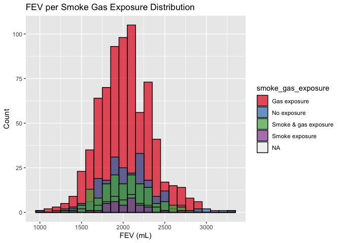

PM566 Homework 2
================
Misha Khan
2022-10-06

For this assignment, we will be analyzing data from USC’s Children’s
Health Study. The learning objectives are to conduct data wrangling and
visualize the data with key questions in mind.

``` r
library(lubridate)
```

    ## 
    ## Attaching package: 'lubridate'

    ## The following objects are masked from 'package:base':
    ## 
    ##     date, intersect, setdiff, union

``` r
library(tidyverse)
```

    ## ── Attaching packages
    ## ───────────────────────────────────────
    ## tidyverse 1.3.2 ──

    ## ✔ ggplot2 3.3.6      ✔ purrr   0.3.4 
    ## ✔ tibble  3.1.8      ✔ dplyr   1.0.10
    ## ✔ tidyr   1.2.1      ✔ stringr 1.4.1 
    ## ✔ readr   2.1.2      ✔ forcats 0.5.2 
    ## ── Conflicts ────────────────────────────────────────── tidyverse_conflicts() ──
    ## ✖ lubridate::as.difftime() masks base::as.difftime()
    ## ✖ lubridate::date()        masks base::date()
    ## ✖ dplyr::filter()          masks stats::filter()
    ## ✖ lubridate::intersect()   masks base::intersect()
    ## ✖ dplyr::lag()             masks stats::lag()
    ## ✖ lubridate::setdiff()     masks base::setdiff()
    ## ✖ lubridate::union()       masks base::union()

``` r
library(data.table)  
```

    ## 
    ## Attaching package: 'data.table'
    ## 
    ## The following objects are masked from 'package:dplyr':
    ## 
    ##     between, first, last
    ## 
    ## The following object is masked from 'package:purrr':
    ## 
    ##     transpose
    ## 
    ## The following objects are masked from 'package:lubridate':
    ## 
    ##     hour, isoweek, mday, minute, month, quarter, second, wday, week,
    ##     yday, year

``` r
library(dtplyr)
library(dplyr)
library(readr)
library(Hmisc)
```

    ## Loading required package: lattice
    ## Loading required package: survival
    ## Loading required package: Formula
    ## 
    ## Attaching package: 'Hmisc'
    ## 
    ## The following objects are masked from 'package:dplyr':
    ## 
    ##     src, summarize
    ## 
    ## The following objects are masked from 'package:base':
    ## 
    ##     format.pval, units

``` r
library(skimr) 
library(leaflet)
library(webshot)
library(psych)
```

    ## 
    ## Attaching package: 'psych'
    ## 
    ## The following object is masked from 'package:Hmisc':
    ## 
    ##     describe
    ## 
    ## The following objects are masked from 'package:ggplot2':
    ## 
    ##     %+%, alpha

# Data Wrangling

Two data sets: individual and regional CHS **individual - personal and
health characteristics of children in 12 communities in Socal**
**regional - air quality at a community level** \### Merge data sets
using location variable

``` r
indv <- read.csv("chs_individual.csv")
reg <- read.csv("chs_regional.csv")
```

Merged data set: chs

``` r
#Location variable = "townname"
chs <- merge(
  # Data
  x     = indv,      
  y     = reg, 
  # List of variables to match
  by  = "townname",
  # Which obs to keep?
  all.x = TRUE,      
  all.y = FALSE
  )
```

## 1. After merging the data, make sure you don’t have any duplicates by counting the number of rows. Make sure it matches.

``` r
skimr::skim(chs)
```

|                                                  |      |
|:-------------------------------------------------|:-----|
| Name                                             | chs  |
| Number of rows                                   | 1200 |
| Number of columns                                | 49   |
| \_\_\_\_\_\_\_\_\_\_\_\_\_\_\_\_\_\_\_\_\_\_\_   |      |
| Column type frequency:                           |      |
| character                                        | 2    |
| numeric                                          | 47   |
| \_\_\_\_\_\_\_\_\_\_\_\_\_\_\_\_\_\_\_\_\_\_\_\_ |      |
| Group variables                                  | None |

Data summary

**Variable type: character**

| skim_variable | n_missing | complete_rate | min | max | empty | n_unique | whitespace |
|:--------------|----------:|--------------:|----:|----:|------:|---------:|-----------:|
| townname      |         0 |             1 |   6 |  13 |     0 |       12 |          0 |
| race          |         0 |             1 |   1 |   1 |     0 |        6 |          0 |

**Variable type: numeric**

| skim_variable | n_missing | complete_rate |    mean |     sd |      p0 |     p25 |     p50 |     p75 |    p100 | hist  |
|:--------------|----------:|--------------:|--------:|-------:|--------:|--------:|--------:|--------:|--------:|:------|
| sid           |         0 |          1.00 | 1037.52 | 592.75 |    1.00 |  528.75 | 1041.50 | 1554.25 | 2053.00 | ▇▇▇▇▇ |
| male          |         0 |          1.00 |    0.49 |   0.50 |    0.00 |    0.00 |    0.00 |    1.00 |    1.00 | ▇▁▁▁▇ |
| hispanic      |         0 |          1.00 |    0.43 |   0.50 |    0.00 |    0.00 |    0.00 |    1.00 |    1.00 | ▇▁▁▁▆ |
| agepft        |        89 |          0.93 |    9.92 |   0.43 |    8.96 |    9.61 |    9.91 |   10.18 |   12.73 | ▅▇▁▁▁ |
| height        |        89 |          0.93 |  138.96 |   6.74 |  114.00 |  135.00 |  139.00 |  143.00 |  165.00 | ▁▃▇▂▁ |
| weight        |        89 |          0.93 |   79.33 |  20.68 |   42.00 |   65.00 |   74.00 |   89.00 |  207.00 | ▇▆▁▁▁ |
| bmi           |        89 |          0.93 |   18.50 |   3.78 |   11.30 |   15.78 |   17.48 |   20.35 |   41.27 | ▇▇▂▁▁ |
| asthma        |        31 |          0.97 |    0.15 |   0.35 |    0.00 |    0.00 |    0.00 |    0.00 |    1.00 | ▇▁▁▁▂ |
| active_asthma |         0 |          1.00 |    0.19 |   0.39 |    0.00 |    0.00 |    0.00 |    0.00 |    1.00 | ▇▁▁▁▂ |
| father_asthma |       106 |          0.91 |    0.08 |   0.28 |    0.00 |    0.00 |    0.00 |    0.00 |    1.00 | ▇▁▁▁▁ |
| mother_asthma |        56 |          0.95 |    0.10 |   0.30 |    0.00 |    0.00 |    0.00 |    0.00 |    1.00 | ▇▁▁▁▁ |
| wheeze        |        71 |          0.94 |    0.33 |   0.47 |    0.00 |    0.00 |    0.00 |    1.00 |    1.00 | ▇▁▁▁▃ |
| hayfever      |       118 |          0.90 |    0.17 |   0.38 |    0.00 |    0.00 |    0.00 |    0.00 |    1.00 | ▇▁▁▁▂ |
| allergy       |        63 |          0.95 |    0.29 |   0.46 |    0.00 |    0.00 |    0.00 |    1.00 |    1.00 | ▇▁▁▁▃ |
| educ_parent   |        64 |          0.95 |    2.80 |   1.11 |    1.00 |    2.00 |    3.00 |    3.00 |    5.00 | ▂▃▇▂▂ |
| smoke         |        40 |          0.97 |    0.16 |   0.37 |    0.00 |    0.00 |    0.00 |    0.00 |    1.00 | ▇▁▁▁▂ |
| pets          |         0 |          1.00 |    0.77 |   0.42 |    0.00 |    1.00 |    1.00 |    1.00 |    1.00 | ▂▁▁▁▇ |
| gasstove      |        33 |          0.97 |    0.78 |   0.41 |    0.00 |    1.00 |    1.00 |    1.00 |    1.00 | ▂▁▁▁▇ |
| fev           |        95 |          0.92 | 2031.27 | 330.67 |  984.85 | 1808.97 | 2022.74 | 2249.72 | 3323.68 | ▁▆▇▂▁ |
| fvc           |        97 |          0.92 | 2323.92 | 397.36 |  894.97 | 2041.08 | 2293.42 | 2572.78 | 3698.33 | ▁▃▇▃▁ |
| mmef          |       106 |          0.91 | 2398.77 | 588.48 |  757.58 | 1993.95 | 2401.52 | 2793.81 | 4935.91 | ▂▇▇▁▁ |
| pm25_mass     |         0 |          1.00 |   14.36 |   7.74 |    5.96 |    7.62 |   10.54 |   20.99 |   29.97 | ▇▁▁▃▁ |
| pm25_so4      |         0 |          1.00 |    1.88 |   0.79 |    0.79 |    1.08 |    1.81 |    2.60 |    3.23 | ▇▃▂▇▂ |
| pm25_no3      |         0 |          1.00 |    4.49 |   3.60 |    0.73 |    1.54 |    2.52 |    7.34 |   12.20 | ▇▁▂▂▁ |
| pm25_nh4      |         0 |          1.00 |    1.76 |   1.23 |    0.41 |    0.74 |    1.14 |    2.77 |    4.25 | ▇▁▂▂▁ |
| pm25_oc       |         0 |          1.00 |    4.55 |   2.64 |    1.45 |    2.52 |    4.04 |    5.35 |   11.83 | ▇▇▂▁▂ |
| pm25_ec       |         0 |          1.00 |    0.74 |   0.40 |    0.13 |    0.40 |    0.58 |    1.17 |    1.36 | ▃▇▁▂▆ |
| pm25_om       |         0 |          1.00 |    5.46 |   3.18 |    1.74 |    3.02 |    4.84 |    6.42 |   14.20 | ▇▇▂▁▂ |
| pm10_oc       |         0 |          1.00 |    5.83 |   3.39 |    1.86 |    3.23 |    5.17 |    6.86 |   15.16 | ▇▇▂▁▂ |
| pm10_ec       |         0 |          1.00 |    0.75 |   0.41 |    0.14 |    0.41 |    0.60 |    1.20 |    1.39 | ▃▇▁▂▆ |
| pm10_tc       |         0 |          1.00 |    6.78 |   3.76 |    1.99 |    3.70 |    6.50 |    8.43 |   16.44 | ▇▃▆▁▂ |
| formic        |         0 |          1.00 |    1.33 |   0.77 |    0.34 |    0.72 |    1.10 |    1.77 |    2.77 | ▇▆▃▂▃ |
| acetic        |         0 |          1.00 |    3.01 |   1.32 |    0.75 |    2.30 |    2.91 |    4.00 |    5.14 | ▅▇▅▇▅ |
| hcl           |         0 |          1.00 |    0.42 |   0.13 |    0.22 |    0.32 |    0.44 |    0.46 |    0.73 | ▆▆▇▂▂ |
| hno3          |         0 |          1.00 |    2.37 |   1.18 |    0.43 |    1.59 |    2.46 |    3.36 |    4.07 | ▇▂▅▇▇ |
| o3_max        |         0 |          1.00 |   60.16 |  14.12 |   38.27 |   49.93 |   64.04 |   67.69 |   84.44 | ▇▅▇▅▅ |
| o3106         |         0 |          1.00 |   47.76 |  11.18 |   28.22 |   41.90 |   46.75 |   55.24 |   67.01 | ▅▅▇▇▅ |
| o3_24         |         0 |          1.00 |   30.22 |  10.20 |   18.22 |   23.31 |   27.59 |   32.39 |   57.76 | ▅▇▁▁▁ |
| no2           |         0 |          1.00 |   18.99 |  10.49 |    4.60 |   12.12 |   16.40 |   23.24 |   37.97 | ▃▇▃▁▅ |
| pm10          |         0 |          1.00 |   32.64 |  14.33 |   18.40 |   20.71 |   29.64 |   39.16 |   70.39 | ▇▃▂▁▁ |
| no_24hr       |       100 |          0.92 |   16.21 |  13.25 |    2.05 |    4.74 |   12.68 |   26.90 |   42.95 | ▇▃▂▂▃ |
| pm2_5\_fr     |       300 |          0.75 |   19.79 |   8.48 |    9.01 |   10.28 |   22.23 |   27.73 |   31.55 | ▇▂▂▂▇ |
| iacid         |         0 |          1.00 |    2.79 |   1.25 |    0.76 |    1.84 |    2.83 |    3.82 |    4.62 | ▇▂▅▇▇ |
| oacid         |         0 |          1.00 |    4.34 |   2.02 |    1.09 |    2.98 |    4.14 |    5.98 |    7.40 | ▅▇▇▂▇ |
| total_acids   |         0 |          1.00 |    6.71 |   3.17 |    1.52 |    4.93 |    6.37 |    9.39 |   11.43 | ▃▃▇▂▆ |
| lon           |         0 |          1.00 | -118.30 |   1.33 | -120.67 | -118.75 | -117.73 | -117.36 | -116.77 | ▅▁▁▆▇ |
| lat           |         0 |          1.00 |   34.20 |   0.65 |   32.84 |   33.93 |   34.10 |   34.65 |   35.49 | ▂▃▇▅▂ |

indv data set: 1200 rows, 23 columns reg data set: 12 rows, 27 columns
chs data set: 1200 rows, 49 columns

When the data sets are merged, the number of rows still stays the same
but the columns increases (23 + 27 - 1 = 49 total cols). There is no
duplicate number of rows, everything matches (nothing lost or
duplicated).

### In the case of missing values, impute data using the average within the variables “male” and “hispanic.”

``` r
#Output the number of columns with number of missing values
which(colSums(is.na(chs)) > 0)
```

    ##        agepft        height        weight           bmi        asthma 
    ##             6             7             8             9            10 
    ## father_asthma mother_asthma        wheeze      hayfever       allergy 
    ##            12            13            14            15            16 
    ##   educ_parent         smoke      gasstove           fev           fvc 
    ##            17            18            20            21            22 
    ##          mmef       no_24hr      pm2_5_fr 
    ##            23            43            44

``` r
chs <- data.table(chs)
chs[, bmi_imp := fcoalesce(bmi, mean(bmi, na.rm = TRUE)), by = .(male, hispanic)]
chs[ , fev_imp := fcoalesce(fev, mean(fev, na.rm = TRUE)), by = .(male, hispanic)]
```

## 2. Create a new categorical variable named “obesity_level” using the BMI measurement (underweight BMI\<14; normal BMI 14-22; overweight BMI 22-24; obese BMI\>24).

``` r
chs <- as.data.frame(chs)
chs <-
  chs %>%
  mutate(obesity_level = case_when(chs$bmi_imp < 14  ~ 'Underweight', 
                              chs$bmi_imp >= 14 & chs$bmi_imp < 22  ~ 'Normal', 
                              chs$bmi_imp >= 22 & chs$bmi_imp < 24  ~ 'Overweight', 
                              chs$bmi_imp >= 24  ~ 'Obese'))
```

### To make sure the variable is rightly coded, create a summary table that contains the minimum BMI, maximum BMI, and the total number of observations per category.

``` r
chs %>%
  group_by(obesity_level) %>%
  summarise(
    min_bmi  = min(bmi), 
    max_bmi  = max(bmi),
    mean_bmi = mean(bmi),
    n_bmi    = n()) %>%
knitr::kable()
```

| obesity_level |  min_bmi |  max_bmi | mean_bmi | n_bmi |
|:--------------|---------:|---------:|---------:|------:|
| Normal        |       NA |       NA |       NA |   975 |
| Obese         | 24.00647 | 41.26613 | 26.97446 |   103 |
| Overweight    | 22.02353 | 23.99650 | 22.93748 |    87 |
| Underweight   | 11.29640 | 13.98601 | 13.32074 |    35 |

## 3. Create another categorical variable named “smoke_gas_exposure” that summarizes “Second Hand Smoke” and “Gas Stove.” The variable should have four categories in total

``` r
chs <-
  chs %>%
  mutate(smoke_gas_exposure = case_when(chs$smoke == 0 & chs$gasstove == 0 ~ 'No exposure',
                                        chs$smoke == 1 & chs$gasstove == 1 ~ 'Smoke & gas exposure',
                                        chs$smoke == 0 & chs$gasstove == 1 ~ 'Gas exposure',
                                        chs$smoke == 1 & chs$gasstove == 0 ~ 'Smoke exposure'))
table(chs$smoke_gas_exposure)
```

    ## 
    ##         Gas exposure          No exposure Smoke & gas exposure 
    ##                  739                  214                  151 
    ##       Smoke exposure 
    ##                   36

## Create four summary tables showing the average (or proportion, if binary) and sd of “Forced expiratory volume in 1 second (ml)” and asthma indicator by town, sex, obesity level, and “smoke_gas_exposure.”

``` r
chs %>%
  group_by(townname) %>%
  summarise(
    n    = n(),
    mean_fev  = mean(fev_imp), 
    sd_fev  = sd(fev_imp),
    mean_fev = mean(fev_imp)) %>%
    #prop_asthma = sum(asthma)/n()*100) %>%
  #distinct(townname, .keep_all = T) %>%
knitr::kable()
```

| townname      |   n | mean_fev |   sd_fev |
|:--------------|----:|---------:|---------:|
| Alpine        | 100 | 2087.101 | 291.1768 |
| Atascadero    | 100 | 2075.897 | 324.0935 |
| Lake Elsinore | 100 | 2038.849 | 303.6956 |
| Lake Gregory  | 100 | 2084.700 | 319.9593 |
| Lancaster     | 100 | 2003.044 | 317.1298 |
| Lompoc        | 100 | 2034.354 | 351.0454 |
| Long Beach    | 100 | 1985.861 | 319.4625 |
| Mira Loma     | 100 | 1985.202 | 324.9634 |
| Riverside     | 100 | 1989.881 | 277.5065 |
| San Dimas     | 100 | 2026.794 | 318.7845 |
| Santa Maria   | 100 | 2025.750 | 312.1725 |
| Upland        | 100 | 2024.266 | 343.1637 |

# EDA

Primary questions of interest **What is the association between BMI and
FEV?** **What is the association between smoke and gas exposure and
FEV?** **What is the association between PM2.5 and FEV?**

## Checklist

``` r
#Check the dimensions and headers and footers of the data
dim(chs)
```

    ## [1] 1200   53

``` r
#Check the variable types in the data
str(chs)
```

    ## 'data.frame':    1200 obs. of  53 variables:
    ##  $ townname          : chr  "Alpine" "Alpine" "Alpine" "Alpine" ...
    ##  $ sid               : int  841 835 838 840 865 867 842 839 844 847 ...
    ##  $ male              : int  1 0 0 0 0 0 1 0 1 1 ...
    ##  $ race              : chr  "W" "W" "O" "W" ...
    ##  $ hispanic          : int  1 0 1 0 0 1 1 1 1 0 ...
    ##  $ agepft            : num  10.55 10.1 9.49 9.97 10.04 ...
    ##  $ height            : int  150 143 133 146 162 141 139 142 143 137 ...
    ##  $ weight            : int  78 69 62 78 140 94 65 86 65 69 ...
    ##  $ bmi               : num  15.8 15.3 15.9 16.6 24.2 ...
    ##  $ asthma            : int  0 0 0 0 1 0 0 0 NA 0 ...
    ##  $ active_asthma     : int  0 0 0 0 1 0 0 0 0 0 ...
    ##  $ father_asthma     : int  0 0 0 0 0 NA 0 0 NA 0 ...
    ##  $ mother_asthma     : int  0 0 0 0 0 0 0 1 NA 0 ...
    ##  $ wheeze            : int  0 0 0 0 1 0 1 1 NA 0 ...
    ##  $ hayfever          : int  0 0 0 0 0 0 0 1 NA 0 ...
    ##  $ allergy           : int  0 1 0 0 1 0 0 1 NA 0 ...
    ##  $ educ_parent       : int  5 3 4 NA 3 5 1 3 NA 5 ...
    ##  $ smoke             : int  0 0 NA NA 0 0 1 1 NA 0 ...
    ##  $ pets              : int  1 1 1 0 1 1 1 1 0 1 ...
    ##  $ gasstove          : int  0 0 0 NA 1 1 0 0 NA 1 ...
    ##  $ fev               : num  2252 2529 1738 2467 2584 ...
    ##  $ fvc               : num  2595 2826 1964 2638 3568 ...
    ##  $ mmef              : num  2445 3407 2133 3466 2071 ...
    ##  $ pm25_mass         : num  8.74 8.74 8.74 8.74 8.74 8.74 8.74 8.74 8.74 8.74 ...
    ##  $ pm25_so4          : num  1.73 1.73 1.73 1.73 1.73 1.73 1.73 1.73 1.73 1.73 ...
    ##  $ pm25_no3          : num  1.59 1.59 1.59 1.59 1.59 1.59 1.59 1.59 1.59 1.59 ...
    ##  $ pm25_nh4          : num  0.88 0.88 0.88 0.88 0.88 0.88 0.88 0.88 0.88 0.88 ...
    ##  $ pm25_oc           : num  2.54 2.54 2.54 2.54 2.54 2.54 2.54 2.54 2.54 2.54 ...
    ##  $ pm25_ec           : num  0.48 0.48 0.48 0.48 0.48 0.48 0.48 0.48 0.48 0.48 ...
    ##  $ pm25_om           : num  3.04 3.04 3.04 3.04 3.04 3.04 3.04 3.04 3.04 3.04 ...
    ##  $ pm10_oc           : num  3.25 3.25 3.25 3.25 3.25 3.25 3.25 3.25 3.25 3.25 ...
    ##  $ pm10_ec           : num  0.49 0.49 0.49 0.49 0.49 0.49 0.49 0.49 0.49 0.49 ...
    ##  $ pm10_tc           : num  3.75 3.75 3.75 3.75 3.75 3.75 3.75 3.75 3.75 3.75 ...
    ##  $ formic            : num  1.03 1.03 1.03 1.03 1.03 1.03 1.03 1.03 1.03 1.03 ...
    ##  $ acetic            : num  2.49 2.49 2.49 2.49 2.49 2.49 2.49 2.49 2.49 2.49 ...
    ##  $ hcl               : num  0.41 0.41 0.41 0.41 0.41 0.41 0.41 0.41 0.41 0.41 ...
    ##  $ hno3              : num  1.98 1.98 1.98 1.98 1.98 1.98 1.98 1.98 1.98 1.98 ...
    ##  $ o3_max            : num  65.8 65.8 65.8 65.8 65.8 ...
    ##  $ o3106             : num  55 55 55 55 55 ...
    ##  $ o3_24             : num  41.2 41.2 41.2 41.2 41.2 ...
    ##  $ no2               : num  12.2 12.2 12.2 12.2 12.2 ...
    ##  $ pm10              : num  24.7 24.7 24.7 24.7 24.7 ...
    ##  $ no_24hr           : num  2.48 2.48 2.48 2.48 2.48 2.48 2.48 2.48 2.48 2.48 ...
    ##  $ pm2_5_fr          : num  10.3 10.3 10.3 10.3 10.3 ...
    ##  $ iacid             : num  2.39 2.39 2.39 2.39 2.39 2.39 2.39 2.39 2.39 2.39 ...
    ##  $ oacid             : num  3.52 3.52 3.52 3.52 3.52 3.52 3.52 3.52 3.52 3.52 ...
    ##  $ total_acids       : num  5.5 5.5 5.5 5.5 5.5 5.5 5.5 5.5 5.5 5.5 ...
    ##  $ lon               : num  -117 -117 -117 -117 -117 ...
    ##  $ lat               : num  32.8 32.8 32.8 32.8 32.8 ...
    ##  $ bmi_imp           : num  15.8 15.3 15.9 16.6 24.2 ...
    ##  $ fev_imp           : num  2252 2529 1738 2467 2584 ...
    ##  $ obesity_level     : chr  "Normal" "Normal" "Normal" "Normal" ...
    ##  $ smoke_gas_exposure: chr  "No exposure" "No exposure" NA NA ...

``` r
#Conduct some summary statistics to answer the initial question
summary(chs$bmi)
```

    ##    Min. 1st Qu.  Median    Mean 3rd Qu.    Max.    NA's 
    ##   11.30   15.78   17.48   18.50   20.35   41.27      89

``` r
summary(chs$fev)
```

    ##    Min. 1st Qu.  Median    Mean 3rd Qu.    Max.    NA's 
    ##   984.8  1809.0  2022.7  2031.3  2249.7  3323.7      95

``` r
summary(chs$smoke)
```

    ##    Min. 1st Qu.  Median    Mean 3rd Qu.    Max.    NA's 
    ##  0.0000  0.0000  0.0000  0.1638  0.0000  1.0000      40

``` r
summary(chs$gasstove)
```

    ##    Min. 1st Qu.  Median    Mean 3rd Qu.    Max.    NA's 
    ##  0.0000  1.0000  1.0000  0.7815  1.0000  1.0000      33

``` r
summary(chs$pm2_5_fr)
```

    ##    Min. 1st Qu.  Median    Mean 3rd Qu.    Max.    NA's 
    ##    9.01   10.28   22.23   19.79   27.73   31.55     300

## 1. Facet plot showing scatterplots with regression lines of BMI vs FEV by “townname”.

``` r
chs %>%
  ggplot(aes(x = bmi, y = fev, group = townname)) +
  geom_point(mapping = aes(x = bmi, y = fev, color = townname)) +
  geom_smooth(se = T, method = "lm") +
  scale_color_brewer(palette = "Paired") +
  facet_wrap( ~ townname, nrow= 3) +
  ggtitle("BMI vs FEV per Town") +
  xlab("BMI") +
  ylab("FEV (mL)")
```

    ## `geom_smooth()` using formula 'y ~ x'

    ## Warning: Removed 95 rows containing non-finite values (stat_smooth).

    ## Warning: Removed 95 rows containing missing values (geom_point).

<!-- --> All the
towns show a positive linear relationship with BMI and FEV meaning as
BMI increases, FEV also increases. Towns like Lake Elsinore, Lompoc,
Long Beach, San Dimas, Santa Maria, and Upland have a fairly steeper
slope just at a glace. Additional statistical analysis will need to be
conducted to confirm.

# 2. Stacked histograms of FEV by BMI category and FEV by smoke/gas exposure. Use different color schemes than the ggplot default.

``` r
chs %>%
  ggplot(mapping = aes(x = fev, fill = obesity_level)) + 
  geom_histogram(position = "identity", alpha = 0.7, binwidth = 100, color = "black") +
  scale_fill_brewer(palette = "Dark2") +
  ggtitle("FEV per Obesity Level Distribution") +
  xlab("FEV (mL)") +
  ylab("Count")
```

    ## Warning: Removed 95 rows containing non-finite values (stat_bin).

<!-- --> Here is
the distribution breakdown of FEV per obesity levels. Normal BMI level
looks like to have a normal distribution. The majority of individuals
with normal BMI level have an FEV around \~2000 mL on average. We can
see that individuals with a underweight BMI level have a lower FEV while
those with obese BMI level have a higher FEV.

``` r
chs %>%
  ggplot(mapping = aes(x = fev, fill = smoke_gas_exposure)) + 
  geom_histogram(position = "identity", alpha = 0.7, binwidth = 100, color = "black") +
  scale_fill_brewer(palette = "Set1") +
  ggtitle("FEV per Smoke Gas Exposure Distribution") +
  xlab("FEV (mL)") +
  ylab("Count")
```

    ## Warning: Removed 95 rows containing non-finite values (stat_bin).

<!-- --> Here is a
distribution breakdown of FEV per smoke gas exposure. The majority of
individuals fall into the gas exposure category. The gas exposure
distribution lies around the middle \~2000 mL. The rest of the other
categories also lie around the middle but have lower count of
individuals.

## 3. Barchart of BMI by smoke/gas exposure.

``` r
chs %>%
  ggplot(mapping = aes(x = obesity_level, fill = factor(smoke_gas_exposure))) + 
  geom_bar(position = "dodge") +
  scale_fill_brewer(palette = "Paired") +
  ggtitle("BMI per Smoke Gas Exposure") +
  xlab("BMI") +
  ylab("Obesity Level") +
  labs(fill = "Exposure")
```

<!-- --> Here is a
barchart of smoke and gas exposure per obesity level. Individuals with a
normal BMI level have the highest exposure to gas (over 450). Across all
BMI categories, gas exposure is the highest.

## 4. Statistical summary graphs of FEV by BMI and FEV by smoke/gas exposure category.

``` r
chs %>%
    ggplot(mapping = aes(x = obesity_level, y = fev, color = obesity_level)) + 
    stat_summary(fun.data = mean_sdl, geom = "pointrange") +
    stat_summary(fun.data = mean_sdl, geom = "errorbar")+
  labs (title = "Statisitical Summary of FEV by BMI")
```

    ## Warning: Removed 95 rows containing non-finite values (stat_summary).
    ## Removed 95 rows containing non-finite values (stat_summary).

<!-- -->

ADD INTERPRETATION

``` r
chs %>%
    ggplot(mapping = aes(x = smoke_gas_exposure, y = fev, color = smoke_gas_exposure)) + 
    stat_summary(fun.data = mean_sdl, geom = "pointrange") +
    stat_summary(fun.data = mean_sdl, geom = "errorbar")+
  labs (title = "Statisitical Summary of FEV by Exposure")
```

    ## Warning: Removed 95 rows containing non-finite values (stat_summary).
    ## Removed 95 rows containing non-finite values (stat_summary).

<!-- -->

ADD INTERPRETATION

## 5. A leaflet map showing the concentrations of PM2.5 mass in each of the CHS communities.

``` r
pm.pal <- colorFactor(c('red', 'yellow', 'blue', 'green'), domain = chs$pm25_mass)
```

``` r
#chs[!is.na(pm25_mass)]%>%
  pm_map <- 
  leaflet(chs) %>% 
  addProviderTiles('CartoDB.Positron') %>% 
  addCircles(
    lat = ~lat, 
    lng = ~lon,
    label = ~paste0(chs$pm25_mass),
    color = ~ pm.pal(chs$pm25_mass),
    opacity = 0.5,
    fillOpacity = 1,
    radius = 500
    ) %>%
  addLegend('bottomleft', 
            pal = pm.pal, 
            values = chs$pm25_mass,
            title = 'PM 2.5 Mass', 
            opacity = 1)
pm_map
```

<!-- --> We can
see from the leaflet plot that the higher concentration of PM 2.5 mass
are in more centrally located in Southern California (Ontario,
Riverside). As we move away from that area, PM 2.5 mass decreases. Areas
like San Luis Obispo, Santa Maria, Santa Barbara, and San Diego show
lower levels of PM 2.5 mass concentration.

## 6. Choose a visualization to examine whether PM2.5 mass is associated with FEV.

``` r
chs %>%
    ggplot(mapping = aes(x = pm25_mass, y = fev, color = fev)) + 
    geom_point(mapping = aes(x = pm25_mass, y = fev)) +
    scale_color_gradient(low = "blue", high = "red") +
    geom_jitter() +
    geom_smooth(method = lm, se = F, col = "black")
```

    ## `geom_smooth()` using formula 'y ~ x'

    ## Warning: Removed 95 rows containing non-finite values (stat_smooth).

    ## Warning: Removed 95 rows containing missing values (geom_point).
    ## Removed 95 rows containing missing values (geom_point).

<!-- --> Above is
a graph of the relationship between PM 2.5 mass and FEV. We see three
separate ranges of PM 2.5 mass: 10, 20, 30. As the PM 2.5 mass
increases, the black line shows a slight decrease in FEV. PM 2.5 mass of
10 has the highest FEV points while PM 2.5 mass 30 is slighty lower.

``` r
#Group the columns with missing values (integer and numeric cols)
fix_na <- c("agepft", 
            "height", 
            "weight", 
            "bmi", 
            "asthma", 
            "father_asthma", 
            "mother_asthma", 
            "wheeze", 
            "hayfever",
            "allergy",
            "educ_parent",
            "smoke", 
            "gasstove",
            "fev",
            "fvc",
            "mmef",
            "no_24hr",
            "pm2_5_fr")

sum(is.na(chs[fix_na]))
```

    ## [1] 1636
