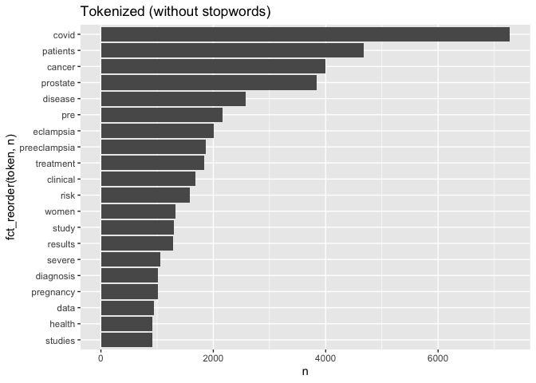

hw3
================
Misha Khan
2022-11-04

``` r
library(tidytext)
library(tidyverse)
```

    ## ── Attaching packages ─────────────────────────────────────── tidyverse 1.3.2 ──
    ## ✔ ggplot2 3.3.6      ✔ purrr   0.3.4 
    ## ✔ tibble  3.1.8      ✔ dplyr   1.0.10
    ## ✔ tidyr   1.2.1      ✔ stringr 1.4.1 
    ## ✔ readr   2.1.2      ✔ forcats 0.5.2 
    ## ── Conflicts ────────────────────────────────────────── tidyverse_conflicts() ──
    ## ✖ dplyr::filter() masks stats::filter()
    ## ✖ dplyr::lag()    masks stats::lag()

``` r
library(data.table)
```

    ## 
    ## Attaching package: 'data.table'
    ## 
    ## The following objects are masked from 'package:dplyr':
    ## 
    ##     between, first, last
    ## 
    ## The following object is masked from 'package:purrr':
    ## 
    ##     transpose

``` r
library(dplyr)
library(dtplyr)
library(ggplot2)
library(forcats)
library(stringr)
library(rvest)
```

    ## 
    ## Attaching package: 'rvest'
    ## 
    ## The following object is masked from 'package:readr':
    ## 
    ##     guess_encoding

``` r
library(xml2)
```

### APIs

#### Using the NCBI API, look for papers that show up under the term “sars-cov-2 trial vaccine.” Look for the data in the pubmed database, and then retrieve the details of the paper as shown in lab 7. How many papers were you able to find?

``` r
# Downloading the website
website <- xml2::read_html("https://pubmed.ncbi.nlm.nih.gov/?term=sars-cov-2+trial+vaccine")

# Finding the counts
counts <- xml2::xml_find_first(website, "/html/body/main/div[9]/div[2]/div[2]/div[1]/div[1]")

# Turning it into character
counts<- as.character(counts)

# Extracting the data using regex
stringr::str_extract(counts, "[0-9,]+")
```

    ## [1] "4,009"

There are 4,007 papers on the term “sars-cov-2 trial vaccine”.

``` r
# Downloading the website
website <- xml2::read_html("https://pubmed.ncbi.nlm.nih.gov/?term=sars-cov-2+trial+vaccine")

# Finding the counts
counts <- xml2::xml_find_first(website, "/html/body/main/div[9]/div[2]/div[2]/div[1]/div[1]")

# Turning it into text
counts <- as.character(counts)

# Extracting the data using regex
stringr::str_extract(counts, "[0-9,]+")
```

    ## [1] "4,009"

``` r
library(httr)
query_ids <- GET(
  url   = "https://eutils.ncbi.nlm.nih.gov/entrez/eutils/esearch.fcgi",
  query = list(
    db = "pubmed",
    term = "sars-cov-2 trial vaccine",
    retmax = 250
  ),
)

# Extracting the content of the response of GET
ids <- httr::content(query_ids)

# Turning it into character
ids <- as.character(ids)

# Find all the ids 
ids <- stringr::str_extract_all(ids, "<Id>[[:digit:]]+</Id>")[[1]]

# Remove all the leading and trailing <Id> </Id>. Make use of "|"
ids <- stringr::str_remove_all(ids, "</?Id>")

head(ids)
```

    ## [1] "36328399" "36327352" "36322837" "36320825" "36314847" "36307830"

#### Using the list of pubmed ids you retrieved, download each papers’ details using the query parameter rettype = abstract. If you get more than 250 ids, just keep the first 250.

``` r
publications <- GET(
    url   = "https://eutils.ncbi.nlm.nih.gov/entrez/eutils/efetch.fcgi",
    query = list(
    db  = "pubmed",
    id  = paste(ids,collapse = ","),
    retmax = 250,
    rettype = "abstract"
    )
)
# Extracting the content of the response of GET
publications <- httr::content(publications)

publications_txt <- as.character(publications)
```

#### As we did in lab 7. Create a dataset containing the following:

Pubmed ID number,Title of the paper, Name of the journal where it was
published, Publication date, and Abstract of the paper (if any)

``` r
pub_char_list <- xml2::xml_children(publications)
pub_char_list <- sapply(pub_char_list, as.character)
```

Abstract

``` r
abstracts <- str_extract(pub_char_list, "<Abstract>[[:print:][:space:]]+</Abstract>")
abstracts <- str_remove_all(abstracts, "</?[[:alnum:]- =\"]+>") 
abstracts <- str_replace_all(abstracts, "[[:space:]]+", " ")
abstracts.s <- substring(abstracts, 1, 100) #Extract first 100 characters of abstract
abstracts[[1]]
```

    ## [1] " Humoral vaccine responses to SARS-CoV-2 vaccines are impaired and short lasting in patients with immune-mediated inflammatory diseases (IMID) following two vaccine doses. To protect these vulnerable patients against severe COVID-19 disease, a three-dose primary vaccination strategy has been implemented in many countries. The aim of this study was to evaluate humoral response and safety of primary vaccination with three doses in patients with IMID. Patients with IMID on immunosuppressive therapy and healthy controls receiving three-dose and two-dose primary SARS-CoV-2 vaccination, respectively, were included in this prospective observational cohort study. Anti-Spike antibodies were assessed 2-4 weeks, and 12 weeks following each dose. The main outcome was anti-Spike antibody levels 2-4 weeks following three doses in patients with IMID and two doses in controls. Additional outcomes were the antibody decline rate and adverse events. 1100 patients and 303 controls were included. Following three-dose vaccination, patients achieved median (IQR) antibody levels of 5720 BAU/mL (2138-8732) compared with 4495 (1591-6639) in controls receiving two doses, p=0.27. Anti-Spike antibody levels increased with median 1932 BAU/mL (IQR 150-4978) after the third dose. The interval between the vaccine doses and vaccination with mRNA-1273 or a combination of vaccines were associated with antibody levels following the third dose. Antibody levels had a slower decline-rate following the third than the second vaccine dose, p&lt;0.001. Adverse events were reported by 464 (47%) patients and by 196 (78%) controls. Disease flares were reported by 70 (7%) patients. This study shows that additional vaccine doses to patients with IMID contribute to strong and sustained immune-responses comparable to healthy persons vaccinated twice, and supports repeated vaccination of patients with IMID. NCT04798625. © Author(s) (or their employer(s)) 2022. Re-use permitted under CC BY-NC. No commercial re-use. See rights and permissions. Published by BMJ. "

Title

``` r
titles <- str_extract(pub_char_list, "<ArticleTitle>[[:print:][:space:]]+</ArticleTitle>")
titles <- str_remove_all(titles, "</?[[:alnum:]- =\"]+>")
titles[[1]]
```

    ## [1] "Immunogenicity and safety of a three-dose SARS-CoV-2 vaccination strategy in patients with immune-mediated inflammatory diseases on immunosuppressive therapy."

Journal

``` r
journals <- str_extract(pub_char_list, "<Title>[[:print:][:space:]]+</Title>")
journals <- str_remove_all(journals, "</?[[:alnum:]- =\"]+>")
journals <- str_replace_all(journals, "[[:space:]]+", " ")
journals[[1]]
```

    ## [1] "RMD open"

Publication date

``` r
#pubdate <- str_extract(pub_char_list, "<PubDate>[[:print:][:space:]]+</PubDate>")
#pubdate <- str_remove_all(pubdate, "</?[[:alnum:]- =\"]+>")
#pubdate <- str_replace_all(pubdate, "[[:space:]]+", " ")
#pubdate[[1]]
```

Fix date

``` r
pubyear <- str_extract(pub_char_list, "<Year>[0-9]{4}</Year>")
pubyear <- str_remove_all(pubyear, "</?[[:alnum:]- =\"]+>")
pubmonth <- str_extract(pub_char_list, "<Month>[a-zA-Z]{3}</Month>")
pubmonth <- str_remove_all(pubmonth, "</?[[:alnum:]- =\"]+>")
pubday <- str_extract(pub_char_list, "<Day>[0-9]{1,2}</Day>")
pubday <- str_remove_all(pubday, "</?[[:alnum:]- =\"]+>")
pubdate <- paste(pubmonth, pubday, pubyear)
pubdate[[1]]
```

    ## [1] "Nov 03 2022"

Combine into dataset

``` r
database <- data.frame(
  PubMedId = ids,
  Title    = titles,
  Journal = journals,
  PubDate = pubdate,
  Abstract = abstracts
)
```

``` r
databasetop5 <- data.frame(
  PubMedId = ids,
  Title    = titles,
  Journal = journals,
  PubDate = pubdate,
  Abstract = abstracts.s
)

knitr::kable(databasetop5[1:5,], caption = "Top 5 paper results about Covid-19")
```

| PubMedId | Title                                                                                                                                                                                                                 | Journal                             | PubDate     | Abstract                                                                                            |
|:---------|:----------------------------------------------------------------------------------------------------------------------------------------------------------------------------------------------------------------------|:------------------------------------|:------------|:----------------------------------------------------------------------------------------------------|
| 36328399 | Immunogenicity and safety of a three-dose SARS-CoV-2 vaccination strategy in patients with immune-mediated inflammatory diseases on immunosuppressive therapy.                                                        | RMD open                            | Nov 03 2022 | Humoral vaccine responses to SARS-CoV-2 vaccines are impaired and short lasting in patients with im |
| 36327352 | S-217622, a SARS-CoV-2 main protease inhibitor, decreases viral load and ameliorates COVID-19 severity in hamsters.                                                                                                   | Science translational medicine      | Nov 03 2022 | In parallel with vaccination, oral antiviral agents are highly anticipated to act as countermeasure |
| 36322837 | Covid-19 Vaccine Protection among Children and Adolescents in Qatar.                                                                                                                                                  | The New England journal of medicine | Nov 02 2022 | The BNT162b2 vaccine against coronavirus disease 2019 (Covid-19) has been authorized for use in chi |
| 36320825 | Withholding methotrexate after vaccination with ChAdOx1 nCov19 in patients with rheumatoid or psoriatic arthritis in India (MIVAC I and II): results of two, parallel, assessor-masked, randomised controlled trials. | The Lancet. Rheumatology            | Nov 02 2022 | There is a necessity for an optimal COVID-19 vaccination strategy for vulnerable population groups, |
| 36314847 | An online community peer support intervention to promote COVID-19 vaccine information among essential workers: a randomized trial.                                                                                    | Annals of medicine                  | Dec 02 2022 | Vaccine hesitancy is still rampant in the United States, including health care personnel. Vaccinati |

Top 5 paper results about Covid-19

# Text Mining

A new dataset has been added to the data science data repository
<https://github.com/USCbiostats/data-science-data/tree/master/03_pubmed>.
The dataset contains 3241 abstracts from articles across 5 search terms.
Your job is to analyse these abstracts to find interesting insights.

``` r
pubmed <- read_csv("https://raw.githubusercontent.com/USCbiostats/data-science-data/master/03_pubmed/pubmed.csv")
```

    ## Rows: 3241 Columns: 2
    ## ── Column specification ────────────────────────────────────────────────────────
    ## Delimiter: ","
    ## chr (2): abstract, term
    ## 
    ## ℹ Use `spec()` to retrieve the full column specification for this data.
    ## ℹ Specify the column types or set `show_col_types = FALSE` to quiet this message.

``` r
pubmed <- as_tibble(pubmed)
table(pubmed$term)
```

    ## 
    ##           covid cystic fibrosis      meningitis    preeclampsia prostate cancer 
    ##             981             376             317             780             787

#### 1. Tokenize the abstracts and count the number of each token. Do you see anything interesting? Does removing stop words change what tokens appear as the most frequent? What are the 5 most common tokens for each search term after removing stopwords?

``` r
# With stopwords
pubmed %>%
  unnest_tokens(word, abstract) %>%
  count(word, sort = TRUE) %>%
  top_n(20, n) %>%
  ggplot(aes(n, fct_reorder(word, n))) +
  geom_col() +
  labs(title = "Tokenize (with stopwords)")
```

<!-- --> With the
stop words, the most common words are “the”, “of”, and “and”. These
words are common in readings. In order to get a more meaningful analysis
of text mining, it is best to remove stop words.

``` r
# Removing stopwords
pubmed %>%
  unnest_tokens(token, abstract) %>%
  anti_join(stop_words, by = c("token" = "word")) %>%
  count(token, sort = TRUE) %>%
  filter(!grepl(pattern = "^[0-9]+$", x = token)) %>%
  top_n(20, n) %>%
  ggplot(aes(n, fct_reorder(token, n)))+
  geom_col() +
  labs(title = "Tokenized (without stopwords)")
```

<!-- --> After
removing stop words, the results are more meaninful. We can see from the
graph above there is more medical terminology like “covid”, “patients”,
and “cancer”.

#### 2. Tokenize the abstracts into bigrams. Find the 10 most common bigram and visualize them with ggplot2.

``` r
pubmed %>%
  unnest_ngrams(bigram, abstract, n = 2) %>%
  count(bigram, sort = TRUE) %>%
  top_n(10, n) %>%
  ggplot(aes(n, fct_reorder(bigram, n))) +
  geom_col() +
  labs(title = "Top 10 Bigrams")
```

<!-- --> There is
still some stop words that appear but most common medical bigram phrases
are “covid 19”, “prostate cancer”, and “pre eclampsia”.

#### 3. Calculate the TF-IDF value for each word-search term combination. What are the 5 tokens from each search term with the highest TF-IDF value? How are the results different from the answers you got in question 1?

``` r
pubmed %>%
  unnest_tokens(word, abstract) %>%
  group_by(term) %>%
  count(word, sort = TRUE) %>%
  filter(!(word %in% stop_words$word)) %>%
  top_n(5, n) %>%
  bind_tf_idf(word, term, n) %>%
  arrange(term, desc(tf_idf))%>%
  knitr::kable(caption = "Highest TF-IDF Values")
```

| term            | word         |    n |        tf |       idf |    tf_idf |
|:----------------|:-------------|-----:|----------:|----------:|----------:|
| covid           | covid        | 7275 | 0.3965442 | 1.6094379 | 0.6382133 |
| covid           | 19           | 7035 | 0.3834623 | 1.6094379 | 0.6171588 |
| covid           | pandemic     |  800 | 0.0436062 | 1.6094379 | 0.0701815 |
| covid           | patients     | 2293 | 0.1249864 | 0.2231436 | 0.0278899 |
| covid           | disease      |  943 | 0.0514009 | 0.5108256 | 0.0262569 |
| cystic fibrosis | fibrosis     |  867 | 0.2595808 | 1.6094379 | 0.4177792 |
| cystic fibrosis | cystic       |  862 | 0.2580838 | 1.6094379 | 0.4153699 |
| cystic fibrosis | cf           |  625 | 0.1871257 | 1.6094379 | 0.3011673 |
| cystic fibrosis | disease      |  400 | 0.1197605 | 0.5108256 | 0.0611767 |
| cystic fibrosis | patients     |  586 | 0.1754491 | 0.2231436 | 0.0391503 |
| meningitis      | meningitis   |  429 | 0.2885003 | 1.6094379 | 0.4643234 |
| meningitis      | meningeal    |  219 | 0.1472764 | 1.6094379 | 0.2370322 |
| meningitis      | csf          |  206 | 0.1385340 | 1.6094379 | 0.2229618 |
| meningitis      | clinical     |  187 | 0.1257566 | 1.6094379 | 0.2023974 |
| meningitis      | patients     |  446 | 0.2999328 | 0.2231436 | 0.0669281 |
| preeclampsia    | pre          | 2038 | 0.2525090 | 1.6094379 | 0.4063975 |
| preeclampsia    | eclampsia    | 2005 | 0.2484203 | 1.6094379 | 0.3998170 |
| preeclampsia    | preeclampsia | 1863 | 0.2308264 | 1.6094379 | 0.3715008 |
| preeclampsia    | women        | 1196 | 0.1481849 | 1.6094379 | 0.2384943 |
| preeclampsia    | pregnancy    |  969 | 0.1200595 | 1.6094379 | 0.1932283 |
| prostate cancer | cancer       | 3840 | 0.3770621 | 1.6094379 | 0.6068580 |
| prostate cancer | prostate     | 3832 | 0.3762765 | 1.6094379 | 0.6055937 |
| prostate cancer | treatment    |  926 | 0.0909269 | 1.6094379 | 0.1463413 |
| prostate cancer | disease      |  652 | 0.0640220 | 0.5108256 | 0.0327041 |
| prostate cancer | patients     |  934 | 0.0917125 | 0.2231436 | 0.0204651 |

Highest TF-IDF Values

Term “covid”: covid, 19, pandemic, patients, disease Term “cystic
fibrosis”: fibrosis, cystic, cf, disease, patients Term “meningitis”:
meningitis, meningeal, csf, clinical, patients Term “preeclampsia”: pre,
eclampsia, women, pregnancy Term “prostate cancer”: cancer, prostate,
treatment, disease, patients

These results are very different than the results from question 1. The
results above are more relevant to the medical terminology.
