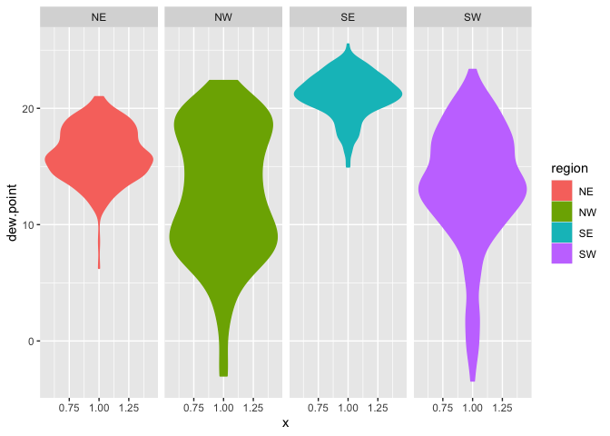
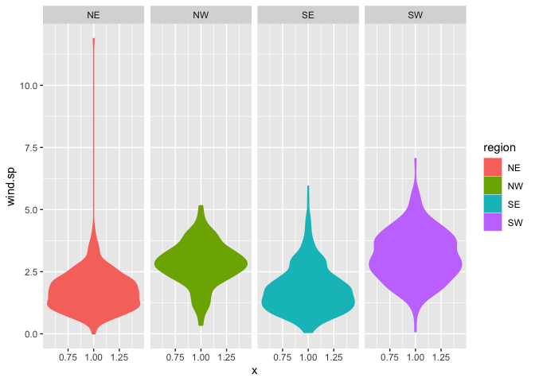
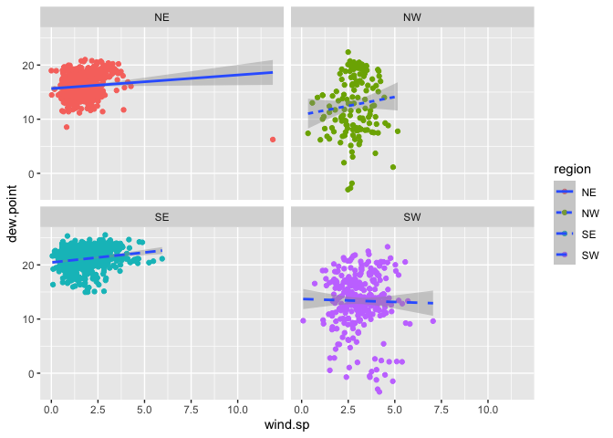
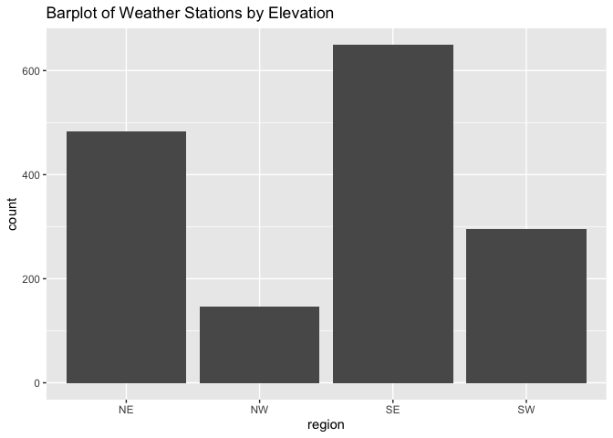
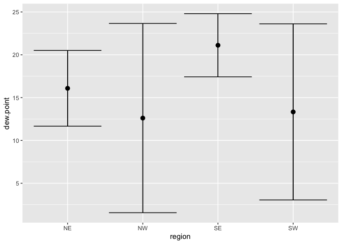

PM566 Lab 4
================
Misha Khan
9/14/2022

``` r
library(lubridate)
```

    ## 
    ## Attaching package: 'lubridate'

    ## The following objects are masked from 'package:base':
    ## 
    ##     date, intersect, setdiff, union

``` r
library(tidyverse)
```

    ## ── Attaching packages
    ## ───────────────────────────────────────
    ## tidyverse 1.3.2 ──

    ## ✔ ggplot2 3.3.6      ✔ purrr   0.3.4 
    ## ✔ tibble  3.1.8      ✔ dplyr   1.0.10
    ## ✔ tidyr   1.2.1      ✔ stringr 1.4.1 
    ## ✔ readr   2.1.2      ✔ forcats 0.5.2 
    ## ── Conflicts ────────────────────────────────────────── tidyverse_conflicts() ──
    ## ✖ lubridate::as.difftime() masks base::as.difftime()
    ## ✖ lubridate::date()        masks base::date()
    ## ✖ dplyr::filter()          masks stats::filter()
    ## ✖ lubridate::intersect()   masks base::intersect()
    ## ✖ dplyr::lag()             masks stats::lag()
    ## ✖ lubridate::setdiff()     masks base::setdiff()
    ## ✖ lubridate::union()       masks base::union()

``` r
library(data.table)
```

    ## 
    ## Attaching package: 'data.table'
    ## 
    ## The following objects are masked from 'package:dplyr':
    ## 
    ##     between, first, last
    ## 
    ## The following object is masked from 'package:purrr':
    ## 
    ##     transpose
    ## 
    ## The following objects are masked from 'package:lubridate':
    ## 
    ##     hour, isoweek, mday, minute, month, quarter, second, wday, week,
    ##     yday, year

``` r
library(leaflet)
```

## 1. Load data

``` r
#cache = TRUE saves the data
if (!file.exists("../lab04/met_all.gz"))
  download.file(
    url = "https://raw.githubusercontent.com/USCbiostats/data-science-data/master/02_met/met_all.gz",
    destfile = "met_all.gz",
    method   = "libcurl",
    timeout  = 60
  )
met <- data.table::fread("met_all.gz")
```

## 2. Prepare the data

Remove temperatures less than -17C abd cgabge ekev 9999 to missing value
code

``` r
met <- met[temp > -17][elev == 9999.0, elev := NA]
```

Make sure there are no missing data in the key variables coded as 9999,
999, etc

``` r
#just another way you can do it separate
#met[met$elev == 9999.0] <- NA
#summary(met$elev) #check NAs
```

Generate a date variable using the functions as.Date()

``` r
#paste YMD and sep is the - in between
#[ , new col]
met <- met[ , ymd := as.Date(paste(year, month, day, sep = "-"))]
```

Using the data.table::week function, keep the observations of the first
week of the month.

``` r
met[ , table(week(ymd))] #frequency of each week 31-35
```

    ## 
    ##     31     32     33     34     35 
    ## 297259 521600 527922 523847 446576

``` r
met$ymd[1:5] #August weeks
```

    ## [1] "2019-08-01" "2019-08-01" "2019-08-01" "2019-08-01" "2019-08-01"

``` r
met<- met[week(ymd) == 31] #subsetting data to that week
nrow(met) #reduced dataset to 297259 rows (first week of August)
```

    ## [1] 297259

Check no 9999s in other important variables

``` r
met[ , .(
  temp = max(temp, na.rm = T),
  rh = max(rh, na.rm = T),
  wind.sp = max(wind.sp, na.rm = T),
  vis.dist = max(vis.dist, na.rm = T),
  dew.point = max(dew.point, na.rm = T),
  lat = max(lat, na.rm = T),
  lon = max(lon, na.rm = T),
  elev = max(elev, na.rm = T)
)]
```

    ##    temp  rh wind.sp vis.dist dew.point    lat     lon elev
    ## 1:   47 100    20.6   144841        29 48.941 -68.313 4113

Compute the mean by station of the variables temp, rh, wind.sp,
vis.dist, dew.point, lat, lon, and elev.

``` r
met_avg <- met[ , .(
  temp = mean(temp, na.rm = T),
  rh = mean(rh, na.rm = T),
  wind.sp = mean(wind.sp, na.rm = T),
  vis.dist = mean(vis.dist, na.rm = T),
  dew.point = mean(dew.point, na.rm = T),
  lat = mean(lat, na.rm = T),
  lon = mean(lon, na.rm = T),
  elev = mean(elev, na.rm = T)
), by = "USAFID"]
```

Create a region variable for NW, SW, NE, SE based on lon = -98.00 and
lat = 39.71 degrees

``` r
#:= means assign
#first condition, assign NE NW SW, otherwise SE
met_avg[, region := fifelse(lon > -98 & lat > 39.71, "NE", 
                fifelse(lon < -98 & lat > 39.71, "NW",
                fifelse(lon < -98 & lat <= 39.71, "SW",
                "SE")))
    ]

table(met_avg$region)
```

    ## 
    ##  NE  NW  SE  SW 
    ## 484 146 649 296

Create a categorical variable for elevation as in the lecture slides

``` r
met_avg[, elev_cat := fifelse(elev > 252, "high", "low")]
```

## 3. Use geom_violin to examine the wind speed and dew point temperature by region

Use facets Set the x aesthetic to 1 Make sure to deal with NA category
Describe what you observe in the graph

``` r
met_avg[!is.na(region) & !is.na(dew.point)] %>% 
  ggplot() + 
  geom_violin(mapping = aes(y = dew.point, x = 1, color=region, fill = region)) + 
  facet_wrap(~ region, nrow = 1)
```

<!-- -->

The highest dew point temperatures are in the southeast (blue).

``` r
met_avg[!is.na(region) & !is.na(wind.sp)] %>% 
  ggplot() + 
  geom_violin(mapping = aes(y = wind.sp, x = 1, color=region, fill = region)) + 
  facet_wrap(~ region, nrow = 1)
```

<!-- --> Windspeeds
are fairly low across all regions

## 4. Use geom_point with geom_smooth to examine the association between dew point temperature and wind speed by region

Colour points by region Make sure to deal with NA category Fit a linear
regression line by region Describe what you observe in the graph

``` r
met_avg[!is.na(region) & !is.na(wind.sp)] %>% 
  ggplot(mapping = aes(x = wind.sp, y= dew.point)) + 
  geom_point(mapping = aes(color = region)) + 
  geom_smooth(method = lm, mapping = aes(linetype = region)) +
  facet_wrap(~ region, nrow = 2) #facet wrap makes separate graphs
```

    ## `geom_smooth()` using formula 'y ~ x'

<!-- --> NE and SE
are faily low in wind speed but high in dew point. NW and SW are more
scattered across dew point and low in wind speed.

\##5. Use geom_bar to create barplots of the weather stations by
elevation category coloured by region Bars by elevation category using
position=“dodge” Change colours from the default. Colour by region using
scale_fill_brewer see this Create nice labels on axes and add a title
Describe what you observe in the graph Make sure to deal with NA

``` r
met_avg[!is.na(elev & elev != "clear")] %>%
  ggplot() + 
  geom_bar(mapping = aes(x = region, fill = wind.sp), position = "dodge")  + scale_fill_brewer(palette = "Dark2") +
  labs(title = "Barplot of Weather Stations by Elevation")
```

<!-- -->

\##6. Use stat_summary to examine mean dew point and wind speed by
region with standard deviation error bars Make sure to remove NA Use
fun.data=“mean_sdl” in stat_summary Add another layer of stats_summary
but change the geom to “errorbar” (see the help). Describe the graph and
what you observe

``` r
met_avg[!is.na(dew.point)] %>%
  ggplot(mapping = aes(x = region, y = dew.point)) + 
    stat_summary(fun.data = mean_sdl, geom = "pointrange") +
    stat_summary(fun.data = mean_sdl, geom = "errorbar")
```

<!-- -->

``` r
#met[region =="NE, min(deew.point, na.rm = T)] #checking the sum stats
```

Dew point has a wider range for NW and SW regions but smaller range for
NE and SE regions.

\##7. Make a map showing the spatial trend in relative h in the US Make
sure to remove NA Use leaflet() Make a colour palette with custom
colours Use addMarkers to include the top 10 places in relative h (hint:
this will be useful rank(-rh) \<= 10) Add a legend Describe trend in RH
across the US

Use addMarkers to include top 10 places in relative

``` r
top10rh <- met_avg[rank(-rh) <= 10]
```

``` r
#Generating color palette
rh.pal <- colorNumeric(c('darkgreen','goldenrod','brown'), domain=met_avg$rh)
rh.pal
```

    ## function (x) 
    ## {
    ##     if (length(x) == 0 || all(is.na(x))) {
    ##         return(pf(x))
    ##     }
    ##     if (is.null(rng)) 
    ##         rng <- range(x, na.rm = TRUE)
    ##     rescaled <- scales::rescale(x, from = rng)
    ##     if (any(rescaled < 0 | rescaled > 1, na.rm = TRUE)) 
    ##         warning("Some values were outside the color scale and will be treated as NA")
    ##     if (reverse) {
    ##         rescaled <- 1 - rescaled
    ##     }
    ##     pf(rescaled)
    ## }
    ## <bytecode: 0x7f8359a5e758>
    ## <environment: 0x7f8359a5fd70>
    ## attr(,"colorType")
    ## [1] "numeric"
    ## attr(,"colorArgs")
    ## attr(,"colorArgs")$na.color
    ## [1] "#808080"

``` r
rhmap <- leaflet(met_avg) %>% 
  # The looks of the Map
  addProviderTiles('CartoDB.Positron') %>% 
  # Some circles
  addCircles(
    lat = ~lat, lng=~lon,
                                                  # HERE IS OUR PAL!
    label = ~paste0(rh), color = ~ rh.pal(rh),
    opacity = 1, fillOpacity = 1, radius = 500
    ) %>%
  # And a pretty legend
  addLegend('bottomleft', pal=rh.pal, values=met_avg$rh,
          title='Relative Humid.', opacity=1)
rhmap
```

<div id="htmlwidget-0d64b2f91e80cf4a0aa4" style="width:672px;height:480px;" class="leaflet html-widget"></div>
<script type="application/json" data-for="htmlwidget-0d64b2f91e80cf4a0aa4">{"x":{"options":{"crs":{"crsClass":"L.CRS.EPSG3857","code":null,"proj4def":null,"projectedBounds":null,"options":{}}},"calls":[{"method":"addProviderTiles","args":["CartoDB.Positron",null,null,{"errorTileUrl":"","noWrap":false,"detectRetina":false}]},{"method":"addCircles","args":[[34.2999166666667,30.784,42.543,32.2174556213018,41.425,30.383,38.583,37.186,34.545,33.636,40.747,46.417,45.417,46.682914893617,31.397,46.619,33.175,34.1,32.915,41.275,38.955,27.207,32.213,48.4670555555556,28.973,34.273,41.736,26.442,35.256,36.687,34.602,36.018,43.677,42.5740489130435,37.521,32.444,33.714,36.3610138888889,33.53,32.747,42.4530034843206,33.7799859649123,32.084,30.886,37.239,31.869,32.456,32.6459965277778,30.872,40.1,33.254,38.96,34.861,41.196,40.947,33.096,41.4,35.6130833333333,31.78,36.4139895833333,27.779,38.398,33.1100486111111,39.016,32.354,45.654,48.2990069444444,30.243,40.435,42.219,44.892,39,38.607,33.898,39.1670344827586,32.1491272727273,44.6259243697479,35.864,44.333,42.732,42.7959722222222,30.750012345679,33.598,33.154,41.226,36.611,34.699,39.6000627615063,35.538,35.95,35.4729375,31.0429927536232,31.846,42.07,45.372,43.987,43.743,41.96,27.916,34.229,35.6334545454545,41.0326610169492,36.855,30.291,30.7036423357664,38.967,39.7999649122807,45.117,47.1039166666667,31.056,34.85,34.1,28.95,39.217,35.6,33.85,41.4120868055556,38.15,39.9280555555556,39.983,36.4219789915966,41.828,34.267,40.333,43.433,39.428,37.158,37.45,39.7669583333333,36.665,37.578,37.633,38.0669684210526,37.751,30.8169479166667,30.558,36.9,46.217027972028,44.567,44.883578313253,44.933,37.4,36.783,37.85,33.902,41.824,41.4440347222222,43.548,38.698,38.2388765432099,38.783,38.533,40.0330208333333,40.333,40.5670138888889,40.167,37.283,34.383,30.5,41.3000729166667,40.6168541666667,41.384,39.18334375,35.4329930555556,36.1748333333333,41.552,40.031,38.533,32.15,32.7170277777778,40.617,26.967,42.683,29.976,44.783,30.4600208333333,41.333,29.717,34.3,34.5,33.183,34.783,33.6499823943662,33.2500286738351,34.283,33.717,34.717,32.701,34.7170629370629,34.181,32.9170139372822,34,32.4118745644599,33.8280106007067,38.909,38.0329893992933,36.533,29.8,44.016,36.75,35.883,35.283,35.483,43.663,34.6170174825175,33.063,34.4,34.315,35.3,38.3500252707581,29.5000208333333,44.095,30.533,43.235,33.417020979021,38.717074204947,37.513,31.106,30.395,36.33,40.225,38.3558888888889,28.867,30.735,31.554,29.467,33.6329861111111,39.608,41.052,40.204,33.912,29.117,28.6430243902439,28.0556443661972,28.5,43.581,30.3490782608696,41.066,47.451,30.902,32.646,35.947,34.8167985611511,36.654,33.433,31.841,31.641,32.304,39.6670277777778,38.946,48.884,46.925,48.784,34.689,48.48,44.251,48.929,48.381,35.937,48.405,47.29,48.39,47.796,46.768,46.117,43.067,29.067,48.301,46.9419722222222,27.833,27.6300520833333,29.296,48.726,34.915,30.071,40.28,45.506,31.606,46.218,41.2330277777778,32.521,40.3677418111753,30.617,32.1100138888889,37.974,32.609,26.9331041666667,29.1170416666667,40.711,32.214,30.033,32.4328762886598,33.227,30.718,35.7,42.517,35.178,35.38,31.684,30.879,31.885,43.467,28.228,32.931,39.332,30.173,29.634,44.4764497607655,46.244,43.6209936507937,43.459,27.812,24.5556802325581,28.29,28.474,24.5828939393939,24.726,25.7813551912568,28.014,26.378,25.907,25.483145631068,25.648,26.6847902097902,34.269,44.0739663299663,44.753,26.917,25.9990268456376,26.1549586206897,26.197,28.1010243902439,29.445,32.742,34.804,28.5169661016949,26.2499805194805,28.4338219178082,34.398,36.773,28.545,35.135,29.167,28.78,42.6900105263158,30.4927005988024,39.4670729166667,31.4770209059233,30.2330545454545,30.3999189189189,30.219,30.4,32.1312285714286,35.0960034722222,34.976,38.089,41.932,40.2,34.471,35.781,32.8992206896552,39.4170282485876,42.246,32.482954887218,40.9331041666667,31.8831948051948,36.2939756944444,36.6050489510489,44.68,32.699,36.682,35.9765833333333,41.584,40.96,35.724,37.45,27.498,27.765,26.5850117647059,32.675,26.536,34.3168229166667,27.9629554140127,32.699,30.169,45.159065625,27.4007446808511,27.911,27.072,27.9999329268293,29.6340526315789,32.693,27.9499345794393,40.1490104166667,43.433,41.5399826388889,41.121,35.483,46.839,31.25,35.541,35.389923566879,35.438,32.193,31.259,31.152,30.368,30.3997086614173,36.023,44.523,32.579,45.2363672456576,45.426,31.083,35.417,41.352,41.35,36.4371666666667,34.722,39.2170416666667,34.123,40.52,26.179,31.536,35.668,34.979,30.783,38.247,44.779,31.3829861111111,32.6877403314917,40.924,39.7,34.167,32.633,33.312,35.195,35.0210104166667,45.149972027972,33.3643461538461,33.467,41.893,45.823,34.2720268456376,35.3570034722222,35.2119369369369,27.182,33.6322666666667,33.929,32.473,36.285,40.293,33.779,33.8750135135135,33.3550437956204,36.2,35.929,29.7329333333333,35.582,29.211,38.483,42.046,28.654,30.483,41.964,29.959,28.8210242424242,35.858,30.78,32.564,38.5330415224914,41.0370069444444,30.478,30.350125,30.717106870229,30.6874405594406,31.666,30.6260175438596,31.35,31.356,42.242,34.891,38.981,30.65,40.624,30.131,39.531,32.35,32.514,44.7293663366337,32.756,32.516,42.0980416666667,32.3,27.2669861111111,32.383,31.860985915493,31.317,31.2670535714286,33.9169124087591,40.684,31.309,31.416,34.653,33.5659732142857,32.6159923076923,33.9670454545455,33.212,33.587,40.948,33.178,29.9954113475177,30.5210173611111,30.038,30.049,29.81732,31.736,30.5369322033898,37.033,31.417,32.036,29.7168396946565,30.3430175438596,42.4709405204461,45.469,38.0970520833333,30.833,27.349,32.3348085106383,29.2961754385965,42.351,32.55,42.9920760869565,31.467,32.3201048951049,29.2657083333333,32.337,32.233020979021,31.616856,31.1829032258065,29.0540882352941,33.167,29.947,34.681,38.783,35.55,27.917,31.0496846846847,30.1267534246575,29.562,30.210025477707,30.205,29.5660526315789,29.9508814814815,29.7089607843137,29.273,29.518963963964,30.0679393939394,29.9783247863248,29.616156626506,29.638067961165,30.3569489795918,31.236,30.744,32.354,32.0309411764706,32.3849895833333,32.664,32.44775,32.543,32.5,32.5158230088496,31.395,32.35,32.7099814814815,31.578,26.228,26.184,26.166,27.775252173913,27.6830970873786,27.5000714285714,27.741,27.9001129032258,27.5331145833333,29.339,28.0840526315789,28.457,29.11,29.5411384615385,29.36,29.3830660377358,29.5329433962264,29.983,29.8910576923077,30.1992782608696,33.19,30.74094,29.622,30.3209900990099,30.679,28.8597246376812,33.651,28.725,31.6186551724138,31.485,31.1338793103448,31.0830576923077,31.067,31.1500594059406,32.8519038461538,33.6330350877193,33.068,33.2059572649573,32.8984637681159,32.565,32.973,32.7670208333333,32.782,32.969,32.681,32.215,29.3763571428571,29.36675,30.0479375,30.9121237113402,31.8309896907216,31.3540338983051,35.8999826388889,30.371,31.921,31.9482831858407,31.78,32.4118421052632,31.7999581881533,33.6637543859649,32.853,35.003,36.7410157480315,33.3067719298246,33.4500909090909,34.3837142857143,32.3340297029703,32.6927905759162,34.43244,32.2,38.5859479166667,32.84,32.2830416666667,31.8084571428571,33.2365151515151,31.458,32.633,32.262,31.4209752066116,31.5879685534591,32.1443793103448,32.1669903846154,32.855,32.9503608247423,33.269,35.658,33.4287666666667,33.4668823529412,33.688,33.5489285714286,33.3005294117647,33.5273272727273,33.4171904761905,33.623,32.817,31.607,31.3997321428571,31.0226554621849,48.941,33.8998020833333,33.8222474226804,33.952,34.0237473684211,34.201,34.016,34.21,34.0992727272727,34.6669939759036,35.237,33.975,32.7338823529412,32.816,32.572,32.826,32.567,33.023,33.3000701754386,33.128,33.286,32.8670223880597,33.219,33.9373798449612,35.0668586572438,33.8029285714286,33.923,33.8126666666667,39.163,33.79,33.872,33.6799674796748,35.742,34.2678106508876,35.173985645933,35.0331105990783,34.991,34.7330076923077,35.9170072727273,35.765,35.889037037037,35.6330138888889,35.3438203592814,35.3175798816568,35.855,34.833,36.261,36.0280173010381,36.817,36.298,36.9023766233766,36.698,37.7080084745763,36.937,37.132,37.133,34.9000066666667,35.068,34.708,34.6831567164179,38.527,33.9430158730159,33.9709661016949,33.96628125,34.187961038961,33.587,34.792,33.9482191780822,38.01,33.462,34.4652608695652,34.9870136054422,34.672,34.8460434782609,34.8871801242236,34.758,46.15,34.249,35.233,35.2226,35.237,35.428,36.432,35.197,35.821,35.4321100917431,35.646,31.536,36.223,36.0940331125828,34.98806,36.047,36.46,34.498,36.134,35.0170136054422,34.3482875816993,34.6445774647887,34.679,34.744032,35.0338897058824,35.554,35.951,35.8177837837838,36.1432251655629,36.009,36.056,36.6239473684211,35.3504228187919,37.225,36.773,33.65,33.45,34.262688,35.054693877551,35.5930603448276,36,36.4799596774194,34.7270208333333,34.9170208333333,36.125,35.8310097087379,35.9668421052632,35.94,34.29,34.6,34.1799285714286,33.454,33.221,33.6170208333333,35.258,36.1674029850746,34.5470285714286,36.2829820359281,36.369,35.333,41.7299826388889,36.191,36.3498195488722,36.01,36.291,35.726,36.372,36.2669626865672,36.878,37.152,33.9774833333333,34.65,34.989,35.357,34.344,35.3876086956522,36.333,36.3829772727273,35.8519459459459,35.4169813084112,35.534,36.162,34.65,34.3000114285714,35.657,36.1991059602649,36.039,36.768,34.882,35.2499542857143,34.558,36.449081300813,34.067,35.165,36.399,35.5139743589744,31.1780104166667,30.069,35.2269185185185,35.6951212121212,35.145,35.040243902439,35.8829270833333,35.617,36.744,34.427,36.4503669724771,35.1820101010101,35.654,35.2592564102564,36.9269911504425,34.6520163934426,35.0264590163934,34.257,34.2640068728522,35.1422518518519,34.518,34.8499588014981,45.497,33.909,30.5159756944444,34.607,35.946,35.157,34.768,34.9013333333333,34.854,34.741,34.629,34.7448571428571,35.4338571428571,36.0735462184874,36.6204159292035,36.7780714285714,37.6329375,36.3170416666667,36.319,34.1170196078431,34.426,34.2169696969697,34.201,34.717,34.89908,35.67,38.341,40.195975,36.666,36.682,37.510325203252,37.183,38.1370680272109,37.358,36.983,37.9365294117647,37.647,38.9412047244095,38.267,38.5039826086957,38.721,38.7169814814815,38.2998823529412,38.804,38.8477260273973,39.143,39.078,36.895,39.4716470588235,36.6830555555556,39.1743125,39.7060327868852,39.3326956521739,39.4517664233577,39.941,39.3660142857143,41.009,39.8743223140496,40.183,40.079,39.133,40.033,38.69,40.876,40.277,40.0169906542056,40.7999636363636,37.3222972972973,38.264,36.573,36.766,37.317132231405,37.208,37.9500037593985,37.1330555555556,36.988,36.688,37.7839315068493,37.298,37.867,38.376387755102,38.8848644067797,39.2960060606061,39.643,39.4039365079365,39.674,37.5909927007299,40.8200306122449,39.0448938053097,38.0398571428571,38.1815,38.1849375,38.228,37.75,37.8001649484536,37.9000578512397,37.086962962963,38.3654024390244,36.0229508196721,39.34,40.1759863945578,39.5939489795918,39.9923982300885,39.9000103626943,39.817,39.944,41.5630625,40.0780204081633,39.89621875,39.756,39.84,39.4309724770642,39.103,40.708,41.038,38.0447946428571,38.65,38.323,37.78,38.5499479166667,37.7500260416667,38.7525178571429,38.657,37.057408,37.0539965277778,39.578,39.2669253731343,38.249,39.452,39.1331354166667,39.72675,39.825,40.11696,40.412,40.528,41.5329339622642,39.845,38.8833333333333,40.483,37.2392328767123,38.1319479166667,39.937125,38.8170234375,38.704,37.761,40.097,37.7499285714286,38.591,38.096,39.2938671328671,39.121,39.823,38.7171274509804,38.8499672131148,38.832,39.7739423076923,37.6482176870748,37.1680060240964,37.7460258064516,37.6170177304964,38.065,37.6699878787879,39.0080361445783,38.0675683453237,37.7650256410256,37.927,37.05,38.3499558823529,38.8495912408759,37.0910559006211,37.2839583333333,36.7369056603774,39.05,39.1350379746835,38.3290193548387,39.0724845360825,38.95,39.5509120879121,38.876,38.8,37,37.438232,37.1429756097561,37.9500555555556,38.0490103092784,38.07,38.2890655737705,37.2619736842105,37.2829693877551,39.367025,39.3760243902439,38.81,39.2749834710744,39.57,39.229,40.0441,39.6494455445545,39.23,38.533,40.517,38.678,39.245,39.7840706521739,39.717,40.167,39.9007005988024,39.609,28.817,38.4261184573003,37.1,37.7087913043478,37.706,39.1311379310345,38.506,37.307,40.436,40.4500606060606,39.6009896907216,38.75,41.7870833333333,38.417,37.3704285714286,37.3827125748503,37.285,38.3779791666667,38.5070659340659,38.5662207792208,38.6670421052632,39.1330566037736,39.1019583333333,38.69596875,36.212,38.051,39.2957391304348,39.4862857142857,39.417,36.5879946236559,37.8905714285714,37.6240416666667,37.693,37.721,37.4667272727273,37.5168275862069,37.6196335877863,37.359,37.333,37.9919791666667,38.21,38.5040806451613,39.7997674418605,37.064,42.571,41.073,41.509,40.822,40.685203125,33.861,40.85,41.51,41.4828655462185,40.7799618320611,41.626,41.067,41.5,41.1592631578947,41.264,41.3280163934426,40.7790188679245,41.921,42.47,41.2527125748503,41.650275862069,41.9099716981132,41.676,41.393,41.669,41.876,41.688,41.7244159292035,42.072,41.597,42.6969863013699,41.533,41.9373103448276,41.742,42.57,41.3710247933884,41.7360280373832,42.584,42.362546875,42.191,42.271,40.3731417322835,41.626,40.821,42.552,40.2380535714286,40.3300280373832,39.918,40.1200135135135,40.1330175438597,40.217,41.047012195122,40.777,41.179,40.296,40.316,40.8499723756906,41.3338120805369,41.2437417218543,40.433,41.7010438596491,43.35,42.2062222222222,42.4836095238095,42.159,42.109,43.533,40.6500149253731,36.695,40.6329860627178,42.7348620689655,43.1123913043478,42.643,43.234,40.4928167938931,40.7680340136054,40.3549850746269,40.2827784810127,40.616,40.9178571428571,41.3459591836735,40.873,39.364,43.338,40.472,40.0230701754386,41.40884375,41.518,41.5669220779221,41.2566859504132,41.217,41.338,41.778,34.594,42.0804210526316,41.8,41.3829673202614,42.9391037037037,42.241,43.10799,43.117,41.716972027972,35.0170277777778,41.9656696428571,41.9139375,38.571,40.04,39.83403125,39.478,40.6676899224806,41.743,41.453,40.9739291338583,40.6499099099099,40.234,41.6169797297297,41.7855714285714,38.764,41.5,42.417,41.604,41.7084285714286,41.717,41.5864482758621,41.014,42.2275912408759,42.099,42.223,42.409,42.2331,42.608,42.6290729166667,41.8166344086021,42.911,44.0219583333333,47.46703125,42.7747142857143,42.746,42.2668653846154,42.308,41.868,43.322,43.78,45.013,45.9823725490196,41.921,41.933,42.251,43.7174578947368,42.566,41.94,40.783,43.622,42.1940178571429,41.139,41.4628571428571,41.883,41.407,41.276,40.46,43.078,42.742,41.5338584070796,42.111,41.633,43.073,41.674,41.108,41.691,40.7510034965035,42.046,41.0190104529617,42.3983571428571,41.9910671641791,41.8328541666667,41.0073902439024,42.223972027972,43.2750174216028,41.986,42.4360070175439,40.722,42.5534285714286,40.659,42.778,43.1540338983051,42.049006993007,41.3670104166667,42.681,42.5500198019802,41.299,41.0100034843206,43.208,42.597,41.259,41.7000105263158,40.6309905660377,41.3085714285714,40.8508947368421,40.8940208333333,40.893,38.142,40.301,40.961530927835,41.623,40.6010245398773,40.7323142857143,41.764,40.08,41.117,40.606,41.433,42.5770208333333,41.9857,41.449,41.4331013513514,42.47,42.3931428571429,41.099,41.1202426035503,41.119,40.789,40.206,40.5099854014599,40.4500625,42.0569496855346,42.8370085470086,41.1569923664122,41.316953271028,39.8404466666667,41.8706081081081,41.1889965156794,42.8784624277457,42.796,42.9009821428571,40.4947538461538,40.443,40.4796875,39.5279583333333,40.7792121212121,40.219,41.595,41.196,41.11765625,42.815,42.061,41.2730377358491,43.6000538461538,42.9196190476191,46.1439583333333,43.51896,40.068,40.7208217821782,40.829,40.9016782608696,40.6117743055556,39.2769583333333,39.3199587628866,38.898,37.654,44.889,43.500125,42.482,42.5420202020202,42.147,39.126,40.1516964285714,40.5154285714286,36.664,40.978,41.78,41.781,41.333,41.491,42.3772265625,42.6,42.1665,42.074,43.2041351351351,43.0829065420561,43.278,43.6439692307692,43.394,44.79845,44.533,44.45,44.067,47.286,44.534015503876,43.344,43.626,44.27,44.42,44.204,43.567,44.576,42.805,44.368,42.9,42.8939591836735,44.4678253968254,43.991,44.05,44.316,45.462,45.648,44.936,44.6500208333333,43.9888899082569,44.385,46.3502985074627,42.8829538461538,42.1260173913043,42.235,41.703,43.1704285714286,43.963,42.9669915966387,42.6650303030303,43.533,44.3595777777778,44.2822452830189,44.267034965035,44.741,45.0708732394366,38.7801795774648,39.4302195121951,46.311,44.4500989010989,39.05,42.9541578947368,45.928,43.1090534759358,43.041,43.1399841269841,43.4170526315789,42.615,42.6171111111111,43.212,45.101,45.308013986014,46.549,42.761,43.7690173913043,44.55,46.6890105263158,43.879,44.867,43.933,43.967,43.156,43.9059642857143,43.019,45.199,44.4838,44.3590175438597,44.133,43.984,44.2655649350649,44.85,44.929,43.167,44.7825987654321,45.2280579710145,45.419,45.709,45.7324166666667,45.1174464285714,41.053,43.4011875,43.164,44.614,43.522,45.932,42.5950338983051,43.769,42.887,46.026,43.426,43.5786896551724,43.733,44.300101010101,44.051,43.021,43.3909012345679,45.6689793814433,42.8803669064748,43.7669965277778,45.032,44.3954864864865,48.016,43.774,44.905,45.644,48.941,47.822,45.543,44.969,46.4049457364341,44.548,45.8679215686275,46.7028088235294,44.4500729166667,44.3810243902439,46.4472977667494,44.628,44.589,45.566,43.983,44.3191214285714,44.123,44.8590987654321,46.2830860759494,44.6379916666667,45.062,45.1498888888889,45.9491012345679,44.831898989899,44.883,45.1421948051948,44.932,44.2171132075472,43.6495625,43.645,44.077,43.6828710601719,45.4437814569536,43.65,44.018,44.857,44.482979020979,44.0434046242775,44.15,45.154,45.6039591836735,44.339,44.381,44.7687419354839,44.5439166666667,43.966,44.517,47.133,45.698,45.56,45.5460072463768,41.8,44.51709,42.584,43.0644137931034,44.6830173611111,45.8054044117647,47.049,46.357603960396,45.787720338983,45.698,43.567,43.6498333333333],[-116.165916666667,-98.662,-83.178,-80.6998047337278,-88.419,-103.683,-91,-88.751,-94.203,-91.756,-122.922,-86.65,-123.817,-122.983,-84.895,-93.31,-97.828,-82.817,-85.963,-85.84,-121.081003472222,-98.121,-101.521012658228,-122.416069444444,-95.863,-78.715,-83.655,-98.1289756944444,-81.601,-77.483,-78.578,-75.671,-92.18,-84.811,-76.765,-97.817,-96.674,-78.529,-82.516,-96.531,-91.948,-82.816,-97.097,-94.035,-76.716,-95.218,-96.9129791666667,-81.596,-96.622,-75.267,-97.581,-94.371,-86.557,-96.112,-91.511,-94.9610104166667,-92.946,-100.995729166667,-95.706,-100.74903125,-97.691,-77.456,-98.555,-87.65,-97.434,-84.519,-116.56,-98.91,-75.382,-92.026,-91.868,-80.274,-87.727,-117.602,-77.1669655172414,-111.167872727273,-86.201,-98.421,-89.02,-95.556,-109.806027777778,-92.688012345679,-83.139,-83.241,-92.491,-83.7379861111111,-99.338,-78.7669748953975,-98.933,-96.773,-98.005875,-86.312,-86.611,-124.29,-94.7461031941032,-95.783,-111.097,-85.593,-82.449,-86.256,-91.1678181818182,-80.4168305084746,-84.856,-87.672,-87.0226423357664,-76.333,-105.765985964912,-95.133,-122.286916666667,-82.7671215277778,-102.333,-93.066,-98.517,-82.233,-92.45,-98.483,-96.1091388888889,-122.55,-74.2920888888889,-75.867,-105.29,-94.16,-87.6,-82.517,-86,-101.046,-95.778,-94.733,-101.799972222222,-88.373,-84.77,-84.333,-83.9829894736842,-82.637,-89.8669652777778,-92.099,-94.017,-97.6331398601398,-72.017,-72.2326144578313,-73.1,-77.517,-76.45,-76.883,-87.314,-110.556024305556,-106.826895833333,-109.69,-106.07,-108.563082304527,-108.067,-106.05,-105.21703125,-103.8,-102.267041666667,-105.167,-107.05,-89.5499405594406,-97.967,-85.06696875,-103.266854166667,-72.506,-119.733038194444,-99.3999791666667,-96.1519583333333,-112.062,-86.251,-121.783,-94.85,-98.8919861111111,-74.249963099631,-99.25,-90.45,-92.084,-88.55,-87.877,-86.667,-95.383,-81.633,-81.95,-80.033,-81.2,-81.6830352112676,-81.3830179211469,-80.567,-79.850049122807,-79.95,-80.003,-80.8500524475524,-79.335,-80.6330278745645,-80.367,-80.6339895470383,-79.122,-121.351,-120.416992932862,-93.2,-95.9,-97.086,-97.35,-101.033,-95.1,-97.817,-84.261,-79.7330034965035,-80.279,-80.117,-81.109,-112.2,-93.6830036101083,-95.477,-121.2,-98.367,-93.624,-112.683020979021,-120.75003180212,-122.501,-98.196,-97.567,-77.635,-83.352,-119.518962962963,-82.5670418118467,-101.203,-81.883,-81.217,-85.1500138888889,-77.008,-93.689,-84.532,-84.941,-89.55,-89.7940209059233,-95.8734683098591,-95.7160034722222,-116.523,-85.7880956521739,-86.182,-99.151,-83.881,-93.298,-114.861,-82.7000863309352,-83.218,-88.849,-99.404,-96.514,-90.411,-119.876,-104.57,-99.621,-103.982,-97.632,-86.006,-99.236,-90.855,-103.297,-102.898,-77.547,-97.371,-101.581,-100.024,-103.254,-100.894,-89.883,-83.2674293628809,-81.2830173611111,-102.406,-98.018,-91.983,-90.45,-88.842,-116.295,-88.604,-94.216,-83.115,-91.981,-90.409,-100.245,-96.5999791666667,-94.308,-83.8172967244701,-81.467,-84.189,-92.691,-82.37,-94.6831041666667,-90.2000138888889,-86.375,-83.128,-85.533,-99.8500515463918,-84.275,-91.479,-79.5,-108.783,-86.066,-86.246,-83.27,-96.971,-82.647,-108.386880701754,-82.156,-96.435,-94.31,-90.941,-104.361017361111,-93.0164497607656,-96.607,-96.2160253968254,-83.4459408450704,-97.089,-81.7541569767442,-81.437,-82.4540189873418,-81.6830909090909,-81.052,-80.3285409836065,-82.345,-80.108,-80.2799724137931,-80.3830242718447,-80.433,-80.0991048951049,-86.858,-93.553,-95.556,-81.991,-80.241,-81.775,-80.171,-80.644012195122,-90.261,-95.496,-96.671,-80.7999830508475,-80.1080194805195,-81.323904109589,-96.148,-98.67,-81.333,-90.234,-82.233,-81.244,-88.3040105263158,-81.6951497005988,-106.15,-82.8609790940767,-81.6672545454545,-81.4170720720721,-81.8760071942446,-86.4719814814815,-81.2017714285714,-97.9660069444444,-78.364,-88.123,-88.708,-87.6,-97.95115625,-80.304,-80.0392344827586,-77.3827457627119,-89.582,-80.717045112782,-90.4329583333333,-81.5668376623377,-95.4790243055556,-94.7380244755245,-84.729,-97.047,-101.505,-115.132083333333,-95.3390069686411,-72.252,-96.82,-106.8,-80.377,-82.627986013986,-81.8610117647059,-102.654,-81.755,-84.417,-82.5386624203822,-94.949,-96.98,-93.842803125,-82.5587872340426,-82.688,-82.44,-82.0498109756098,-83.1047368421053,-100.95,-81.783,-97.587,-83.8665108695652,-87.5319930555555,-87.846,-81.161,-96.6630898058252,-82.4,-78.39,-80.707076433121,-94.803,-82.3719930555555,-81.466,-81.391,-89.455,-84.3461732283465,-78.33,-114.215,-96.719,-93.9863672456576,-84.913,-83.8,-80.151,-89.153,-71.799,-99.5210104166667,-84.869,-104.632958333333,-84.849,-90.652,-97.974,-84.194,-95.949,-89.787,-83.277,-78.046,-95.033,-103.510013888889,-83.6524254143646,-88.625,-87.6690034722222,-101.716,-83.6,-84.77,-83.8649930555555,-94.621,-92.5330699300699,-81.9634166666667,-82.039,-89.078,-92.373,-83.83,-96.943,-91.7370630630631,-80.221,-84.4391333333333,-78.075,-100.466,-78.984,-88.142,-84.521,-84.302,-84.5671094890511,-81.65,-95.0040138888889,-85.03292,-79.101,-99.744,-106.316,-90.108,-96.681,-86.517,-100.568,-81.34,-81.8099878787879,-102.013,-86.523,-82.985,-76.0329792387543,-107.492034722222,-87.187,-87.3170833333333,-87.0170763358779,-88.2464475524475,-98.149,-88.068,-85.667,-85.751,-96.983,-79.759,-76.922,-86.523,-74.669,-93.376,-84.395,-85,-92.5880694444444,-96.2660915841584,-91.881,-84.942,-70.6718958333333,-86.4064294478528,-80.85,-86.3503096774193,-86.012,-85.45,-85.7169761904762,-84.5169562043796,-92.901,-86.394,-87.044,-86.945,-86.7450803571429,-85.4330076923077,-86.0830454545455,-87.616,-85.856,-95.917,-86.782,-90.2748226950355,-90.418,-91.884,-90.029,-90.01772,-93.099,-91.1470508474576,-85.95,-97.8,-102.101,-91.3331374045802,-89.8219912280702,-93.2078921933085,-89.806,-106.168034722222,-93.333,-98.737,-88.7445957446809,-81.1130350877193,-86.256,-88.567,-84.1384456521739,-89.3330240963855,-90.0791188811189,-96.0115486111111,-90.221,-90.9329825174825,-91.283672,-90.4710193548387,-80.948,-95.617,-100.173024305556,-90.347,-93.8,-98.667,-97.2,-93.1835675675676,-93.2255890410959,-91.526,-93.143,-91.988,-90.66,-94.0205259259259,-98.0459607843137,-94.859,-95.2421441441441,-95.5559696969697,-95.3581452991453,-95.1663253012048,-95.2819708737864,-95.414,-94.754,-95.586,-95.403,-96.3990392156863,-94.7119895833333,-97.094,-93.82625,-93.745,-93.667,-92.0408938053097,-92.291,-91.028,-96.267,-94.7090190476191,-97.654,-98.254,-97.346,-97.5103304347826,-97.2830776699029,-97.8169285714286,-98.025,-98.0502258064516,-99.4669479166667,-98.472,-97.0459824561404,-99.2180404040404,-95.462,-98.4796,-99.1740625,-98.5828679245283,-98.262320754717,-99.083,-97.8639711538462,-97.6827826086957,-96.591,-98.23512,-95.657,-97.760099009901,-97.679,-96.9284927536232,-97.197,-96.254,-97.2265086206897,-97.3160612244898,-97.717,-97.6830576923077,-97.833,-97.4168217821782,-96.8559230769231,-95.4500087719298,-96.065,-97.1989914529915,-97.0222463768116,-97.308,-97.318,-97.4499166666667,-98.06,-96.836,-96.868,-98.178,-100.925571428571,-100.78284375,-102.213,-102.916,-104.808020618557,-100.495677966102,-100.400013888889,-104.016103092784,-102.386,-102.204460176991,-103.201,-99.6821403508772,-98.9500418118467,-101.822157894737,-104.467003484321,-105.662,-104.502,-104.511912280702,-105.516132867133,-103.315571428571,-104.25804950495,-103.212209424084,-103.08272,-81.87,-77.7111041666667,-105.990021126761,-106.916041666667,-106.380735714286,-107.267878787879,-109.606,-108.166,-107.72,-110.845024793388,-110.344,-110.951965517241,-110.883,-109.635,-111.766072164948,-111.811887096774,-109.061,-112.005016666667,-111.732901960784,-112.081042553191,-112.367214285714,-111.665272058824,-112.295,-112.382777777778,-111.910009174312,-115.683,-110.428,-93.2819017857143,-92.9115798319328,-97.903,-117.25009375,-116.504092783505,-117.438072916667,-118.290305263158,-118.357,-118.451,-118.489010416667,-117.782909090909,-120.466012048193,-120.641,-117.636020618557,-117.181117647059,-117.139024590164,-116.979007042254,-116.972,-117.116025641026,-118.588,-117.350350877193,-117.279014814815,-117.456,-117.133223880597,-117.349,-118.389488372093,-118.150035335689,-118.339232142857,-118.334,-118.146542635659,-89.675,-118.051042735043,-117.978,-117.866016260163,-81.382,-77.9,-79.009023923445,-79.4999447004608,-78.88,-76.6570307692308,-75.6999854545455,-80.9569583333333,-78.7821185185185,-77.3830138888889,-77.9648562874251,-77.6320059171598,-77.893,-77.617,-76.175,-76.5670519031142,-76.033,-77.171,-76.1936623376623,-76.9030176678445,-77.4340254237288,-76.289,-76.493,-76.6004426229508,-76.8829866666667,-77.048,-77.44,-77.0329328358209,-77.859,-81.117873015873,-80.9958898305085,-80.800015625,-79.7309090909091,-80.209,-79.366,-83.3267945205479,-77.97,-80.858,-79.89,-81.0579863945578,-82.886,-82.3460869565217,-82.2202049689441,-82.376,-89.217,-82.159,-75.622,-80.9506,-79.391,-81.935,-81.4190034722222,-81.156,-81.611,-82.5389174311927,-80.52,-82.507,-81.098,-79.9444834437086,-117.86398,-79.477,-80.553,-82.71,-80.222,-80.6209931972789,-85.1615490196078,-86.7837042253521,-86.685,-87.60032,-85.2,-87.179,-85.0810273972603,-83.9853513513514,-86.6593973509934,-86.52,-85.531,-87.4188947368421,-89.8671812080537,-89.571,-90.325,-88.45,-88.583,-88.77048,-89.9898231292517,-88.9169913793103,-89.40853125,-82.399064516129,-92.23884375,-92.1499375,-90.9240306122449,-90.646,-89.9496842105263,-89.831,-93.06,-91.5740625,-91.9340204081633,-94.0068350515464,-92.814,-92.7669861111111,-93.095,-94.1170895522388,-93.5780190476191,-94.300125748503,-92.4700096153846,-94.3638205128205,-98.0540347222222,-94.491,-94.2170902255639,-94.169,-92.59,-91.647,-94.107,-93.1569850746269,-91.903,-94.4950223880597,-98.4916583333333,-99.267,-99.053,-99.204,-98.983,-97.600768115942,-97.917,-97.7999488636364,-97.414054054054,-97.3830373831776,-97.647,-97.089,-98.4000185185185,-97.0169085714286,-95.361,-95.8865761589404,-95.984,-96.026,-95.783,-97.4670571428571,-98.417,-103.152837398374,-106.9,-107.902,-76.016,-108.793957264957,-99.324,-93.80393728223,-101.707081481481,-101.39497979798,-106.795,-106.615390243902,-106.282659722222,-106.088017241379,-108.229,-100.283,-105.666275229358,-103.603,-105.141016666667,-113.935452991453,-111.447424778761,-112.42,-110.721754098361,-111.339,-110.006993127148,-111.666548148148,-109.379,-111.783205992509,-91.0009824561403,-94.859,-96.704,-120.075027777778,-112.154,-114.559055813953,-114.618,-117.866078431373,-116.785,-118.211,-118.083,-118.725285714286,-119.053428571429,-115.163445378151,-116.025637168142,-119.718696428571,-118.849916666667,-119.399854166667,-119.628,-119.116032679739,-119.841983333333,-119.083083333333,-119.206,-120.566,-120.44816,-120.628,-75.513,-76.771925,-76.321,-76.602,-77.3242520325203,-77.5,-78.4549319727891,-78.438,-77.001,-75.468,-75.761,-77.4516771653543,-77.449,-77.305,-77.515,-77.1829814814815,-76.4169579831933,-76.069,-77.034602739726,-78.144,-77.5579861111111,-81.35,-76.1699411764706,-82.033,-76.681375,-77.7299836065574,-76.4168695652174,-74.567,-74.841,-75.0779571428571,-74.736125,-75.2300413223141,-74.133,-75.013,-75.467,-74.35,-75.363,-74.283,-74.816,-74.5999252336449,-74.4169272727273,-79.2062432432432,-78.896,-79.335,-80.8230104166667,-79.9730909090909,-80.408,-79.8170639097744,-80.6829305555556,-82.53,-78.054,-81.1223561643836,-81.204,-80.4,-81.5921768707483,-79.8527966101695,-80.2289939393939,-79.916,-77.9462698412698,-75.606,-83.3139708029197,-82.5179693877551,-84.6712566371681,-84.6051428571429,-85.7375,-84.9030416666667,-85.664,-87.167,-87.6830618556701,-85.967041322314,-84.0770592592593,-82.5540426829268,-84.2339344262295,-81.444,-80.6469863945578,-84.2259897959184,-82.8781150442478,-83.1330414507772,-82.933,-81.892,-83.4761875,-83.0779489795918,-84.1935,-82.657,-83.84,-83.7771376146789,-84.419,-84.027,-81.4640309278351,-87.5228125,-88.967,-88.858,-89.25,-89.84984375,-89.0000572916667,-90.3728839285714,-90.656,-88.773104,-84.6150034722222,-85.803,-85.8999402985075,-86.954,-87.309,-86.617,-86.278625,-86.296,-85.61698,-86.937,-86.059,-85.7830943396226,-89.684,-90.0498095238095,-88.95,-93.391095890411,-91.7650520833333,-91.1920625,-92.217796875,-93.183,-90.4280824742268,-92.543,-92.1499196428571,-92.156,-92.5529622641509,-94.7352517482517,-94.597,-93.579,-93.5499803921569,-94.7389836065574,-94.89,-94.922625,-97.4303265306122,-97.0370060240964,-97.221,-97.2670035460993,-97.861,-95.4840121212121,-95.2120602409639,-97.275,-99.9677692307692,-100.724,-100.966,-98.8669411764706,-99.2673065693431,-95.5661118012422,-98.55296875,-97.1019622641509,-96.767,-96.6789493670886,-96.1949741935484,-95.6252371134021,-95.664,-97.6509120879121,-98.809,-97.65,-101.883,-105.861768,-107.76,-107.900111111111,-103.511969072165,-102.688,-104.498245901639,-104.337035087719,-102.613071428571,-101.6920375,-99.8300081300813,-104.688,-103.666,-104.848018518519,-106.316,-107.88796,-106.916158415842,-106.87,-106.933,-106.866,-104.756007518797,-102.284,-104.537423913043,-104.75,-103.216,-105.116077844311,-110.754,-82.317,-113.01244077135,-113.6,-113.094130434783,-112.145,-108.536267241379,-107.898,-108.626,-104.631,-105.015848484848,-116.005051546392,-109.762,-111.852979166667,-113.016,-118.359285714286,-120.566191616766,-120.512,-121.957104166667,-121.494978021978,-121.299805194805,-121.400042105263,-121.433075471698,-121.56703125,-121.5890625,-115.195,-117.09,-114.845408695652,-119.772714285714,-118.715234693878,-121.844989247312,-121.228571428571,-120.950083333333,-121.814054054054,-122.220008474576,-122.115954545455,-122.25,-122.366320610687,-121.924,-121.816056603774,-122.055020833333,-122.284,-122.810048387097,-121.850372093023,-89.2190034965035,-77.713,-71.923,-74.265,-72.869,-74.16875,-90.758,-74.061,-72.828,-73.1330672268908,-73.8767709923664,-73.882,-73.708,-74.1,-73.1295614035088,-72.887,-72.0489672131148,-73.9690188679245,-71.491,-71.289,-70.1190598802395,-70.5171379310345,-70.729,-70.958,-70.615,-70.28,-71.021,-69.993,-71.433,-70.221,-71.412,-73.17,-71.283,-72.6821379310345,-72.184,-72.2909880239521,-73.4829752066116,-72.6509439252336,-70.918,-71.007421875,-71.174,-71.873,-75.9591417322835,-80.215,-76.864,-71.756,-75.5550535714286,-75.1229906542056,-76.874,-76.2940135135135,-80.2830409356725,-76.851,-78.412006097561,-79.95,-78.893,-78.32,-78.834,-77.8499723756906,-75.7248255033557,-76.9214701986755,-76.567,-74.795,-76.385,-75.9803333333333,-76.4663142857143,-76.892,-77.992,-72.95,-75.4461492537313,-76.136,-79.1000836236934,-73.7992206896552,-76.1030724637681,-77.056,-75.4119494949495,-80.2147328244275,-80.3984489795918,-79.9221194029851,-79.4001582278481,-83.06398,-81.4448571428571,-82.1789795918367,-81.887,-84.5249381443299,-73.61,-81.424,-82.4629649122807,-81.85146875,-81.68396875,-81.4831168831169,-80.6752727272727,-81.25,-84.429,-80.696,-83.296,-80.1821403508772,-78.633,-79.866954248366,-78.731437037037,-78.371,-78.93808,-77.6755964912281,-92.7001223776224,-80.0829583333333,-87.9268125,-88.24603125,-90.1569791666667,-88.278,-88.866,-88.28,-89.6838914728682,-89.676,-87.006,-85.2045354330709,-86.1500900900901,-85.394,-87.4169189189189,-87.7517142857143,-87.606,-88.167,-87.867,-88.085,-86.3161428571429,-85.983,-83.8051724137931,-83.669,-83.335598540146,-83.161,-83.7440353982301,-83.01,-83.53294,-82.818,-83.984,-85.4335483870968,-82.529,-82.7929375,-87.88296875,-84.6,-86.097,-84.4668461538461,-85.251,-84.0789405940594,-84.688,-82.9859876923077,-84.701,-86.182137254902,-84.586,-85.053,-84.9559184782609,-85.5003052631579,-84.4322582417582,-83.435,-91.125,-84.737,-89.0940357142857,-75.379,-90.5197142857143,-91.717,-95.047,-91.673,-91.428,-94.272,-93.759,-93.6551592920354,-92.916,-91.543,-92.611,-93.022,-92.447,-93.566,-95.4130034965035,-94.789,-93.3590104529617,-90.7059464285714,-93.6189850746269,-90.3327083333333,-94.363,-91.165979020979,-91.739,-95.3809965034965,-93.869,-95.026,-92.4008571428571,-91.327,-96.194,-93.3270338983051,-93.848,-91.1499791666667,-91.974,-94.183198019802,-93.114,-95.26,-95.833,-95.241,-95.7600069686411,-94.9170421052632,-93.9009905660377,-95.8991428571429,-96.75,-97.6259791666667,-97.997,-76.429,-96.754,-98.3142268041237,-98.948,-98.4260122699387,-99,-96.178,-95.592,-95.917,-95.864,-99.633,-100,-97.4348,-96.52,-97.3499527027027,-98.688,-96.3799285714286,-102.986,-100.674869822485,-101.768041666667,-99.771,-100.591,-101.62001459854,-99.3389583333333,-102.801037735849,-103.097974358974,-104.805358778626,-105.682925233645,-104.65924,-103.593797297297,-103.670024390244,-100.55,-105.38,-106.471901785714,-107.522246153846,-109.512,-107.217,-107.719166666667,-111.964393939394,-111.723,-109.052,-112.011,-111.96665625,-108.726,-104.158,-111.030037735849,-110.733038461538,-112.574682539683,-115.596041666667,-112.06308,-118.569,-114.034643564356,-115.788,-117.806869565217,-116.890704861111,-120.71,-120.139139175258,-119.994,-122.115,-116.101,-114.299875,-114.486,-113.766121212121,-121.724,-123.2,-122.252553571429,-122.298285714286,-121.608,-124.108005376344,-124.236009708738,-122.468,-122.332,-120.564,-122.8707890625,-123.364,-120.399916666667,-124.29,-71.5024810810811,-70.8171121495327,-70.922,-70.3072,-70.708,-68.81945,-69.667,-68.3668834951456,-69.1,-68.313,-72.614,-72.5179925373134,-72.3049913043478,-71.3,-72.019,-72.562,-71.433,-71.179,-72.0039914529915,-71.5449794520548,-72.267,-73.2489591836735,-73.1500476190476,-70.948,-70.283,-69.797,-69.595,-68.6929285714286,-74.846,-73.4670208333333,-76.0258348623853,-74.207,-87.3996268656716,-85.5222538461538,-86.4279652173913,-85.552,-86.821,-86.2388571428571,-86.408,-83.7490840336134,-83.4180606060606,-84.08,-84.6746133333333,-85.4171886792453,-86.249979020979,-85.5829895833333,-83.564676056338,-106.219820422535,-107.380219512195,-85.457,-83.3997032967033,-105.510314685315,-87.9033157894737,-89.731,-88.0311604278075,-88.237,-89.3434761904762,-88.132947368421,-89.591,-89.0333333333333,-90.181,-90.303,-92.690013986014,-90.919,-87.8140306122449,-87.851,-89.533,-92.0940105263158,-91.253,-91.488,-90.267,-90.733,-90.678,-92.4933928571429,-91.124,-89.7110070175439,-88.1324285714286,-89.8370350877193,-87.667,-88.557,-88.517,-87.417,-89.628,-88.717,-89.667,-96.0067971014493,-91.773,-90.402,-87.0836416666667,-87.6332232142857,-91.979,-94.74696875,-95.202,-88.731,-89.774,-89.269,-87.9376610169491,-88.491,-90.236,-91.444,-88.703,-96.7511034482759,-103.611,-96.8003434343434,-101.601,-102.518,-99.8420987654321,-96.9910927835052,-97.3647913669065,-99.3180104166667,-102.019,-98.2219945945946,-92.856,-98.038,-97.149,-95.32,-95.348,-92.689,-94.051,-95.71,-94.1310542635659,-95.08,-95.3940392156863,-92.504,-95.8173645833333,-100.285012195122,-95.2119007444169,-93.228,-92.485,-95.9679265822785,-96.3,-94.502,-93.261,-94.3820987654321,-96.1506025316456,-90.1880083333333,-93.351,-93.2168666666667,-94.347,-93.4707171717172,-93.2273865546218,-94.507,-93.056,-93.9170377358491,-94.4169270833333,-95.58,-91.708,-93.367,-98.4134834437086,-94.9860393442623,-92.831,-93.033,-103.783,-103.053809248555,-103.1,-89.111,-103.546040816327,-105.541,-106.721,-106.967967741935,-110.420979166667,-107.95,-108.082,-104.8,-92.953,-93.608,-100.407007246377,-107.2,-109.01624,-110.107,-108.456931034483,-111.116006944444,-108.539933823529,-109.457,-104.250356435644,-111.159822033898,-110.44,-116.239008849558,-116.6330625],500,null,null,{"interactive":true,"className":"","stroke":true,"color":["#056500","#C49E1C","#D9A221","#B24A2A","#CF8A26","#76840C","#C16C29","#C16B29","#BD622A","#C87A28","#A29315","#C37029","#BC612A","#C87B28","#C47129","#C26D29","#CF8B26","#C67828","#BD632A","#C97E28","#868910","#D49624","#9A9014","#C87B28","#BD632A","#B95A2A","#C26E29","#D39524","#B7562A","#BD622A","#BB5F2A","#B44F2A","#C87C28","#CD8726","#B5502A","#D69D22","#C67728","#BE662A","#BD622A","#C36F29","#CA7F27","#C16D29","#CA8127","#BB5E2A","#BA5C2A","#C16B29","#C67628","#BB5E2A","#C06A29","#BD632A","#D08E25","#C97D28","#BB5E2A","#C77828","#CD8726","#C16C29","#CC8527","#A49415","#BD632A","#B69919","#CC8527","#BD642A","#D29125","#BD622A","#CC8327","#C77828","#B19818","#CDA11D","#C06A29","#CD8626","#C26F29","#C16B29","#C47229","#D49823","#C06A29","#84890F","#D08C26","#D18F25","#C77A28","#B8582A","#C69F1C","#BF672A","#BF662A","#C16B29","#C87A28","#B24B2A","#D0A21E","#BE642A","#C79F1C","#BF662A","#CF8C26","#C26D29","#CB8127","#AE412A","#BF662A","#CF8B26","#D3A31F","#D08C26","#BF672A","#BF682A","#C06A29","#BF672A","#AD3E2A","#BD622A","#BB5F2A","#C16C29","#D49624","#C67628","#CB8327","#BE662A","#9F9214","#B5512A","#D59A23","#BC602A","#C06A29","#D69A23","#C47229","#C37029","#CC8427","#BA5C2A","#C47129","#BA5C2A","#B6532A","#C47329","#CD8627","#C57529","#B6532A","#B24A2A","#CA7F27","#B9592A","#C47329","#C67728","#C47229","#BC612A","#C16C29","#BA5B2A","#B1482A","#B1492A","#C97C28","#C67728","#CF8B26","#C26F29","#B6532A","#B6532A","#BC612A","#B59919","#D89F22","#A59416","#D59823","#B19818","#B09818","#D79F22","#BF9C1B","#D69B23","#CA8027","#C69F1C","#CE8826","#C26D29","#D08E25","#CA8027","#C97D28","#C77928","#667E09","#D79D22","#BE652A","#8D8C11","#C37029","#D49723","#BF682A","#BE9C1A","#D29225","#B79A19","#C37129","#B24A2A","#C87C28","#B7562A","#C77928","#D08E25","#B7552A","#B7552A","#B34C2A","#BF662A","#B7552A","#BF682A","#C06929","#B44F2A","#B95A2A","#B5512A","#BA5D2A","#BA5C2A","#BA5C2A","#BC602A","#B7552A","#B6542A","#B49919","#968F13","#B34C2A","#C47329","#A9342A","#BB5E2A","#9E9214","#BE662A","#CF8B26","#CE8926","#B6542A","#B8592A","#B44E2A","#BD622A","#D49624","#BB5D2A","#BC612A","#A09215","#CCA11D","#C16C29","#86890F","#74830C","#A72F2A","#D69B23","#CF8B26","#AF432A","#CD8627","#5B7B07","#B9592A","#8C8C11","#C16D29","#B0452A","#BA5D2A","#C77828","#C37029","#D79E22","#B44F2A","#D08E25","#CA7F28","#CB8227","#C87C28","#82880F","#C26D29","#D39524","#B95A2A","#BD632A","#C26D29","#4C7505","#BA5B2A","#B9592A","#BA5C2A","#AF9718","#C37129","#B7552A","#587907","#C79F1C","#B95A2A","#C97D28","#C67728","#B24A2A","#B7562A","#C36F29","#CA8027","#BF662A","#B8572A","#C06929","#B8582A","#C0692A","#C26E29","#B1482A","#BB5F2A","#C87C28","#B7552A","#BB5D2A","#AF442A","#CD8726","#CD8527","#CC8427","#978F13","#C16B29","#C16B29","#CF8C26","#C06A29","#B8582A","#B5522A","#BA5C2A","#C57429","#D69B23","#B34D2A","#CA8127","#C37029","#C57429","#CC8527","#C26E29","#C77A28","#C26E29","#C16B29","#999013","#BA5D2A","#BB5E2A","#B5512A","#918D12","#BE652A","#BD622A","#BE652A","#CD8527","#CE8826","#898B10","#B44F2A","#C67728","#C77928","#B95A2A","#5E7C08","#C47229","#C26E29","#C26D29","#C77828","#C77928","#C16D29","#B5502A","#B5512A","#C77928","#C57529","#BF682A","#B44F2A","#BA5D2A","#B8582A","#B8572A","#B5502A","#BC622A","#BF672A","#C26D29","#C26E29","#B44F2A","#BD622A","#AC3B2A","#BA5B2A","#B8572A","#C87B28","#BD622A","#C06A29","#BB5E2A","#BE662A","#B7562A","#BE662A","#D29125","#B8582A","#C06A29","#B7552A","#B8592A","#BF682A","#B7552A","#D79E22","#BF682A","#C36F29","#B7552A","#B8572A","#C87B28","#BA5B2A","#D08E25","#D2A31F","#C06929","#CD8726","#C67628","#CE8926","#B2492A","#BC612A","#BC602A","#C36F29","#B7562A","#D08D25","#B8582A","#BA5D2A","#B7552A","#BC612A","#D08E25","#CCA11D","#477404","#B7562A","#C06929","#BD622A","#C16B29","#B7552A","#BD632A","#B5502A","#978F13","#B34C2A","#BC602A","#BE652A","#C26D29","#CC8527","#CA8027","#B7562A","#B0452A","#BA5C2A","#B24B2A","#BB5F2A","#AA9617","#AF432A","#B95B2A","#CE8926","#CA7F28","#CC8327","#B8592A","#C06A29","#C87C28","#B7562A","#B6542A","#C06929","#CD8726","#B0462A","#BB5F2A","#C26F29","#BF672A","#BB5E2A","#A69416","#C97D28","#BE642A","#C97D28","#C16D29","#B8582A","#D29125","#C26E29","#D1A21E","#B95A2A","#D39424","#BD632A","#C67828","#CF8A26","#C26E29","#B5512A","#B4502A","#C26D29","#BD642A","#C47329","#6E810B","#C16C29","#CD8726","#C36F29","#B09718","#B8582A","#BE652A","#B0462A","#B5502A","#C77928","#BF682A","#C77928","#C87B28","#C57429","#B5522A","#C37029","#BB5E2A","#BB5E2A","#C87B28","#BE652A","#AA9617","#B8582A","#D19025","#C16B29","#BC612A","#C16C29","#B34D2A","#B9592A","#C26D29","#BA5C2A","#DAA420","#C26D29","#CD8726","#C47129","#C67728","#BE662A","#B5522A","#BA5D2A","#B59919","#C57629","#C67728","#BB5F2A","#CFA21E","#BE642A","#B95A2A","#BB5F2A","#BC602A","#D49624","#C16B29","#B9592A","#B95B2A","#B8572A","#C67728","#D59823","#C16C29","#BB5E2A","#BF682A","#CD8726","#B6532A","#BF682A","#C87C28","#BD622A","#C16D29","#C77828","#C16B29","#AF442A","#BB5E2A","#B0472A","#C16C29","#C57529","#BF682A","#BB5E2A","#C37029","#C26F29","#BE642A","#C57529","#B8582A","#BD622A","#C16C29","#BC602A","#BD622A","#C57429","#C67828","#BA5D2A","#B7542A","#C77828","#B4502A","#C36F29","#C37129","#C36F29","#D08D25","#888A10","#B34D2A","#C57529","#C37129","#BC622A","#D29225","#BF662A","#D8A021","#BD632A","#B24B2A","#C26D29","#BA5C2A","#CD8627","#B34C2A","#C57429","#C77828","#C47129","#BA5B2A","#BA5C2A","#BA5D2A","#BA5B2A","#C97D28","#CAA01D","#B9592A","#C16C29","#D29125","#CA7F28","#C16C29","#C06A29","#BD622A","#B7562A","#B8582A","#BE642A","#BD632A","#D39424","#C97D28","#C67628","#C77A28","#CC8527","#CB8127","#CD8726","#BF672A","#BA5D2A","#C97E28","#CA8127","#C16C29","#C16B29","#CF8A26","#C97E28","#CC8427","#C37029","#C26D29","#B34E2A","#BD632A","#C97E28","#BD622A","#C67828","#D29324","#C87B28","#C87C28","#C26D29","#CB8327","#CB8227","#C87A28","#C29E1B","#D1A21E","#C67728","#BD9C1A","#BE662A","#D8A021","#D9A320","#D39424","#CE8826","#D79E22","#CD8627","#CD8726","#C67728","#DAA420","#BD642A","#D79E22","#D29324","#C87C28","#C87B28","#CD8626","#D29225","#CD8627","#CD8627","#D18F25","#CE8926","#CB8127","#D19025","#BD622A","#C97D28","#CA7F27","#CF8B26","#CB8227","#D39424","#D9A221","#D19125","#CF8B26","#CC8527","#D69B23","#A69416","#BE9C1B","#8A8B10","#79850D","#78850D","#A99516","#C89F1D","#918D12","#83880F","#908D12","#6D810B","#B29818","#CCA11D","#A89516","#918D12","#CCA11D","#D79D22","#84890F","#DAA420","#B69A19","#878A10","#898A10","#C59E1C","#BC602A","#CC8527","#7E870E","#9E9114","#7F870E","#8C8B11","#D0A21E","#CAA01D","#948E12","#D59A23","#D8A021","#A19315","#B69A19","#A99516","#9E9214","#7B860D","#D7A41F","#7D860E","#8A8B10","#80880E","#84890F","#A99516","#607C08","#6F820B","#80870E","#336E02","#D79D22","#C06929","#BC612A","#C16B29","#978F13","#2E6C02","#AD9717","#CE8926","#DAA520","#B95B2A","#B79A19","#A29315","#B1482A","#BB5F2A","#D3A31F","#BC602A","#BE652A","#B0472A","#C47229","#C37029","#C47329","#B95B2A","#BE662A","#B8572A","#C97D28","#BE662A","#B8582A","#276A01","#C47229","#C97E28","#CE8926","#C67828","#C77828","#CD8726","#C77A28","#BC602A","#BB5F2A","#BC602A","#B6532A","#B8572A","#BE652A","#B9592A","#BC602A","#BA5D2A","#BD632A","#B5512A","#B5512A","#BE662A","#B6532A","#BC612A","#B6532A","#B7552A","#B44F2A","#BE652A","#BB5E2A","#C47329","#BC612A","#BC602A","#C36F29","#BC612A","#B34E2A","#BB5E2A","#B95A2A","#C57529","#C06A29","#C47129","#BE652A","#BC612A","#BA5C2A","#BD632A","#C26F29","#BF662A","#BC602A","#C16C29","#BB5E2A","#B5512A","#C16C29","#BF672A","#B4502A","#C57429","#BB5E2A","#B8572A","#C47329","#BA5B2A","#B6542A","#B0472A","#C57529","#C16C29","#B8592A","#B7552A","#BF662A","#AF442A","#BA5C2A","#266A01","#C26E29","#B95B2A","#C26F29","#C16A29","#BD622A","#BF682A","#BB5D2A","#B5502A","#C36F29","#C37129","#B5512A","#B7552A","#C67728","#C97D28","#BE652A","#BC612A","#BE642A","#BB5E2A","#CB8127","#C36F29","#BE642A","#B6532A","#C97E28","#CA7F28","#BB5F2A","#C06929","#BF662A","#CC8427","#C77928","#C16B29","#C97D28","#D39424","#C47229","#C57429","#C57429","#CB8227","#C16D29","#BA5D2A","#C77928","#C06929","#B34C2A","#AF432A","#B7562A","#C26F29","#B6532A","#B1482A","#AD3F2A","#B44F2A","#B0452A","#C67628","#BA5D2A","#B2492A","#B8582A","#C47229","#B1492A","#D08E25","#D2A31E","#CDA11D","#DAA520","#D8A121","#C77A28","#B7562A","#C67728","#C47229","#C77928","#D18F25","#C57429","#C87C28","#BB5E2A","#B8582A","#B8572A","#BE652A","#B5512A","#B95A2A","#C67728","#D8A021","#C59F1C","#9D9114","#D29125","#B5502A","#CCA11D","#B99A19","#B34E2A","#A89516","#938E12","#D59923","#BD9C1A","#B59919","#C09D1B","#A59416","#BA9B1A","#D8A021","#9B9114","#D49624","#6C810A","#77840C","#BC9B1A","#A29315","#D0A21E","#DAA420","#D08E25","#D7A41F","#C39E1C","#C06929","#C37129","#C77A28","#C97D28","#D6A41F","#316D02","#1E6801","#216901","#116600","#396F03","#1D6801","#4F7605","#637D09","#2E6C02","#006400","#898B10","#7A850D","#D1A21E","#9A9013","#B0452A","#B95A2A","#C37029","#B6542A","#A9352A","#AF422A","#D49723","#BC602A","#C77828","#B95A2A","#B8572A","#C16C29","#C06A29","#C16C29","#BF682A","#BE642A","#BE642A","#B24B2A","#CB8127","#BF682A","#C47329","#B7562A","#C37129","#BE662A","#BA5C2A","#CC8527","#C16B29","#C37029","#B1492A","#C26D29","#B9592A","#C87A28","#C77928","#B95A2A","#C06A29","#BC602A","#BD622A","#BE652A","#CB8327","#C67728","#CE8826","#B95B2A","#D69B23","#B5512A","#C67628","#C37029","#C06A29","#B34D2A","#BC602A","#BB5E2A","#B7542A","#B44E2A","#C47329","#B6532A","#B44E2A","#B7562A","#BF682A","#B5512A","#C26F29","#BE652A","#BD622A","#C87A28","#B6522A","#C16D29","#BB5F2A","#C16D29","#BF672A","#B8572A","#CA7F28","#DAA520","#D19025","#D9A520","#CB8327","#D49624","#C97E28","#C47229","#CA8127","#B5502A","#C26D29","#BF662A","#BE652A","#BD622A","#D89F22","#D79E22","#C77828","#CF8C26","#CB8227","#D79E22","#D29324","#D69B23","#C16C29","#CA7F27","#C67728","#C57429","#D19025","#D39424","#CF8A26","#CA7F27","#BC612A","#C26D29","#D59923","#B6532A","#D59A23","#C47229","#C47129","#BC602A","#D29324","#D59923","#C57529","#C87C28","#C37129","#D7A41F","#D9A321","#C47229","#CF8A26","#C67728","#C97E28","#C97D28","#B34D2A","#CC8527","#C0692A","#C77928","#D39424","#CB8227","#C06A29","#C47229","#C06A29","#C67628","#CF8A26","#C06A29","#C77928","#D08D25","#C47229","#BC612A","#B9592A","#BE652A","#C57529","#C36F29","#C16B29","#B7552A","#BB5E2A","#BE652A","#BB5D2A","#BE662A","#B5522A","#CD8627","#CD8627","#D08E25","#C16B29","#C16B29","#B6532A","#C97C28","#BC602A","#BD622A","#BA5D2A","#B1482A","#BB5E2A","#BE662A","#B7562A","#C67629","#C26E29","#D79D22","#DAA520","#CF8C26","#D08D25","#B59919","#D7A420","#D5A31F","#D9A221","#CAA01D","#BD622A","#C67728","#C69F1C","#CB8127","#C89F1C","#CF8A26","#DAA520","#BD9C1A","#B99B1A","#CD8527","#D29224","#C19D1B","#C57429","#D39424","#DAA520","#BD622A","#D9A221","#978F13","#AC3D2A","#898A10","#687F0A","#A59416","#CF8B26","#9B9114","#BD9C1A","#CEA11E","#D69C22","#D3A31F","#427204","#7C860E","#B89A19","#83880F","#2C6C02","#D39524","#C59E1C","#DAA520","#D89F22","#BC9B1A","#BD9C1A","#B89A19","#C9A01D","#DAA420","#316D02","#206901","#7C860E","#487405","#437304","#BC602A","#B59919","#A89516","#CB8227","#C16C29","#C47229","#CB8327","#C16C29","#BB5E2A","#D8A121","#D9A420","#BB5F2A","#BE662A","#8B8B10","#C47129","#C67628","#C37029","#B7562A","#C87A28","#CC8427","#B95B2A","#CE8826","#C47229","#BF662A","#D49823","#C16B29","#C16B29","#C16B29","#CA8027","#C77828","#C67828","#CA8027","#C87A28","#D49724","#AF442A","#BC602A","#C67628","#C36F29","#B6522A","#C67628","#C47329","#BC612A","#D08E25","#BC612A","#C9A01D","#B44F2A","#C26F29","#CD8527","#C26D29","#BF672A","#C16B29","#CA7F28","#CC8527","#D8A021","#CC8427","#CC8527","#B95A2A","#C77A28","#B44F2A","#CF8B26","#BC602A","#C47329","#BE662A","#B95A2A","#B44F2A","#CB8227","#B44E2A","#B34C2A","#BE652A","#BB5F2A","#C37029","#B24A2A","#C47229","#BE652A","#BE652A","#C37129","#CD8527","#C67728","#BD642A","#BA5C2A","#BA5D2A","#BF672A","#C97E28","#BC612A","#BB5F2A","#CA8027","#D39424","#C87A28","#CC8427","#CC8427","#CB8327","#BC612A","#B0472A","#CD8627","#CF8A26","#D49723","#C97D28","#CB8227","#B5522A","#BC612A","#C67828","#D18F25","#D29125","#BC612A","#CC8427","#CD8726","#D29225","#BE652A","#C06A29","#CF8A26","#B95A2A","#B95B2A","#D8A021","#C0692A","#D29324","#D79E22","#CB8227","#BD622A","#D69A23","#D59823","#CA8127","#D19125","#D08E25","#CC8427","#D79F22","#C77928","#D39524","#CC8527","#C57529","#CD8627","#BE642A","#D79D22","#CA8027","#CB8327","#C0692A","#D18F25","#CE8826","#C79F1C","#D69B23","#D8A121","#D69C22","#CB8227","#C67628","#D08E25","#D49724","#C67628","#D19025","#CA7F28","#CC8427","#C57529","#C26D29","#D18F25","#C57429","#C97D28","#D18F25","#D59A23","#CA7F27","#C57429","#CA8027","#BC5F2A","#CE8826","#D49723","#CB8327","#C77828","#CA8027","#C16C29","#D49724","#C57429","#D59A23","#BC612A","#D69B23","#CA8027","#BB5E2A","#CA7F27","#CC8427","#BE652A","#C16D29","#CE8826","#C16C29","#D9A321","#C06A29","#C67728","#C97E28","#C47229","#BC602A","#BA5B2A","#BC612A","#CB8127","#BA5B2A","#CA8027","#BD632A","#C06A29","#C0692A","#B44E2A","#B9592A","#B9592A","#D08E25","#C97D28","#BA5C2A","#C16B29","#BC602A","#D29324","#BD642A","#BE662A","#C37029","#BF682A","#AD3D2A","#B6532A","#B44F2A","#BC602A","#C57429","#CA8027","#C26E29","#B2492A","#AC3B2A","#C67728","#BC602A","#B8582A","#AD3E2A","#B8582A","#B8582A","#C67728","#B95B2A","#CB8227","#BE662A","#AE412A","#B34D2A","#BC602A","#CE8926","#B6532A","#B95A2A","#BD632A","#C26F29","#BB5E2A","#C37029","#B7562A","#BA5D2A","#C37029","#B44F2A","#C16C29","#C77928","#D3A31F","#D9A321","#D3A31F","#C47229","#C97E28","#C67628","#D1A21E","#D4A31F","#D9A320","#C19D1B","#D79E22","#A79516","#868A10","#CAA01D","#AD9717","#81880F","#8C8B11","#898B10","#C97D28","#C59E1C","#CF8B26","#938E12","#D79D22","#C79F1C","#296B02","#72820C","#677F09","#2D6C02","#256A01","#7B860D","#D9A221","#CCA11D","#BE642A","#948E12","#C09D1B","#989013","#B59919","#B69A19","#BD9C1A","#9B9114","#76840C","#B7542A","#B5512A","#AC3B2A","#7D860E","#AB9617","#73830C","#978F13","#D49624","#A59416","#AE402A","#C26D29","#CC8527","#CC8527","#D49723","#C06A29","#CF8B26","#CC8327","#C77A28","#C37029","#CB8127","#C06929","#C26E29","#CD8627","#BA5C2A","#C97E28","#BD642A","#CD8626","#BB5F2A","#C97C28","#C16B29","#B5522A","#BC602A","#DAA520","#C97E28","#CF8A26","#D29224","#D39424","#D19025","#CE8A26","#D49823","#CB8227","#C16C29","#C0692A","#D39524","#C36F29","#D49823","#BD622A","#D19025","#C06A29","#D29125","#D29225","#CE8826","#B95A2A","#CF8A26","#B7552A","#CF8B26","#CA7F27","#D9A321","#D29125","#CD8627","#C77828","#D39424","#CD8627","#C47329","#CC8427","#C37129","#CA8027","#C16C29","#D79F22","#C26F29","#BF682A","#BC5F2A","#BF672A","#B95B2A","#C57429","#C67628","#C0682A","#B7552A","#D08E25","#C47229","#AE412A","#C16B29","#BF662A","#C57429","#CA8027","#BD622A","#C77828","#C67728","#C37029","#CB8127","#D29324","#CA8027","#C67628","#C26D29","#B9592A","#C47229","#DAA520","#B8582A","#BD622A","#BF672A","#CA7F27","#BC602A","#C47229","#C97E28","#C77828","#C26F29","#BD622A","#CA7F27","#C97E28","#BB5E2A","#C57529","#C47229","#BB5E2A","#BB5F2A","#B34E2A","#C47229","#BC612A","#B7562A","#B24B2A","#A52A2A","#BE652A","#B5512A","#C47329","#B7552A","#BA5D2A","#BD632A","#BE642A","#BF682A","#C47129","#C67728","#C26E29","#C47329","#CA8127","#C57429","#C37029","#B44E2A","#B8582A","#C36F29","#CE8826","#B7552A","#BE652A","#C77928","#C67728","#BD622A","#C06A29","#BF682A","#CE8926","#C06929","#BA5C2A","#CE8826","#D18F25","#C77828","#C77928","#C26D29","#C06A29","#BE662A","#C67828","#BE642A","#BC602A","#C67628","#CB8127","#CF8A26","#C26E29","#BD632A","#B0452A","#BF672A","#CD8726","#D59A23","#C29D1B","#BC9B1A","#D19025","#878A10","#74830C","#D9A221","#C26F29","#C67628","#BE652A","#C39E1C","#84890F","#B99B1A","#8C8B11","#CE8926","#74830C","#9D9114","#D49624","#D89F22","#B09818","#73830C","#999013"],"weight":5,"opacity":1,"fill":true,"fillColor":["#056500","#C49E1C","#D9A221","#B24A2A","#CF8A26","#76840C","#C16C29","#C16B29","#BD622A","#C87A28","#A29315","#C37029","#BC612A","#C87B28","#C47129","#C26D29","#CF8B26","#C67828","#BD632A","#C97E28","#868910","#D49624","#9A9014","#C87B28","#BD632A","#B95A2A","#C26E29","#D39524","#B7562A","#BD622A","#BB5F2A","#B44F2A","#C87C28","#CD8726","#B5502A","#D69D22","#C67728","#BE662A","#BD622A","#C36F29","#CA7F27","#C16D29","#CA8127","#BB5E2A","#BA5C2A","#C16B29","#C67628","#BB5E2A","#C06A29","#BD632A","#D08E25","#C97D28","#BB5E2A","#C77828","#CD8726","#C16C29","#CC8527","#A49415","#BD632A","#B69919","#CC8527","#BD642A","#D29125","#BD622A","#CC8327","#C77828","#B19818","#CDA11D","#C06A29","#CD8626","#C26F29","#C16B29","#C47229","#D49823","#C06A29","#84890F","#D08C26","#D18F25","#C77A28","#B8582A","#C69F1C","#BF672A","#BF662A","#C16B29","#C87A28","#B24B2A","#D0A21E","#BE642A","#C79F1C","#BF662A","#CF8C26","#C26D29","#CB8127","#AE412A","#BF662A","#CF8B26","#D3A31F","#D08C26","#BF672A","#BF682A","#C06A29","#BF672A","#AD3E2A","#BD622A","#BB5F2A","#C16C29","#D49624","#C67628","#CB8327","#BE662A","#9F9214","#B5512A","#D59A23","#BC602A","#C06A29","#D69A23","#C47229","#C37029","#CC8427","#BA5C2A","#C47129","#BA5C2A","#B6532A","#C47329","#CD8627","#C57529","#B6532A","#B24A2A","#CA7F27","#B9592A","#C47329","#C67728","#C47229","#BC612A","#C16C29","#BA5B2A","#B1482A","#B1492A","#C97C28","#C67728","#CF8B26","#C26F29","#B6532A","#B6532A","#BC612A","#B59919","#D89F22","#A59416","#D59823","#B19818","#B09818","#D79F22","#BF9C1B","#D69B23","#CA8027","#C69F1C","#CE8826","#C26D29","#D08E25","#CA8027","#C97D28","#C77928","#667E09","#D79D22","#BE652A","#8D8C11","#C37029","#D49723","#BF682A","#BE9C1A","#D29225","#B79A19","#C37129","#B24A2A","#C87C28","#B7562A","#C77928","#D08E25","#B7552A","#B7552A","#B34C2A","#BF662A","#B7552A","#BF682A","#C06929","#B44F2A","#B95A2A","#B5512A","#BA5D2A","#BA5C2A","#BA5C2A","#BC602A","#B7552A","#B6542A","#B49919","#968F13","#B34C2A","#C47329","#A9342A","#BB5E2A","#9E9214","#BE662A","#CF8B26","#CE8926","#B6542A","#B8592A","#B44E2A","#BD622A","#D49624","#BB5D2A","#BC612A","#A09215","#CCA11D","#C16C29","#86890F","#74830C","#A72F2A","#D69B23","#CF8B26","#AF432A","#CD8627","#5B7B07","#B9592A","#8C8C11","#C16D29","#B0452A","#BA5D2A","#C77828","#C37029","#D79E22","#B44F2A","#D08E25","#CA7F28","#CB8227","#C87C28","#82880F","#C26D29","#D39524","#B95A2A","#BD632A","#C26D29","#4C7505","#BA5B2A","#B9592A","#BA5C2A","#AF9718","#C37129","#B7552A","#587907","#C79F1C","#B95A2A","#C97D28","#C67728","#B24A2A","#B7562A","#C36F29","#CA8027","#BF662A","#B8572A","#C06929","#B8582A","#C0692A","#C26E29","#B1482A","#BB5F2A","#C87C28","#B7552A","#BB5D2A","#AF442A","#CD8726","#CD8527","#CC8427","#978F13","#C16B29","#C16B29","#CF8C26","#C06A29","#B8582A","#B5522A","#BA5C2A","#C57429","#D69B23","#B34D2A","#CA8127","#C37029","#C57429","#CC8527","#C26E29","#C77A28","#C26E29","#C16B29","#999013","#BA5D2A","#BB5E2A","#B5512A","#918D12","#BE652A","#BD622A","#BE652A","#CD8527","#CE8826","#898B10","#B44F2A","#C67728","#C77928","#B95A2A","#5E7C08","#C47229","#C26E29","#C26D29","#C77828","#C77928","#C16D29","#B5502A","#B5512A","#C77928","#C57529","#BF682A","#B44F2A","#BA5D2A","#B8582A","#B8572A","#B5502A","#BC622A","#BF672A","#C26D29","#C26E29","#B44F2A","#BD622A","#AC3B2A","#BA5B2A","#B8572A","#C87B28","#BD622A","#C06A29","#BB5E2A","#BE662A","#B7562A","#BE662A","#D29125","#B8582A","#C06A29","#B7552A","#B8592A","#BF682A","#B7552A","#D79E22","#BF682A","#C36F29","#B7552A","#B8572A","#C87B28","#BA5B2A","#D08E25","#D2A31F","#C06929","#CD8726","#C67628","#CE8926","#B2492A","#BC612A","#BC602A","#C36F29","#B7562A","#D08D25","#B8582A","#BA5D2A","#B7552A","#BC612A","#D08E25","#CCA11D","#477404","#B7562A","#C06929","#BD622A","#C16B29","#B7552A","#BD632A","#B5502A","#978F13","#B34C2A","#BC602A","#BE652A","#C26D29","#CC8527","#CA8027","#B7562A","#B0452A","#BA5C2A","#B24B2A","#BB5F2A","#AA9617","#AF432A","#B95B2A","#CE8926","#CA7F28","#CC8327","#B8592A","#C06A29","#C87C28","#B7562A","#B6542A","#C06929","#CD8726","#B0462A","#BB5F2A","#C26F29","#BF672A","#BB5E2A","#A69416","#C97D28","#BE642A","#C97D28","#C16D29","#B8582A","#D29125","#C26E29","#D1A21E","#B95A2A","#D39424","#BD632A","#C67828","#CF8A26","#C26E29","#B5512A","#B4502A","#C26D29","#BD642A","#C47329","#6E810B","#C16C29","#CD8726","#C36F29","#B09718","#B8582A","#BE652A","#B0462A","#B5502A","#C77928","#BF682A","#C77928","#C87B28","#C57429","#B5522A","#C37029","#BB5E2A","#BB5E2A","#C87B28","#BE652A","#AA9617","#B8582A","#D19025","#C16B29","#BC612A","#C16C29","#B34D2A","#B9592A","#C26D29","#BA5C2A","#DAA420","#C26D29","#CD8726","#C47129","#C67728","#BE662A","#B5522A","#BA5D2A","#B59919","#C57629","#C67728","#BB5F2A","#CFA21E","#BE642A","#B95A2A","#BB5F2A","#BC602A","#D49624","#C16B29","#B9592A","#B95B2A","#B8572A","#C67728","#D59823","#C16C29","#BB5E2A","#BF682A","#CD8726","#B6532A","#BF682A","#C87C28","#BD622A","#C16D29","#C77828","#C16B29","#AF442A","#BB5E2A","#B0472A","#C16C29","#C57529","#BF682A","#BB5E2A","#C37029","#C26F29","#BE642A","#C57529","#B8582A","#BD622A","#C16C29","#BC602A","#BD622A","#C57429","#C67828","#BA5D2A","#B7542A","#C77828","#B4502A","#C36F29","#C37129","#C36F29","#D08D25","#888A10","#B34D2A","#C57529","#C37129","#BC622A","#D29225","#BF662A","#D8A021","#BD632A","#B24B2A","#C26D29","#BA5C2A","#CD8627","#B34C2A","#C57429","#C77828","#C47129","#BA5B2A","#BA5C2A","#BA5D2A","#BA5B2A","#C97D28","#CAA01D","#B9592A","#C16C29","#D29125","#CA7F28","#C16C29","#C06A29","#BD622A","#B7562A","#B8582A","#BE642A","#BD632A","#D39424","#C97D28","#C67628","#C77A28","#CC8527","#CB8127","#CD8726","#BF672A","#BA5D2A","#C97E28","#CA8127","#C16C29","#C16B29","#CF8A26","#C97E28","#CC8427","#C37029","#C26D29","#B34E2A","#BD632A","#C97E28","#BD622A","#C67828","#D29324","#C87B28","#C87C28","#C26D29","#CB8327","#CB8227","#C87A28","#C29E1B","#D1A21E","#C67728","#BD9C1A","#BE662A","#D8A021","#D9A320","#D39424","#CE8826","#D79E22","#CD8627","#CD8726","#C67728","#DAA420","#BD642A","#D79E22","#D29324","#C87C28","#C87B28","#CD8626","#D29225","#CD8627","#CD8627","#D18F25","#CE8926","#CB8127","#D19025","#BD622A","#C97D28","#CA7F27","#CF8B26","#CB8227","#D39424","#D9A221","#D19125","#CF8B26","#CC8527","#D69B23","#A69416","#BE9C1B","#8A8B10","#79850D","#78850D","#A99516","#C89F1D","#918D12","#83880F","#908D12","#6D810B","#B29818","#CCA11D","#A89516","#918D12","#CCA11D","#D79D22","#84890F","#DAA420","#B69A19","#878A10","#898A10","#C59E1C","#BC602A","#CC8527","#7E870E","#9E9114","#7F870E","#8C8B11","#D0A21E","#CAA01D","#948E12","#D59A23","#D8A021","#A19315","#B69A19","#A99516","#9E9214","#7B860D","#D7A41F","#7D860E","#8A8B10","#80880E","#84890F","#A99516","#607C08","#6F820B","#80870E","#336E02","#D79D22","#C06929","#BC612A","#C16B29","#978F13","#2E6C02","#AD9717","#CE8926","#DAA520","#B95B2A","#B79A19","#A29315","#B1482A","#BB5F2A","#D3A31F","#BC602A","#BE652A","#B0472A","#C47229","#C37029","#C47329","#B95B2A","#BE662A","#B8572A","#C97D28","#BE662A","#B8582A","#276A01","#C47229","#C97E28","#CE8926","#C67828","#C77828","#CD8726","#C77A28","#BC602A","#BB5F2A","#BC602A","#B6532A","#B8572A","#BE652A","#B9592A","#BC602A","#BA5D2A","#BD632A","#B5512A","#B5512A","#BE662A","#B6532A","#BC612A","#B6532A","#B7552A","#B44F2A","#BE652A","#BB5E2A","#C47329","#BC612A","#BC602A","#C36F29","#BC612A","#B34E2A","#BB5E2A","#B95A2A","#C57529","#C06A29","#C47129","#BE652A","#BC612A","#BA5C2A","#BD632A","#C26F29","#BF662A","#BC602A","#C16C29","#BB5E2A","#B5512A","#C16C29","#BF672A","#B4502A","#C57429","#BB5E2A","#B8572A","#C47329","#BA5B2A","#B6542A","#B0472A","#C57529","#C16C29","#B8592A","#B7552A","#BF662A","#AF442A","#BA5C2A","#266A01","#C26E29","#B95B2A","#C26F29","#C16A29","#BD622A","#BF682A","#BB5D2A","#B5502A","#C36F29","#C37129","#B5512A","#B7552A","#C67728","#C97D28","#BE652A","#BC612A","#BE642A","#BB5E2A","#CB8127","#C36F29","#BE642A","#B6532A","#C97E28","#CA7F28","#BB5F2A","#C06929","#BF662A","#CC8427","#C77928","#C16B29","#C97D28","#D39424","#C47229","#C57429","#C57429","#CB8227","#C16D29","#BA5D2A","#C77928","#C06929","#B34C2A","#AF432A","#B7562A","#C26F29","#B6532A","#B1482A","#AD3F2A","#B44F2A","#B0452A","#C67628","#BA5D2A","#B2492A","#B8582A","#C47229","#B1492A","#D08E25","#D2A31E","#CDA11D","#DAA520","#D8A121","#C77A28","#B7562A","#C67728","#C47229","#C77928","#D18F25","#C57429","#C87C28","#BB5E2A","#B8582A","#B8572A","#BE652A","#B5512A","#B95A2A","#C67728","#D8A021","#C59F1C","#9D9114","#D29125","#B5502A","#CCA11D","#B99A19","#B34E2A","#A89516","#938E12","#D59923","#BD9C1A","#B59919","#C09D1B","#A59416","#BA9B1A","#D8A021","#9B9114","#D49624","#6C810A","#77840C","#BC9B1A","#A29315","#D0A21E","#DAA420","#D08E25","#D7A41F","#C39E1C","#C06929","#C37129","#C77A28","#C97D28","#D6A41F","#316D02","#1E6801","#216901","#116600","#396F03","#1D6801","#4F7605","#637D09","#2E6C02","#006400","#898B10","#7A850D","#D1A21E","#9A9013","#B0452A","#B95A2A","#C37029","#B6542A","#A9352A","#AF422A","#D49723","#BC602A","#C77828","#B95A2A","#B8572A","#C16C29","#C06A29","#C16C29","#BF682A","#BE642A","#BE642A","#B24B2A","#CB8127","#BF682A","#C47329","#B7562A","#C37129","#BE662A","#BA5C2A","#CC8527","#C16B29","#C37029","#B1492A","#C26D29","#B9592A","#C87A28","#C77928","#B95A2A","#C06A29","#BC602A","#BD622A","#BE652A","#CB8327","#C67728","#CE8826","#B95B2A","#D69B23","#B5512A","#C67628","#C37029","#C06A29","#B34D2A","#BC602A","#BB5E2A","#B7542A","#B44E2A","#C47329","#B6532A","#B44E2A","#B7562A","#BF682A","#B5512A","#C26F29","#BE652A","#BD622A","#C87A28","#B6522A","#C16D29","#BB5F2A","#C16D29","#BF672A","#B8572A","#CA7F28","#DAA520","#D19025","#D9A520","#CB8327","#D49624","#C97E28","#C47229","#CA8127","#B5502A","#C26D29","#BF662A","#BE652A","#BD622A","#D89F22","#D79E22","#C77828","#CF8C26","#CB8227","#D79E22","#D29324","#D69B23","#C16C29","#CA7F27","#C67728","#C57429","#D19025","#D39424","#CF8A26","#CA7F27","#BC612A","#C26D29","#D59923","#B6532A","#D59A23","#C47229","#C47129","#BC602A","#D29324","#D59923","#C57529","#C87C28","#C37129","#D7A41F","#D9A321","#C47229","#CF8A26","#C67728","#C97E28","#C97D28","#B34D2A","#CC8527","#C0692A","#C77928","#D39424","#CB8227","#C06A29","#C47229","#C06A29","#C67628","#CF8A26","#C06A29","#C77928","#D08D25","#C47229","#BC612A","#B9592A","#BE652A","#C57529","#C36F29","#C16B29","#B7552A","#BB5E2A","#BE652A","#BB5D2A","#BE662A","#B5522A","#CD8627","#CD8627","#D08E25","#C16B29","#C16B29","#B6532A","#C97C28","#BC602A","#BD622A","#BA5D2A","#B1482A","#BB5E2A","#BE662A","#B7562A","#C67629","#C26E29","#D79D22","#DAA520","#CF8C26","#D08D25","#B59919","#D7A420","#D5A31F","#D9A221","#CAA01D","#BD622A","#C67728","#C69F1C","#CB8127","#C89F1C","#CF8A26","#DAA520","#BD9C1A","#B99B1A","#CD8527","#D29224","#C19D1B","#C57429","#D39424","#DAA520","#BD622A","#D9A221","#978F13","#AC3D2A","#898A10","#687F0A","#A59416","#CF8B26","#9B9114","#BD9C1A","#CEA11E","#D69C22","#D3A31F","#427204","#7C860E","#B89A19","#83880F","#2C6C02","#D39524","#C59E1C","#DAA520","#D89F22","#BC9B1A","#BD9C1A","#B89A19","#C9A01D","#DAA420","#316D02","#206901","#7C860E","#487405","#437304","#BC602A","#B59919","#A89516","#CB8227","#C16C29","#C47229","#CB8327","#C16C29","#BB5E2A","#D8A121","#D9A420","#BB5F2A","#BE662A","#8B8B10","#C47129","#C67628","#C37029","#B7562A","#C87A28","#CC8427","#B95B2A","#CE8826","#C47229","#BF662A","#D49823","#C16B29","#C16B29","#C16B29","#CA8027","#C77828","#C67828","#CA8027","#C87A28","#D49724","#AF442A","#BC602A","#C67628","#C36F29","#B6522A","#C67628","#C47329","#BC612A","#D08E25","#BC612A","#C9A01D","#B44F2A","#C26F29","#CD8527","#C26D29","#BF672A","#C16B29","#CA7F28","#CC8527","#D8A021","#CC8427","#CC8527","#B95A2A","#C77A28","#B44F2A","#CF8B26","#BC602A","#C47329","#BE662A","#B95A2A","#B44F2A","#CB8227","#B44E2A","#B34C2A","#BE652A","#BB5F2A","#C37029","#B24A2A","#C47229","#BE652A","#BE652A","#C37129","#CD8527","#C67728","#BD642A","#BA5C2A","#BA5D2A","#BF672A","#C97E28","#BC612A","#BB5F2A","#CA8027","#D39424","#C87A28","#CC8427","#CC8427","#CB8327","#BC612A","#B0472A","#CD8627","#CF8A26","#D49723","#C97D28","#CB8227","#B5522A","#BC612A","#C67828","#D18F25","#D29125","#BC612A","#CC8427","#CD8726","#D29225","#BE652A","#C06A29","#CF8A26","#B95A2A","#B95B2A","#D8A021","#C0692A","#D29324","#D79E22","#CB8227","#BD622A","#D69A23","#D59823","#CA8127","#D19125","#D08E25","#CC8427","#D79F22","#C77928","#D39524","#CC8527","#C57529","#CD8627","#BE642A","#D79D22","#CA8027","#CB8327","#C0692A","#D18F25","#CE8826","#C79F1C","#D69B23","#D8A121","#D69C22","#CB8227","#C67628","#D08E25","#D49724","#C67628","#D19025","#CA7F28","#CC8427","#C57529","#C26D29","#D18F25","#C57429","#C97D28","#D18F25","#D59A23","#CA7F27","#C57429","#CA8027","#BC5F2A","#CE8826","#D49723","#CB8327","#C77828","#CA8027","#C16C29","#D49724","#C57429","#D59A23","#BC612A","#D69B23","#CA8027","#BB5E2A","#CA7F27","#CC8427","#BE652A","#C16D29","#CE8826","#C16C29","#D9A321","#C06A29","#C67728","#C97E28","#C47229","#BC602A","#BA5B2A","#BC612A","#CB8127","#BA5B2A","#CA8027","#BD632A","#C06A29","#C0692A","#B44E2A","#B9592A","#B9592A","#D08E25","#C97D28","#BA5C2A","#C16B29","#BC602A","#D29324","#BD642A","#BE662A","#C37029","#BF682A","#AD3D2A","#B6532A","#B44F2A","#BC602A","#C57429","#CA8027","#C26E29","#B2492A","#AC3B2A","#C67728","#BC602A","#B8582A","#AD3E2A","#B8582A","#B8582A","#C67728","#B95B2A","#CB8227","#BE662A","#AE412A","#B34D2A","#BC602A","#CE8926","#B6532A","#B95A2A","#BD632A","#C26F29","#BB5E2A","#C37029","#B7562A","#BA5D2A","#C37029","#B44F2A","#C16C29","#C77928","#D3A31F","#D9A321","#D3A31F","#C47229","#C97E28","#C67628","#D1A21E","#D4A31F","#D9A320","#C19D1B","#D79E22","#A79516","#868A10","#CAA01D","#AD9717","#81880F","#8C8B11","#898B10","#C97D28","#C59E1C","#CF8B26","#938E12","#D79D22","#C79F1C","#296B02","#72820C","#677F09","#2D6C02","#256A01","#7B860D","#D9A221","#CCA11D","#BE642A","#948E12","#C09D1B","#989013","#B59919","#B69A19","#BD9C1A","#9B9114","#76840C","#B7542A","#B5512A","#AC3B2A","#7D860E","#AB9617","#73830C","#978F13","#D49624","#A59416","#AE402A","#C26D29","#CC8527","#CC8527","#D49723","#C06A29","#CF8B26","#CC8327","#C77A28","#C37029","#CB8127","#C06929","#C26E29","#CD8627","#BA5C2A","#C97E28","#BD642A","#CD8626","#BB5F2A","#C97C28","#C16B29","#B5522A","#BC602A","#DAA520","#C97E28","#CF8A26","#D29224","#D39424","#D19025","#CE8A26","#D49823","#CB8227","#C16C29","#C0692A","#D39524","#C36F29","#D49823","#BD622A","#D19025","#C06A29","#D29125","#D29225","#CE8826","#B95A2A","#CF8A26","#B7552A","#CF8B26","#CA7F27","#D9A321","#D29125","#CD8627","#C77828","#D39424","#CD8627","#C47329","#CC8427","#C37129","#CA8027","#C16C29","#D79F22","#C26F29","#BF682A","#BC5F2A","#BF672A","#B95B2A","#C57429","#C67628","#C0682A","#B7552A","#D08E25","#C47229","#AE412A","#C16B29","#BF662A","#C57429","#CA8027","#BD622A","#C77828","#C67728","#C37029","#CB8127","#D29324","#CA8027","#C67628","#C26D29","#B9592A","#C47229","#DAA520","#B8582A","#BD622A","#BF672A","#CA7F27","#BC602A","#C47229","#C97E28","#C77828","#C26F29","#BD622A","#CA7F27","#C97E28","#BB5E2A","#C57529","#C47229","#BB5E2A","#BB5F2A","#B34E2A","#C47229","#BC612A","#B7562A","#B24B2A","#A52A2A","#BE652A","#B5512A","#C47329","#B7552A","#BA5D2A","#BD632A","#BE642A","#BF682A","#C47129","#C67728","#C26E29","#C47329","#CA8127","#C57429","#C37029","#B44E2A","#B8582A","#C36F29","#CE8826","#B7552A","#BE652A","#C77928","#C67728","#BD622A","#C06A29","#BF682A","#CE8926","#C06929","#BA5C2A","#CE8826","#D18F25","#C77828","#C77928","#C26D29","#C06A29","#BE662A","#C67828","#BE642A","#BC602A","#C67628","#CB8127","#CF8A26","#C26E29","#BD632A","#B0452A","#BF672A","#CD8726","#D59A23","#C29D1B","#BC9B1A","#D19025","#878A10","#74830C","#D9A221","#C26F29","#C67628","#BE652A","#C39E1C","#84890F","#B99B1A","#8C8B11","#CE8926","#74830C","#9D9114","#D49624","#D89F22","#B09818","#73830C","#999013"],"fillOpacity":1},null,null,["14.9360449114047","51.1898735880375","57.097985526709","88.109704764408","65.7996425076754","33.7941662185474","76.428113795526","76.7773893400409","79.9897847170574","71.4970063344763","43.5406602552033","75.0280391689192","80.3919017002189","71.0918497435383","74.6749776893046","76.2663787008341","65.5622316534299","72.3930529395491","79.7740354938888","70.0378662703457","37.3857932292787","61.302198077286","41.8899760739077","71.0652610481436","79.6242964968488","82.8044537958766","75.9173095427087","61.8714738274595","84.0162069993915","80.0353462393319","81.0726332780228","86.5105472960345","70.9434820201335","66.9126980709254","86.1476959030436","59.1051298933289","72.5799194969384","78.7907932357841","80.1528508300224","75.3840031644893","69.7920685235866","76.3464850546026","69.2365278349393","81.3951451009243","82.1779821289694","76.8019934708516","73.0018797583994","81.5812914125287","77.2206886816376","79.8106695292639","64.3784889310752","70.4273382280066","81.4233194546043","72.2581060875455","67.0095244993685","76.4249266244619","67.5485835832632","44.146199613917","79.7180576880723","47.9631959742923","67.6231251105855","79.5377236314051","63.3174614944062","80.0558597173468","68.2471229429039","72.1983911885491","46.8716474441877","53.1997189999558","77.1748464016573","67.0928643594882","75.5797425939425","76.8963211635145","74.3180020045075","60.9072596421645","77.1380456940928","36.8371711583883","64.9517609310452","63.9375825449839","71.6739825160857","83.6383342036804","51.7025525798534","78.1732430438156","78.6420833704986","77.0069374877636","71.4154400845639","87.8523189660046","53.8338217246402","79.3293271253385","51.9272542817311","78.5853648284702","65.1227109390959","76.3016078444472","68.8871541524351","90.9871962066063","78.5786798873036","65.4930328459659","54.4670705798649","64.9996400424055","78.1947401144696","78.0402189508334","77.1122511326535","78.1619909507644","91.9878333394208","80.1870123326803","81.1710685522107","76.5531756500414","61.4202426609826","73.0487269369493","68.3605009838859","78.7136792262482","42.8704400555151","85.9785830481266","59.9989733055939","80.6658248932858","77.3509121869833","59.8532246622519","74.3924794747021","75.0004509465604","68.1330294158851","82.1422214259921","74.6287456739321","82.10939189338","85.3178888844823","74.2325768109595","67.3468421351624","73.3241283265085","85.0518853645124","88.1859886841509","69.6657014020612","83.0773367825029","74.1481409960985","72.6959591383381","74.2967387190971","80.4213984600612","76.5344379970745","82.3194886274468","88.7211190329238","88.5971655275522","70.6912548584263","72.5833651322063","65.3114758158756","75.6568629082822","85.274384133157","85.0753748892854","80.2792675322753","47.9055696307386","58.1926705670242","44.313663148999","60.5676504520603","46.9854358913397","46.7389439718978","58.2250373106283","49.9997646042786","59.5759337998299","69.4131764138346","51.6438469369327","66.4133399102644","76.2948829765381","64.200450131418","69.4817493622525","70.3766430928294","71.8051577781621","30.2330383765538","59.0264213662993","79.0270234890633","38.8331004192567","75.1639916718664","60.9938801271829","77.947588116402","49.7991809687816","63.0577233127051","48.3019753307561","74.7828963032702","88.0331925286076","70.9063754468895","84.1384361051672","71.9724861150649","64.4024169537053","84.6071369072465","84.4751099505891","87.3354869397687","78.6524586533441","84.5667407569196","78.1434543791575","77.5877892532616","86.4923886167954","82.8135822131288","86.0003170994529","81.9450533937454","82.065814781922","82.1691594168194","80.8323246555432","84.3844146367427","84.9215279198676","47.7191148917567","40.9390043542786","87.4134538689677","74.0279282516088","94.8683961241239","81.3500279337612","42.7162042634457","78.8175322158937","65.3287776789686","66.1226578331073","84.9106255325712","83.3087375212724","86.7760308326636","80.0134669626888","61.3822874810016","81.6374493469475","80.5400084568847","43.253210791835","52.8661185037111","76.7285394375236","37.3254730615737","33.3603901391305","96.1434333804094","59.7644967657946","65.632897046236","90.2294177030458","67.3101188689162","28.0715307405612","83.1349910185446","38.7983849484159","76.342215563905","89.6717253572079","81.8423719885536","72.2508184661909","75.020698698546","58.7378036098032","86.6467234001459","64.2230546957549","69.8404918611128","68.5297540239989","71.0160748252673","36.3917764937785","76.0537945276369","61.9178902502206","82.8344482871241","79.560731114936","76.1602180461965","24.8947924682743","82.3802061903893","83.0335285775092","82.2701254548425","46.5512055206434","74.84618674864","84.621938914314","27.3067299242654","51.8763562046064","82.8933597915645","70.3446638710339","72.4857063692298","87.9931187684721","84.0312117062055","75.3705682694875","69.2435712932295","78.5316323049117","83.8765430185674","77.5116945116334","83.515660856009","77.7863314140404","75.8351005023279","88.8062454039779","81.148747968144","70.8587177192831","84.6149472546114","81.7081760705499","90.0003517706903","66.8278491183386","67.5005023873208","67.937790345575","41.0735352328701","76.8202005130687","76.8052503544097","65.0932285329203","77.3371014718339","83.4122952596218","85.5435919935212","82.0808184190065","73.6857427602291","59.5264825069295","87.0481751203006","69.142238931662","75.2233075404275","73.6712181230698","67.733572487903","75.7910273134655","71.683350384656","75.8702800917827","76.9721593462631","41.5535353487056","81.9439358741302","81.5427467936271","85.7242050321596","39.8559261754621","78.880910586256","80.0438608847752","78.96055545298","67.49028942278","66.3970627657998","38.0659723130909","86.4035468037129","72.6205848085557","71.8539026806392","82.863258954134","28.5842353755002","74.5016245540666","75.7427370204459","76.1189153009547","72.1294332287838","71.7720616593827","76.3487652043268","86.032295490055","85.8505426674456","71.9701668619722","73.2315378641894","78.0207250749263","86.576142108462","81.9105112862383","83.4718118407234","83.9220887993205","86.1395558628839","80.2256427651536","78.3151788286196","76.0858472635617","75.813947327283","86.5151589897867","80.0482998421126","92.7951102687851","82.4245141931293","83.886319590419","71.1752824383252","80.001812271262","77.3477746037202","81.454467561489","78.6648345854981","84.2685483128814","78.7170968878196","63.1338956529413","83.3480532056083","77.1379585182127","84.605364807646","83.2925009427995","78.1339393114403","84.5164966735645","58.5791865335076","78.0573363163396","75.3832757560175","84.5485498180012","83.7966327214262","71.1441105271963","82.389387003035","64.417616051622","54.3689139634323","77.5974498567877","66.8550264931037","72.9101776417364","66.0492523102932","88.4329453579616","80.4336448412386","80.9091544166578","75.4079684075041","84.3133143294474","64.6503227920876","83.4549415949867","81.9334577502192","84.5717095916887","80.3240037560453","64.5066380468669","52.880681440543","23.8290266681776","84.015221670073","77.5968595904593","80.0866222454458","77.0280708073174","84.4758523376186","79.7328156346936","86.0748084631696","41.2090993891313","87.5793448966091","80.848182505195","78.8787716120427","76.1114770621632","67.5584969584124","69.5792548263326","84.2830481691417","89.7206754580958","82.1979628369414","87.8670302099125","81.1307313609459","45.4128821037542","90.3709023350131","82.5109070447466","66.1034548603462","69.9242154693755","68.2278352889323","83.2717543203137","77.2018017122882","70.7950199508842","84.1371321356949","84.7491024365297","77.4743219531584","66.7334111362831","89.4645646469296","81.2389799326282","75.555058265277","78.4897181193346","81.4920603772468","44.5452830008105","70.6619140462271","79.3163113349655","70.4334367895216","76.3611069962722","83.426626472715","63.1926860869365","75.6829392751627","54.1068743941829","82.7277815345598","62.1023555037888","79.6772404023231","72.46771951954","65.6599802792271","75.8906512905099","85.828409009015","86.2726125394888","76.2879745382067","79.5246240409884","74.1379682686239","32.0898614920428","76.52341972062","66.8329269508597","75.4229395822987","46.6205253815469","83.3681778988802","79.0607347037751","89.2675526255966","86.0866438287873","71.7874924364557","78.0209821670235","72.0017272393326","71.0644970680833","73.8796719651015","85.4955425838871","75.3081345275721","81.509458862177","81.2897891566172","71.2192333565134","78.9992783093414","45.4595147291162","83.3889826511135","63.8189759150701","77.0654365214682","80.5720606297505","76.4759854143276","87.1420879966805","83.049467144838","76.0832712489376","82.1736184694326","56.2106308577025","76.1809151421768","66.9780259040396","74.704012695149","72.7887271201706","78.7129926289285","85.5475329872618","81.912939439778","47.7612596872615","73.1873496015233","72.5507716024338","81.1254219953492","53.6783762109159","79.3477765926799","82.9378390048382","81.1410570544932","80.6321341829715","61.3646474722934","77.0238840520004","83.1117199290149","82.5809406749084","83.7382170700426","72.571762402847","60.7685555073399","76.6222566715254","81.3471305204955","78.0494348510918","66.8009963472008","85.0830815920651","77.9528353290888","70.9707892066525","80.1315952286581","76.3690111323514","72.1589500405346","77.0462678482785","90.1305059490889","81.3892409372468","89.2454515758847","76.7026787510246","73.2854500979549","78.049483230893","81.5941697864133","75.1982576377697","75.5671713031807","79.3098638502016","73.4299519732895","83.4994966732977","80.1882544951404","76.5763376661843","80.7191544889775","79.9715929893688","73.839194164343","72.4597201028152","81.9092880420603","84.7188973226225","72.2026731099351","86.3369396494147","75.4471852808934","74.7722940501287","75.4093204517882","64.7643788690774","37.731863267742","87.013576314766","73.4794351741862","74.8572256402262","80.211904849198","63.0605486162859","78.5339341239357","57.6935558395303","79.8928072398066","87.8670306615343","76.2303725677281","82.1836505519834","67.261402824001","87.3788102062262","73.5648035726357","72.15824918067","74.6156402405077","82.4491073457683","81.9710204089633","81.8718495963187","82.3322671938982","70.4574324294718","52.568507694373","83.0305028089178","76.4346099900252","63.277217216531","69.8607918079482","76.5822006593658","77.1178844153334","80.0374721065482","84.2938434920821","83.369693614048","79.4104309123981","79.7081698039494","62.2234915159337","70.6636257860048","73.0858276828191","71.6176790909789","67.6060933943989","68.947837761175","66.8003734697989","78.435444343476","81.9410485754514","70.1810312013038","69.1762295673177","76.4748054236168","76.7457434555085","65.6606211880786","70.0535575884815","67.8554768323185","75.1996268812748","76.3042103410205","87.0028674929982","79.6809153981624","70.1620575409764","80.0592971068456","72.3727538326148","62.6012188185553","71.386283457429","70.7671071172234","76.1295728548741","68.3962867562498","68.6909649106318","71.490766947229","50.7705389735352","53.9336667605643","72.6471571257154","49.586722393858","78.7141350143051","57.8348537134569","56.6069337807731","62.1208729264954","66.6030185985878","58.5734279162047","67.2551626217691","66.8336407114512","72.579613741142","56.2198334296855","79.4529088917248","58.4497795908857","62.5881218193318","70.8248053952213","71.3277669158255","67.1122099405516","62.9984608028875","67.2949685555366","67.1966603406124","63.9881468554179","66.3458604656441","68.8925911268796","63.5247195747495","80.0322689253784","70.3452312800744","69.7210892427823","65.5605496618481","68.73742002894","62.2968265109108","57.1028832742935","63.4536021788612","65.3570176905404","67.58121373323","59.6253932258982","44.4014261264938","49.8476271661847","38.3518927245583","34.5438685956842","34.2472935038567","45.0707703513699","52.0944166875979","39.7671556397107","36.6335504069447","39.6186333034706","31.8152661990488","47.0683959225387","52.894757155665","45.0290525719858","39.7250940854246","53.0288462888949","58.9324057942934","36.8077813096631","56.4474445176919","48.1416370145486","37.5586169786056","37.9874461909379","51.3713816987998","80.7937107937476","67.7301009853606","35.6178243752958","42.6214921560785","35.846225456609","38.5972576122901","53.8074238797829","52.4791098513585","40.5665260886727","60.0731674923732","57.680764827079","43.3012580250374","48.1403681123292","45.1442911707143","42.6622670073655","34.8581893284502","55.3095717911955","35.2680271165176","38.3457672270935","36.1234323959567","36.8412319174958","45.146731918429","29.0260957920837","32.3427223607361","36.0306204685903","20.193226001019","58.9672664017266","77.5134719087867","80.3758472307549","76.8550595456484","41.0381633264488","19.3793871235565","45.9893955569105","66.2623385708241","56.0565698050829","82.6007299508247","48.226287159335","43.6566490938831","88.8070344752059","80.9912584573651","54.4073526969648","80.8724014663841","79.0863477125347","89.2155372618799","74.4176435339057","75.0982442421234","74.0043404077948","82.6113895320157","78.8003508936668","83.8983761036223","70.3945082604773","78.7821975468365","83.494073295277","18.2831760618962","74.3526279304306","70.304553442681","66.2072147030496","72.4227351994843","72.1494156961084","66.8075564270959","71.7161719053679","80.6167550798379","81.0491714409943","80.8035547170939","85.0891358075787","83.9376378346537","79.133577506953","83.1429285009164","80.8210716247298","81.7500765404519","79.8206857393234","85.7889117970699","85.730383642303","78.7519323159578","85.1477973661142","80.4498308748093","85.2509445249698","84.587657348348","86.6229459012168","79.03403645938","81.5719253796681","74.0970082971357","80.2759349255735","80.7342670206126","75.4348334707478","80.3900691989466","86.9910365737587","81.5079232961434","82.725210802095","73.2595343622115","77.2651744871645","74.6860047285338","78.8931653246524","80.4020179779409","82.0469978213675","79.7740607912503","75.6459013586341","78.6250738226479","80.709381514277","76.4605499812441","81.4426460098962","85.80192795831","76.5007320004431","78.2259691407709","86.2460562971964","73.8668278453164","81.3070781606906","83.7255121160541","74.0607254155133","82.4322850403466","84.8780107567187","89.2553186669979","73.3702586768572","76.499016520154","83.2737040553382","84.430925142044","78.5245985744281","89.931832956372","82.0259259662473","18.1990567949014","75.9279255359241","82.6070985458899","75.655372280133","77.0967818812457","80.1908031254055","78.0305591849472","81.7208050615536","86.2123767079891","75.4561825326117","74.8603203179311","85.8270776636038","84.3797218632723","72.72043982396","70.4746680858516","78.9279407513727","80.3822833498739","79.3288357929016","81.4964601656616","69.0034246300188","75.4640198394088","79.3759265313031","85.0958099348246","70.0863825545718","69.8300073233222","81.1186692517378","77.6076840143767","78.5068637658257","68.0087973066239","72.0098459399176","76.7661481851709","70.5612293973638","62.156962880703","74.3399233231912","73.8648093691363","73.8285005006263","68.5643956058411","76.3374745808953","81.8717150896124","72.0657514898526","77.4581409646127","87.5917905831565","90.2368028767794","84.203979836855","75.6690533706408","85.1396850984361","88.749505845573","91.5061891494096","86.5433885545376","89.6658916641464","72.9587155193853","81.7875963162976","88.3317591817268","83.3915373521238","74.3127096973693","88.5986278833282","64.2311250504366","54.2574434932098","53.066272954906","56.0425040299493","57.5274992439958","71.5786983803926","84.1530875012854","72.7083952707131","74.3755050068643","72.1071285588058","64.0376090455017","73.8466202851197","70.9392955061893","81.4285398355883","83.4019270868384","83.7869201397165","79.1206119818395","85.7568800053103","82.9194043371025","72.7344217001412","58.0010962595456","51.4736619464706","42.4386860525114","63.2837833483071","86.2074685807491","52.8933304593097","48.6124710813138","87.0033583200213","45.008394145652","40.2358295970398","60.5541417598963","49.6268885884569","47.9066432466178","50.3711893057614","44.3395788192307","48.9736811965756","57.9173483164455","42.0027350543733","61.5398149059564","31.6937175216257","33.9543150250702","49.3765538162804","43.6860973636137","53.9080394174369","56.2660547290959","64.3389634281568","55.2625330530272","51.0220539133924","77.52042647135","74.8286351373285","71.7005282447279","70.6760718652735","55.0351510622925","19.9028653943725","17.1139566626149","17.5535896553419","15.8118270494854","21.2467958156558","16.9953718132352","25.4564166075348","29.614776535105","19.3784181915862","14.6454948390844","38.0694990039403","34.7281415102036","54.1268800233542","41.8221036682082","89.8137736553495","82.7646735590178","75.2849858964201","84.9982751531181","94.4818005864834","90.5953872671982","61.0223010003838","80.8050826821891","72.2672046996643","82.8853510308309","83.8708646502602","76.6499153431512","77.1203462948948","76.6849541840822","78.0302528677694","79.2318497730345","79.3019659276869","87.9767557189467","68.8984435923646","77.9219051500116","73.982153732462","84.2586576443922","74.7995243049876","78.7369588932262","82.2335264542448","67.5767346836997","76.7894365628817","75.0624374443677","88.578815091239","76.1990226239184","83.1189771268463","71.4429850608524","71.8550856268081","82.7400823801188","77.4001027587929","80.7579319392611","80.1944280138043","79.0639432595525","68.3497361424561","72.5254428446839","66.6262067858099","82.5525008792031","59.6739332739313","85.7592177472939","72.9910875973445","75.2528697816252","77.1349811713254","87.2222041919786","80.6843156185858","81.5389446252703","84.7217830512259","86.8770878232793","74.1683220643151","85.0448472920628","86.9105217942779","84.0467968515481","77.905218611419","85.9685582489982","75.6419649611734","78.9671241909363","79.9940940845414","71.515200022385","85.485808760691","76.3385194799146","81.0471091492287","76.3688929044263","78.4465759793295","83.6751188651698","69.9517905653562","56.00084867646","63.7991587772924","55.8439099404755","68.4000109173223","61.5734171128267","70.2329264962885","74.2609358923129","69.234254904959","86.1911411796775","76.293882571124","78.6216765598746","79.0958736532132","79.8989030489205","58.0930151805506","58.742202773236","72.1571573220275","65.2002107992525","68.8585194193872","58.5458217156586","62.5493801243162","59.6330525301053","76.5436103048786","69.6233030872338","72.5939029288019","73.5531183835752","63.5270468855685","62.1808629338418","65.7686276731967","69.7074329553309","80.5011208923522","76.2838049845193","60.2489954157519","85.1217740419849","60.1629366415635","74.385169710654","74.6936871123606","80.8216407879483","62.5460327710476","60.3792515650325","73.436991076219","70.9317375627818","74.8037558141469","55.4189638690929","56.7004273378878","74.5335442932877","65.8000268179136","72.6623416997832","70.1619126685791","70.3506594940862","87.2045078279631","67.6211221356073","77.7542293552447","71.778238711008","62.1219543030856","68.8581409170198","77.2205327397593","74.5191600917704","77.319711033623","73.0403523447862","65.6990631237965","77.4126918187325","71.9033370524512","64.6782369603471","74.2802269469716","80.5877693701217","83.0814319575477","78.8800439138194","73.1989580614383","75.5040763241639","76.7467913882198","84.6770500409107","81.4323498311713","79.1913991257197","81.656055515835","78.7382480092648","85.5479576247238","67.214653847735","67.2713574941521","64.496275270613","76.9846207278972","76.9734452796085","85.3044325674706","70.7102012975463","80.5919583071596","80.0979471742332","81.9557176036361","88.9291045728376","81.536310382245","78.8061799295002","84.0580325885279","73.1426152228769","75.9399058384603","58.8005890539474","56.1531070263413","65.0346054508287","64.758735524795","47.7747048948769","55.4713683212604","54.854233013199","57.1276977160695","52.5022157292645","80.0042439078285","72.5565051027984","51.6925580409164","69.0730038569345","52.0550008321994","65.6816985374485","56.02980707022","49.5065816697865","48.800595141751","67.4893318062751","62.8398730225212","50.4279657028327","73.7480160595089","62.0920722889468","56.0567750742404","79.9673001344229","56.9497223416478","41.1808465301982","92.249408193821","37.9585810621801","30.837090248272","44.347933656426","65.4428228448913","42.1205443919114","49.5451590582342","53.3315867087092","59.3152116539243","54.5608577297105","22.8462535136291","35.2350994493184","48.4725356228977","36.6467862097795","19.0777864796216","61.7142871683803","51.3287486881668","56.0947120310826","58.0474030606029","49.3054109990299","49.5292498563827","48.4916737927601","52.1788189567661","56.2141515067161","19.8265724474463","17.3918319514822","35.1466351174625","24.112589117737","23.2073072919574","80.7284223954406","47.7938318448778","44.9925453231596","68.6852719131929","76.7096404444713","74.4579772647255","68.4566704359545","76.4026904483477","81.5780334059091","57.3638370043483","56.5170711987053","81.0997017818282","78.7935202904385","38.431523643591","74.6952504552609","72.8486419932911","75.133637393542","84.023344157535","71.4253061472934","67.9109770186069","82.5175610759003","66.5933398470224","74.4705785751457","78.5749848236093","60.7978213448518","76.9814878994862","76.9224538387934","76.8747449212244","69.4198087617213","72.2017407053409","72.471441637554","69.4463353041481","71.5062114922173","61.2077257089035","89.9888552555554","80.8925135458976","72.8421963479467","75.3555532781223","85.4563641000585","72.8547113805253","73.9860759139739","80.3805452474287","64.2078764676664","80.4808951754518","52.2872696136978","86.6035861085091","75.601664698844","67.4939123669855","76.1344726986197","78.353305047942","76.9043141208998","69.8523884832811","67.5079247321079","57.9238700040226","67.8570268181847","67.7372848755654","82.850791026846","71.6296369838684","86.4372934800356","65.6037206338327","80.7954992030546","74.0016488754857","78.7069933391252","82.8306987291886","86.5288855689721","68.7969097597533","86.8088689167979","87.3628807887607","78.8514522755584","81.1553770565637","75.2200686139408","88.2495154124313","74.3326093737868","78.9286847180171","78.8975862413194","74.9049727671537","67.4521938375465","72.6150077783842","79.4560916335045","81.975584143817","81.8804499659463","78.3488091196051","70.0765510833089","80.493645330502","81.2332568822944","69.2904453289168","62.2492824158699","71.5465035406344","67.9579838907842","68.0276599182281","68.4600915010342","80.2536348308557","89.2364909585004","67.2311615471457","65.7359922655849","61.0085951547654","70.4754846262925","68.5403012940102","85.6500452624819","80.5089192219293","72.3760264622172","63.931225363243","63.1970226468708","80.3714782768063","67.8370362442464","66.7236828112732","62.9626030138463","79.1861265618783","77.2198321024691","65.7454082371924","82.848419772111","82.5573951559308","57.9133094113498","77.6696895123824","62.6350508474121","58.6811801022083","68.5494085607398","80.1381623830545","59.9360209275296","60.5734905851743","69.2239016124365","63.4442647284264","64.5186010604506","68.0255721630722","58.2634075006742","71.9311179680865","61.8777520876696","67.6071122545737","73.4471181193044","67.3060769457099","79.2324282431056","58.7908742843477","69.5167043267754","68.4188514319643","77.673639741559","64.1073541818176","66.5719925984806","51.9071838035793","59.8183754253475","57.478744447872","59.3687798615507","68.6714197427889","72.9173646742582","64.4619351909347","61.1930238433789","72.9090660322859","63.5066295715864","69.8292276834271","68.1169986933205","73.4233995317939","76.1289235196718","64.0027057821615","73.7354170376199","70.5284747973429","63.8433720954121","60.0572230206175","69.7021038301015","73.738549888537","69.4721275026575","80.9606836304311","66.5479772652973","60.9450041850844","68.4199573399982","72.2448272961616","69.3880121705201","76.4647198229758","61.1319999184424","73.8274345330481","60.1402925612668","80.3067745323334","59.7351513477032","69.3168831080393","81.4677382604756","69.8048321058286","67.9859556926489","79.0746333407182","76.3756847611292","66.5736549186057","76.3976584053079","56.7124994942684","77.3498342781241","72.6413880185526","70.1840279621806","74.4642004560993","80.8562894740562","82.3655168716572","80.3704173294009","69.0859993703322","82.4252973352368","69.2574619185099","79.7717819208876","77.2713504317714","77.6599595168129","86.752422699677","83.0475233477703","83.0339455290654","64.3647841760429","70.3225574908048","81.9972792701632","76.7504416611252","80.7555651241931","62.6183171089239","79.4611134634182","78.8400731910634","75.1801868341979","77.9356980502446","92.0483564799396","85.1697181871104","86.5915776367453","80.6465553710178","73.843689818383","69.3393704699927","76.0306481770636","88.432113721972","92.7075947949511","72.6847166713594","80.816853667273","83.5850416702312","91.7524022482021","83.4825650790985","83.6589304792091","72.562719994002","82.5374476241987","68.8070529844479","78.6931126861176","90.9676018702654","87.0541223202692","80.7167045181139","66.2714581632361","85.2426756480717","82.9090771728033","79.6508682677496","75.6025999977861","81.5312762107894","74.9931459382012","84.2474827242933","81.9474870211805","75.1812664112193","86.6445334900093","76.5443083128918","72.0029738280478","54.3821870463555","56.8862261834243","54.5193009427803","74.5247995264832","70.1849325061589","72.9930652014637","54.1241699792055","54.7129160382154","56.6205760561043","50.5654571312514","58.4935876002926","44.7603362500403","37.4313002489983","52.5415591264582","46.1426232436676","36.2943417456085","38.6066663503875","38.0828091388715","70.3802119287085","51.4491390530607","65.5199679820912","40.3393445993174","58.9275371881914","51.7283168805165","18.6414140494415","32.8899456744325","30.5181966066342","19.2352492478998","18.0362847892534","34.895739350532","57.0440755319774","52.9449977790939","79.3460721837062","40.5627717582598","50.2929140670059","41.302407167245","47.9144157235293","48.1080739016394","49.5372123473485","42.0796161690674","33.7310266136038","84.7002508736926","85.7550079204854","92.6535445283832","35.3059749406393","45.5979421786197","33.1593313990704","41.1485515313116","61.5975263187919","44.2951206213178","91.3414913377681","76.1078456052037","67.7987053291512","67.5937010534342","60.9522065696695","77.2802072402719","65.3550942464092","68.2146130436872","71.7209680460174","75.2100684786953","68.9121239862253","77.6022714833845","75.9812282095891","67.3915349348421","82.2246525877657","70.1330830116094","79.4876515316478","67.0817054205889","81.2661933817039","70.7532346894707","77.0598007585622","85.6568752901538","80.8181221452365","56.1251652833445","70.2028619192902","65.8328976606999","62.7571800950477","62.1294860258523","63.6801638501147","65.8859032758915","60.8299133055422","68.7176886330311","76.4956237529955","77.6650914371369","61.962961763389","75.4797672439229","60.8494669174393","80.0449955114068","63.5144192506606","77.390047036708","63.2539545039885","63.0307893058713","66.4824252560182","82.9598683899546","65.7367530458824","84.6463614294453","65.5866666177461","69.6761784350516","56.75522373945","63.1675507124502","67.4287284496205","72.3524198461333","62.2233399568824","67.3398811550161","74.1697780015702","67.8495891226378","74.8589834433627","69.3782585013143","76.516130688458","58.3824962957849","75.6539028270629","77.9931627816475","80.9381597131682","78.1899742954718","82.4941095846783","73.5611202518769","72.9553751276657","77.8260869302789","84.6121083686293","64.4333801994724","74.5799050894665","90.973694896024","76.7823098199441","78.6556585354979","73.7077253311565","69.5424891277556","80.1399958464009","72.3005731639839","72.5779937809461","74.9861548699204","69.1141146217634","62.6172292600029","69.2495474166081","72.9278068033191","76.1050747972243","83.053280767217","74.3353113524517","56.2033937189702","83.4539326960143","79.9396698843966","78.4352240592216","69.7852641249871","80.8286329069094","74.6084363924974","70.3084061108359","72.3431328499944","75.5803108278225","79.9696206651018","69.6377200864953","70.0672334169649","81.5669737587104","73.4748219742461","74.4303078192643","81.3707493736202","81.1808623644126","87.0024874847275","74.4766450785983","80.3364092568654","84.0974805580767","87.7585212776103","97.4071099449524","79.172869661012","86.0198399391383","74.016867511338","84.5440869890458","81.8310622552683","79.7180421550756","79.2248320830254","78.0659756791236","74.6247930363014","72.626140142074","75.7006793813216","74.1069498846051","69.1981871009447","73.8635113479275","75.2988246734501","86.9375869506831","83.4866363159216","75.5178352186469","66.4855567160085","84.5719548372642","79.1805690373903","71.8671501286649","72.7235894766721","80.1627831914536","77.1960279575543","77.9442406491382","66.1938473556205","77.4716440780423","82.268058007701","66.6370390100995","64.0693872360392","72.2510729414054","72.0298674734964","76.3005985959849","77.426063114495","78.7360739888933","72.4178314216273","79.2668635863282","80.8693953299845","73.035464692844","68.9766247639012","65.8323815998598","75.9882659172293","79.8893924834451","89.7856626521167","78.3000869203755","66.7582374985492","60.1449532544042","50.7516190876692","49.2824474168547","63.5343547443742","37.5538035203481","33.4346429950155","57.0255440695954","75.6777379004607","72.9352599094409","78.9162508528996","50.9983060742943","36.9925470907062","48.7386654254353","38.6048830050653","66.0013357097372","33.2876986977851","42.5844081989863","61.5089411293701","58.0406530244464","46.6544086237157","33.1802406395045","41.578131177448"],{"interactive":false,"permanent":false,"direction":"auto","opacity":1,"offset":[0,0],"textsize":"10px","textOnly":false,"className":"","sticky":true},null,null]},{"method":"addLegend","args":[{"colors":["#006400 , #326D02 6.46979297596616%, #647E09 18.5526891195565%, #928E12 30.6355852631468%, #BF9C1B 42.7184814067372%, #D59A23 54.8013775503275%, #C97E28 66.8842736939179%, #BD622A 78.9671698375082%, #AF442A 91.0500659810985%, #A52A2A "],"labels":["20","30","40","50","60","70","80","90"],"na_color":null,"na_label":"NA","opacity":1,"position":"bottomleft","type":"numeric","title":"Relative Humid.","extra":{"p_1":0.0646979297596616,"p_n":0.910500659810985},"layerId":null,"className":"info legend","group":null}]}],"limits":{"lat":[24.5556802325581,48.941],"lng":[-124.29,-68.313]}},"evals":[],"jsHooks":[]}</script>

Humidity is higher on the east coast compared to west coast.
